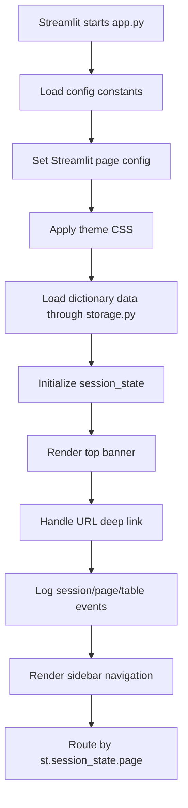
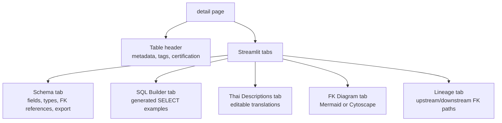
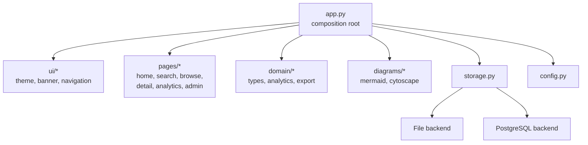

# app.py Analysis

## Overview

`app.py` is the main Streamlit application file. It contains the presentation layer, feature orchestration, page routing, data preparation, analytics rendering, diagram generation, and user interaction handling.

The file is currently a large Streamlit monolith. It delegates persistence to `storage.py` and configuration to `config.py`, but most UI and domain-specific rendering logic remains inside `app.py`.

---

## Main Responsibilities

| Area | Responsibility |
|---|---|
| App setup | Streamlit page config, theme setup, constants, admin passcode |
| UI shell | Fixed top banner, sidebar navigation, theme toggle |
| State management | `st.session_state` for page, selected table, theme, admin mode, recently viewed |
| Data loading | Cached call to `storage.load_data()` |
| User data | Loads translations, tags, metadata, changelog, and usage log through `storage.py` |
| Navigation | Custom page routing using `st.session_state.page` |
| Search | Full-text search and advanced filters |
| Browse | Module/table browsing and table selection |
| Detail page | Schema, SQL Builder, Thai descriptions, FK diagram, lineage |
| Analytics | Module dependency map, hub tables, orphan tables, ER diagram |
| Diagrams | Mermaid and Cytoscape HTML generation |
| Export | CSV and Excel schema export |
| Audit / stats | Changelog page and usage statistics page |

---

## Major Function Groups

### UI and Theme

| Function | Purpose |
|---|---|
| `_is_dark()` | Reads current theme from `st.session_state` |
| `_theme()` | Returns color tokens for dark or light mode |
| `_apply_css()` | Injects dynamic CSS for Streamlit components |
| `render_banner()` | Renders the fixed top banner, logo, request-change link, notification badge, and sidebar controls |

### Data and Metadata Helpers

| Function | Purpose |
|---|---|
| `_cached_load_data()` | Cache wrapper around `storage.load_data()` |
| `compute_completeness()` | Calculates English description coverage per table |
| `extract_storage()` | Extracts storage metadata from IRIS class declaration |
| `simplify_iris_type()` | Converts IRIS field types into simplified categories |
| `iris_to_mssql()` | Maps IRIS types to MS SQL Server type equivalents |

### Export Helpers

| Function | Purpose |
|---|---|
| `schema_to_csv()` | Builds CSV export for a table schema |
| `schema_to_excel()` | Builds multi-sheet Excel export for schema, FK, parameters, and triggers |

### Analytics and Diagram Helpers

| Function | Purpose |
|---|---|
| `compute_analytics()` | Builds module summary, hub table ranking, orphan table list, and module edges |
| `mermaid_id()` | Normalizes IDs for Mermaid diagrams |
| `_module_mermaid_html()` | Wraps module dependency Mermaid code in renderable HTML |
| `build_module_mermaid()` | Builds module-level dependency Mermaid diagram |
| `build_er_mermaid()` | Builds table-level or multi-table ER Mermaid diagram |
| `build_cytoscape_html()` | Builds interactive Cytoscape.js diagram HTML |
| `_cytoscape_error_html()` | Renders fallback HTML if Cytoscape diagram generation fails |

### Navigation and Access Control

| Function | Purpose |
|---|---|
| `render_admin_gate()` | Renders admin passcode gate for locked pages |
| `nav()` | Updates current page and selected table, then reruns Streamlit |

---

## Runtime Structure



---

## Page Routing

`app.py` does not use a separate router framework. It uses `st.session_state.page` as the routing key.

```mermaid
flowchart LR
  Sidebar[Sidebar button] --> Nav[nav(page)]
  Nav --> State[st.session_state.page]
  State --> Rerun[st.rerun()]
  Rerun --> Router[if / elif page blocks]

  Router --> Home[home]
  Router --> Search[search]
  Router --> Browse[browse]
  Router --> Detail[detail]
  Router --> Analytics[analytics]
  Router --> Usage[usage]
  Router --> Changelog[changelog]
```

Main page blocks:

| Page key | Rendered page |
|---|---|
| `home` | Landing dashboard with table/module counts and recently viewed tables |
| `search` | Search page with advanced filters |
| `browse` | Browse tables by module, name, tag, and certification |
| `detail` | Table detail page with schema, SQL builder, Thai descriptions, FK diagram, and lineage |
| `analytics` | Analytics dashboard and ER diagrams |
| `usage` | Usage statistics, admin locked |
| `changelog` | Change audit log, admin locked |

---

## Data Flow Inside app.py

```mermaid
flowchart TB
  Storage[storage.py] --> LoadData[load_data()]
  LoadData --> Frames[DataFrames:<br/>tables, fields, fk, classes, members]

  Storage --> UserData[translations, tags,<br/>metadata, changelog, usage_log]

  Frames --> Derived[Derived data:<br/>COMPLETENESS, MODULE_SUMMARY,<br/>analytics outputs]
  UserData --> Session[st.session_state]
  Derived --> Pages[Page rendering]
  Session --> Pages

  Pages --> Save[save_translations / save_tags / save_metadata]
  Save --> Storage
  Pages --> Logs[append_changelog / log_event]
  Logs --> Storage
```

---

## Detail Page Composition

The table detail view is the most complex part of `app.py`. It combines metadata, user annotations, FK relationships, diagrams, and exports.



---

## Diagram Rendering

`app.py` supports two diagram approaches:

| Renderer | Used for | Behavior |
|---|---|---|
| Mermaid | Static FK, ER, and module dependency diagrams | Generates Mermaid text and wraps it in HTML |
| Cytoscape.js | Interactive FK and ER diagrams | Generates HTML/JS embedded with `components.html()` |

Diagram-related logic is handled directly in `app.py`, especially:

- `build_module_mermaid()`
- `build_er_mermaid()`
- `build_cytoscape_html()`
- `_module_mermaid_html()`
- `_cytoscape_error_html()`

---

## State Management

Important `st.session_state` keys include:

| Key | Purpose |
|---|---|
| `page` | Current page route |
| `selected_table` | Current table on detail page |
| `recently_viewed` | Recently opened tables |
| `theme` | Dark or light mode |
| `translations` | Thai descriptions loaded from storage |
| `tags` | Table tags loaded from storage |
| `metadata` | Governance metadata loaded from storage |
| `admin_authenticated` | Whether locked admin pages are accessible |
| `_last_logged_page` | Prevents duplicate page view logging |
| `_last_logged_table` | Prevents duplicate table view logging |
| `_last_logged_query` | Prevents duplicate search logging |

---

## External Dependencies Used Directly

| Dependency | Usage in `app.py` |
|---|---|
| Streamlit | UI, layout, forms, session state, components |
| pandas | DataFrame filtering and transformations |
| Plotly | Analytics charts |
| Mermaid JS | Static diagrams rendered in browser |
| Cytoscape.js | Interactive graph diagrams rendered in browser |
| openpyxl | Indirectly through pandas Excel export/read paths |

---

## Strengths

- Clear separation between UI and persistence through `storage.py`
- Supports both local and production-style storage backends
- Rich data catalog functionality in one deployable Streamlit app
- URL deep linking makes table detail pages shareable
- Cached dictionary loading reduces repeated Excel/database reads
- Built-in audit log and usage tracking
- Diagram functionality covers both static exportable diagrams and interactive exploration

---

## Risks and Maintenance Notes

| Risk | Note |
|---|---|
| Large monolithic file | `app.py` contains UI, domain logic, JavaScript HTML generation, analytics, and routing in one file |
| Harder testing | Most logic is embedded in Streamlit runtime blocks, making isolated unit tests harder |
| Diagram complexity | Mermaid and Cytoscape HTML/JS generation inside Python can be difficult to maintain |
| State coupling | Many features depend on shared `st.session_state` keys |
| Encoding artifacts | Some comments/display strings appear mojibake in the current file view, suggesting historical encoding issues |
| Page logic duplication | Browse, detail, analytics, and diagram code could become harder to evolve as features grow |

---

## Suggested Refactoring Direction

The current structure works, but future maintenance would improve if `app.py` were split gradually.

Suggested target modules:

| Proposed module | Extract from `app.py` |
|---|---|
| `ui/theme.py` | `_is_dark()`, `_theme()`, `_apply_css()` |
| `ui/banner.py` | `render_banner()` |
| `ui/navigation.py` | sidebar rendering, `nav()`, admin gate |
| `domain/types.py` | `simplify_iris_type()`, `iris_to_mssql()` |
| `domain/analytics.py` | `compute_completeness()`, `compute_analytics()` |
| `domain/export.py` | `schema_to_csv()`, `schema_to_excel()` |
| `diagrams/mermaid.py` | Mermaid ID, module Mermaid, ER Mermaid |
| `diagrams/cytoscape.py` | Cytoscape HTML and fallback HTML |
| `pages/home.py` | Home page rendering |
| `pages/search.py` | Search and advanced filter rendering |
| `pages/browse.py` | Browse page rendering |
| `pages/detail.py` | Table detail page rendering |
| `pages/analytics.py` | Analytics page rendering |
| `pages/admin.py` | Changelog and usage stats pages |

Recommended migration approach:

1. Extract pure helper functions first, especially type mapping, analytics, and export helpers.
2. Extract diagram generation into dedicated modules because it has a high amount of HTML/JS string logic.
3. Extract page render functions one page at a time.
4. Keep `app.py` as the composition root that loads data, initializes state, renders shell UI, and dispatches pages.

---

## Target Structure After Refactor



---

## Summary

`app.py` is the central application orchestrator and currently holds most of the product logic. It is effective for a single-file Streamlit deployment, but its size and mixed responsibilities make it the main maintenance hotspot.

The best next architectural improvement is to keep `app.py` as a thin composition root and progressively move pure logic, diagram generation, and page rendering into smaller modules.
