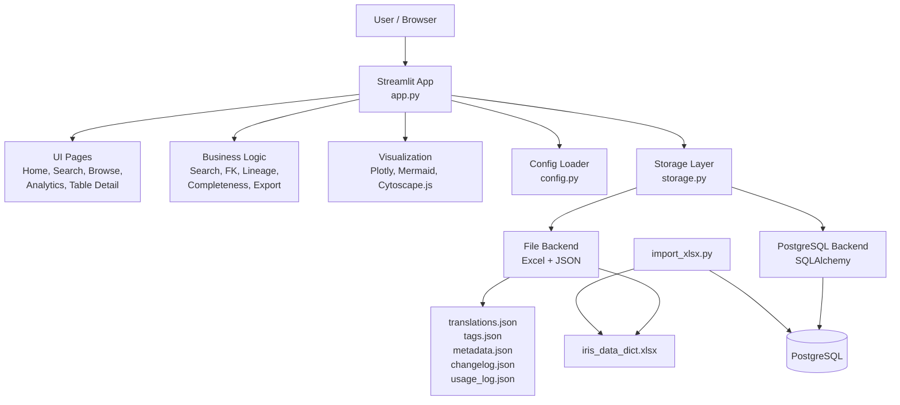
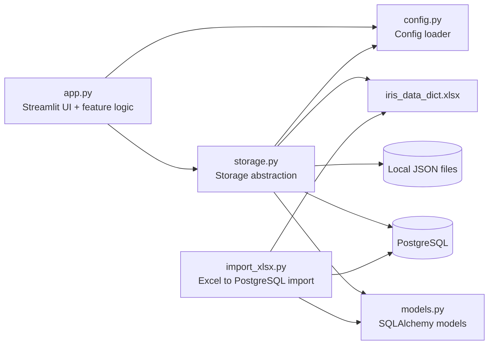
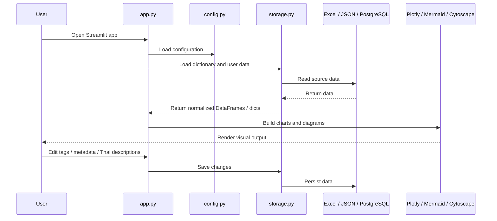
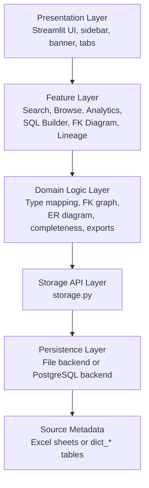
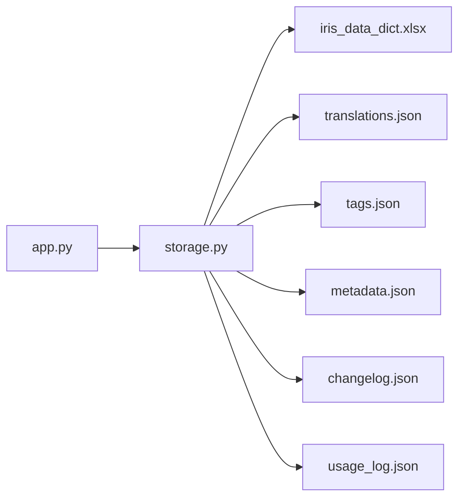
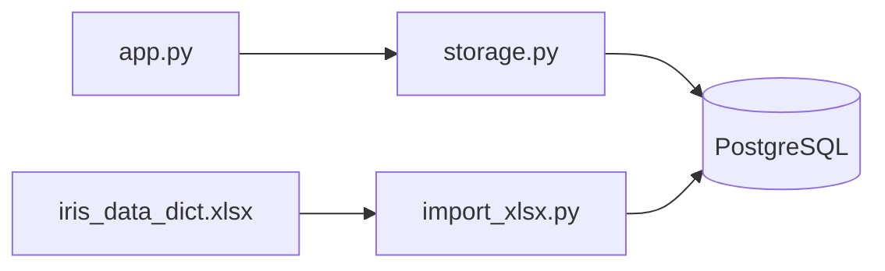

# IRIS Data Dictionary Architecture Summary

## Overview

IRIS Data Dictionary is a local data catalog web application for browsing and documenting InterSystems IRIS persistent class metadata. It is built with Streamlit and uses `iris_data_dict.xlsx` as the main metadata source.

The system supports two storage backends:

- File backend: uses Excel and local JSON files
- PostgreSQL backend: uses PostgreSQL through SQLAlchemy

---

## Tech Stack

| Layer | Technology |
|---|---|
| Web UI | Streamlit |
| Data Processing | pandas |
| Visualization | Plotly, Mermaid, Cytoscape.js |
| Excel Reader | openpyxl |
| Configuration | `config.toml`, `config.py` |
| File Storage | JSON files |
| Database Storage | PostgreSQL |
| ORM / DB Layer | SQLAlchemy |
| Source Data | `iris_data_dict.xlsx` |

---

## Main Modules

| File | Responsibility |
|---|---|
| `app.py` | Main Streamlit application, UI rendering, navigation, search, diagrams, analytics |
| `storage.py` | Unified storage layer for file backend and PostgreSQL backend |
| `config.py` | Loads configuration from `config.toml` and exposes constants |
| `models.py` | SQLAlchemy table definitions for PostgreSQL backend |
| `import_xlsx.py` | CLI script to import Excel metadata into PostgreSQL |
| `iris_data_dict.xlsx` | Main source metadata file |
| `config.toml` | Application configuration |
| `requirements.txt` | Python dependencies |

---

## High-Level Architecture

---

## Module Diagram

---

## Runtime Flow

---

## Layered Stack

---

## Data Sources

The main source file is `iris_data_dict.xlsx`, which contains five sheets:

| Sheet | Description |
|---|---|
| `sql_tables` | Table to class mapping, module, description |
| `sql_fields` | Field definitions per class |
| `fk_relationships` | FK / object-reference relationships |
| `classes` | IRIS class declarations and metadata |
| `members` | Properties, parameters, triggers |

---

## Storage Backends

### File Backend

Used by default for local development.

### PostgreSQL Backend

Used for production or multi-user deployment.

PostgreSQL tables include:

| Table Group | Purpose |
|---|---|
| `dict_*` tables | Read-only imported dictionary metadata |
| `translations` | Thai field descriptions |
| `table_tags` | Table tags |
| `table_metadata` | Governance metadata |
| `changelog` | Audit log |
| `usage_log` | Usage tracking |

---

## Key Features

- Browse tables by module, name, tags, and certification status
- Full-text and advanced search
- Table schema view
- SQL Builder
- Thai description editor
- FK diagram
- Column-level lineage
- Analytics dashboard
- Module dependency map
- ER diagram
- Table tags and metadata
- Certification status
- Changelog
- Usage statistics
- File or PostgreSQL backend
- Mermaid and Cytoscape diagram rendering

---

## Summary

This project is a Streamlit-based data catalog application.

The main application logic lives in `app.py`, while `storage.py` abstracts persistence so the same UI can work with either local files or PostgreSQL.

The system is designed around a metadata source, `iris_data_dict.xlsx`, and adds user-managed annotations such as Thai descriptions, tags, governance metadata, changelog, and usage tracking.
