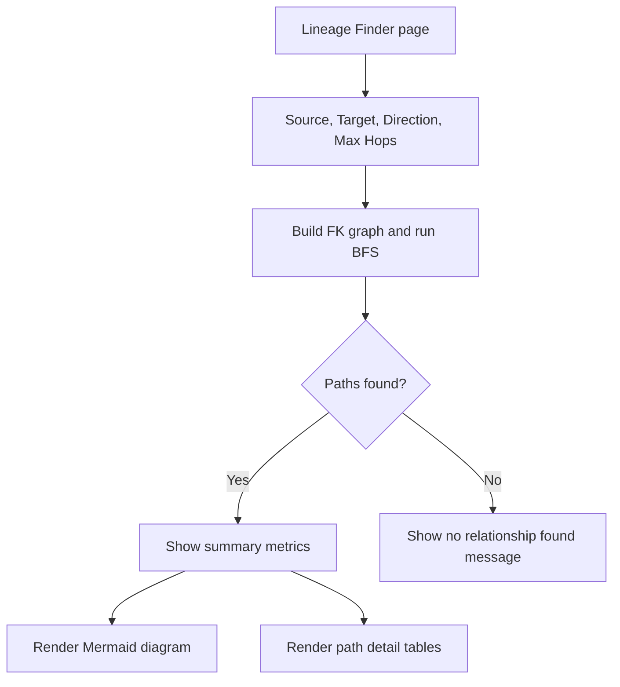

# Lineage Finder Feature Plan

## Objective

Add a new feature that lets users select a source table and a target table, then find the relationship or data lineage path between them.

The feature should show:

- Whether the two tables are related
- Direct FK relationship, if one exists
- Indirect relationship paths through intermediate tables
- FK fields used in each step
- Referenced key / PK information where available
- Table-level path diagram
- Detailed path table for review and export in a later phase

---

## Recommended Placement

Create this as a new page:

```text
Lineage Finder
```

Recommended sidebar structure:

```text
Home
Search
Browse
Analytics
Lineage Finder
Changelog
Usage Stats
```

Reason:

- The existing Detail page already has lineage for the currently selected table.
- This new use case starts from two user-selected tables, which is a different workflow.
- Users who need source-to-target impact analysis should not have to open one table first.
- It is important enough to be a first-class feature rather than hidden inside an existing tab.

Alternative:

Add it as a new tab under `Analytics`.

This is acceptable if the sidebar should stay compact, but less discoverable.

---

## Current Architecture Fit

Based on `ARCHITECTURE_SUMMARY.md` and `APP_PY_ANALYSIS.md`:

- `app.py` is currently the main Streamlit composition file.
- Data is loaded through `storage.py`, so the feature can work with both file backend and PostgreSQL backend.
- Existing dataframes from `load_data()` are enough for the first version:
  - `tables`
  - `fields`
  - `fk`
  - `classes`
  - `members`
- Existing Mermaid and Cytoscape diagram patterns can be reused.
- The first implementation can live in `app.py` to match current structure.
- If logic grows, lineage-specific pure functions should be extracted later.

---

## User Workflow

```text
1. User opens Lineage Finder.
2. User selects Source Table.
3. User selects Target Table.
4. User chooses direction and max hops.
5. User clicks Find Relationship.
6. App searches FK graph.
7. App displays summary, paths, FK/key details, and diagram.
```

---

## Proposed UI

```text
Table Relationship & Lineage Finder

[Source Table dropdown]    [Target Table dropdown]
[Direction selector]       [Max hops slider]
[Find Relationship button]

Summary
- Relationship found / not found
- Number of paths
- Shortest path length
- Direction used

Path Diagram
SourceTable -- FK_Field -> IntermediateTable -- FK_Field -> TargetTable

Path Details
| Step | Source Table | Source Field / FK | Source Type | Target Table | Target Key / PK | Target Type |
```

---

## Input Controls

| Control | Type | Default | Purpose |
|---|---|---|---|
| Source Table | `st.selectbox` | None / first table | Starting table |
| Target Table | `st.selectbox` | None / second table | Destination table |
| Direction | `st.radio` or segmented control | Downstream | Search direction |
| Max Hops | `st.slider` | 3 | Limit path depth |
| Max Paths | `st.slider` or hidden constant | 10 | Prevent huge result sets |
| Same Module Only | `st.checkbox` | False | Optional scope limiter |
| Show Columns | `st.checkbox` | True | Show field/key details |
| Show Diagram | `st.checkbox` | True | Render Mermaid diagram |

Direction options:

| Option | Meaning |
|---|---|
| Downstream | Source table references other tables until target is found |
| Upstream | Other tables reference source table until target is found |
| Both | Search both directions |

---

## Data Requirements

The feature should use the already loaded dataframes:

| DataFrame | Usage |
|---|---|
| `tables` | Table names, class names, module names |
| `fields` | Field names, IRIS types, descriptions |
| `fk` | FK relationships between tables |
| `classes` | Optional class-level metadata |
| `members` | Optional property / parameter / trigger context |

Primary input is `fk_relationships`, represented in the app as `fk`.

Before implementation, confirm exact column names in `fk`.

Expected logical fields:

| Logical field | Meaning |
|---|---|
| Source table | Table containing the FK/reference field |
| Source field | FK/reference field name |
| Target table | Referenced table |
| Target key / PK | Referenced key, usually `ID` or target primary key |
| Source class | IRIS class for source table |
| Target class | IRIS class for target table |

---

## Core Algorithm

Use graph traversal over FK relationships.

### Step 1: Build FK Graph

Convert `fk` dataframe into adjacency lists.

Outgoing graph:

```text
SourceTable -> TargetTable
```

Incoming graph:

```text
TargetTable -> SourceTable
```

Each edge should keep metadata:

```python
{
    "source_table": "APInvoice",
    "source_field": "VendorDR",
    "source_type": "ref",
    "target_table": "APC_Vendor",
    "target_key": "ID",
    "target_type": "BIGINT",
    "direction": "outgoing"
}
```

### Step 2: Find Paths

Use BFS because the user usually wants the shortest relationship path.

Requirements:

- Stop at `max_hops`
- Avoid cycles
- Return shortest paths first
- Limit number of paths
- Support downstream, upstream, and both-direction search

Pseudo-flow:

```text
queue = [(source_table, empty_path)]

while queue:
    current_table, path = queue.pop_left()

    if len(path) >= max_hops:
        continue

    for edge in graph[current_table]:
        next_table = edge.target_table

        if next_table already in path:
            continue

        new_path = path + edge

        if next_table == target_table:
            save result
        else:
            queue.append((next_table, new_path))
```

### Step 3: Enrich Results

For every edge in every path, enrich using `fields` and `tables`:

- Source module
- Target module
- Source field IRIS type
- Source field MS SQL type
- Target key type
- Source field description
- Target key description
- Whether source field is FK/reference

### Step 4: Render Results

Render:

- Summary metrics
- One section per path
- Detail table
- Mermaid diagram

---

## Proposed Result Model

```python
LineageEdge = {
    "step": 1,
    "source_table": "APInvoice",
    "source_field": "VendorDR",
    "source_field_type": "APC.Vendor",
    "source_mssql_type": "BIGINT",
    "target_table": "APC_Vendor",
    "target_key": "ID",
    "target_key_type": "%Integer",
    "target_mssql_type": "BIGINT",
    "relationship": "FK",
    "direction": "downstream",
}

LineagePath = {
    "path_index": 1,
    "hop_count": 2,
    "tables": ["APInvoice", "APC_Vendor", "CT_Organization"],
    "edges": [LineageEdge, LineageEdge],
}
```

---

## Diagram Plan

Start with Mermaid.

Example:


Diagram requirements:

- Highlight source table
- Highlight target table
- Show FK field on edge label
- Show target key on edge label if available
- Keep diagram scoped to found paths only

Future version can add Cytoscape for interactive exploration.

---

## Page-Level Flow



---

## Implementation Options

### Option A: Conservative App-Only Implementation

Add everything in `app.py`.

Changes:

- Add sidebar item `Lineage Finder`
- Add route key `lineage_finder`
- Add helper functions near existing lineage / ER helpers
- Add new `elif st.session_state.page == "lineage_finder"` block

Pros:

- Matches current repo style
- Fastest to implement
- Lowest structural change

Cons:

- Makes already large `app.py` larger
- More difficult to unit test

### Option B: Hybrid Implementation

Add pure lineage functions in a new module, keep UI in `app.py`.

Suggested file:

```text
lineage_finder.py
```

Functions:

```python
build_fk_graph(fk, fields=None, tables=None)
find_table_paths(graph, source_table, target_table, direction, max_hops, max_paths)
enrich_lineage_paths(paths, fields, tables)
build_lineage_mermaid(paths)
```

Pros:

- Keeps `app.py` smaller
- Easier to test
- Still avoids a large refactor

Cons:

- Introduces a new module style not yet widely used in the project

### Option C: Full Refactor-Oriented Implementation

Create domain/page/diagram modules:

```text
domain/lineage.py
diagrams/lineage_mermaid.py
pages/lineage_finder.py
```

Pros:

- Best long-term architecture
- Matches suggested refactoring direction in `APP_PY_ANALYSIS.md`

Cons:

- Larger structural change
- More risk for a first feature iteration

---

## Recommended Implementation Option

Use **Option B: Hybrid Implementation**.

Reason:

- `app.py` is already the main maintenance hotspot.
- The lineage search algorithm is pure logic and should be easy to test.
- UI can still stay in `app.py` to match current page routing.
- This avoids a broad refactor while keeping the new logic clean.

Recommended files:

```text
app.py
lineage_finder.py
```

`app.py` should handle:

- Sidebar navigation
- Page block
- Streamlit inputs
- Calling lineage functions
- Rendering results

`lineage_finder.py` should handle:

- FK graph building
- BFS path search
- Path enrichment
- Mermaid path diagram generation

---

## Suggested Function Design

```python
def build_fk_graph(fk_df, direction="downstream"):
    """Build an adjacency list from FK dataframe."""


def find_table_paths(
    graph,
    source_table: str,
    target_table: str,
    max_hops: int = 3,
    max_paths: int = 10,
):
    """Find shortest FK paths between two tables using BFS."""


def enrich_lineage_paths(paths, fields_df, tables_df):
    """Add module, type, PK, and description metadata to path edges."""


def build_lineage_mermaid(paths, source_table: str, target_table: str):
    """Build Mermaid flowchart for found lineage paths."""
```

---

## Phase Plan

### Phase 1: Minimum Useful Feature

Deliver:

- New `Lineage Finder` page
- Source table dropdown
- Target table dropdown
- Direction selector
- Max hops slider
- BFS-based path search
- Result summary
- Path detail table
- Mermaid diagram
- Empty state when no path exists

No database schema changes required.

### Phase 2: Better Column Detail

Add:

- IRIS type
- MS SQL type
- Field descriptions
- Target key descriptions
- Thai descriptions where available
- Confidence indicator if PK cannot be inferred

### Phase 3: Filtering and Governance

Add:

- Same module only
- Include / exclude deprecated tables
- Certified-only path
- Cross-module toggle
- Max paths control

### Phase 4: Export and Sharing

Add:

- Download path details as CSV
- Download path details as Excel
- Deep link:

```text
?lineage_source=TABLE_A&lineage_target=TABLE_B
```

### Phase 5: Interactive Diagram

Add:

- Cytoscape renderer
- Click node to show columns
- Highlight selected path
- Download PNG

---

## Acceptance Criteria

Phase 1 is complete when:

- User can select source and target tables.
- User can search for direct FK paths.
- User can search for indirect FK paths up to max hops.
- App shows a clear no-path message when no relationship exists.
- Result table includes source table, source FK field, target table, and target key/PK.
- Diagram shows only tables and edges involved in found paths.
- Feature works with existing `storage.load_data()` outputs.
- Feature does not require separate SQL queries.
- Feature works with both file backend and PostgreSQL backend.
- Existing Detail page lineage remains unchanged.

---

## Open Questions Before Implementation

1. What are the exact column names in the `fk` dataframe?
2. Does `fk_relationships` always contain the referenced target key/PK?
3. If target key is missing, should the app assume `ID`?
4. Should paths search across modules by default?
5. Should upstream paths be shown reversed as `source -> target` for readability?
6. Should multiple parallel FK fields between the same tables be shown as separate paths?
7. Should self-referencing tables be included or ignored by default?

---

## Recommended First Build

Build Phase 1 using Option B.

Create:

```text
lineage_finder.py
```

Modify:

```text
app.py
```

No changes needed initially:

```text
storage.py
models.py
config.py
import_xlsx.py
```

This keeps the implementation scoped while avoiding more growth inside the already large `app.py`.
