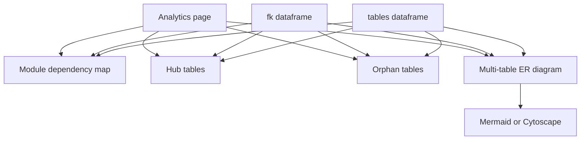
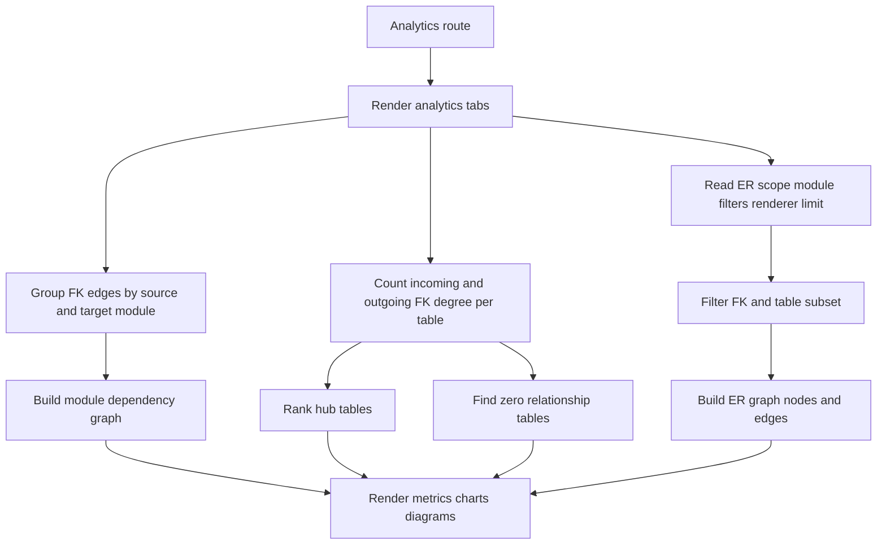
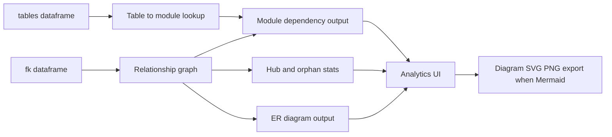

# Analytics Stack

## Purpose

Analytics summarizes the metadata graph across modules and tables. It includes cross-module dependency heatmaps/flowcharts, hub table rankings, orphan table discovery, and scoped ER diagrams.

## Stack Diagrams

### High Level Stack Diagram



### Detail Level Stack Diagram



### Lineage / Data Flow Diagram




## High Level Stack

| Layer | Responsibility | Source |
|---|---|---|
| Analytics precompute | Builds hub table dataframe, orphan table dataframe, and module dependency counts from resolved FK rows. | `app.py:553-598`, `app.py:1466-1471` |
| Page route | Renders Analytics page with four tabs. | `app.py:3028-3037` |
| Module Dependency Map | Shows heatmap, Mermaid flowchart, filtered dependency table. | `app.py:3041-3181` |
| Hub Tables | Shows incoming-reference ranking chart and selectable table. | `app.py:3185-3233` |
| Orphan Tables | Shows tables with no resolved FK in either direction, with filters and chart. | `app.py:3237-3297` |
| ER Diagram | Builds multi-table ER diagrams by module, one-hop table scope, or custom selection. | `app.py:3301-3442` |

## High Level Flow

```text
App startup computes analytics data
  -> compute_analytics(fk, tables)
     app.py:553-598, app.py:1466-1471
User opens Analytics page
  -> four tabs are created
     app.py:3028-3037
  -> dependency tab renders heatmap and Mermaid graph
     app.py:3041-3181
  -> hub/orphan tabs render table rankings and row navigation
     app.py:3185-3297
  -> ER tab renders Mermaid or Cytoscape diagram for selected scope
     app.py:3301-3442
```

## Detail Level Stack

### 1. Analytics Data Builder

| Detail | Source |
|---|---|
| `compute_analytics()` is cached with `st.cache_data`. | `app.py:553-554` |
| Only FK rows with `resolve_status == "resolved"` are included. | `app.py:562-563` |
| Incoming counts group by `target_sql_table_name`. | `app.py:565` |
| Outgoing counts group by non-empty `source_sql_table_name`. | `app.py:566-570` |
| Hub dataframe merges incoming/outgoing counts into table metadata and computes total. | `app.py:572-577` |
| Orphan dataframe keeps rows with zero incoming and zero outgoing. | `app.py:579` |
| Cross-module dependency counts map source/target tables to modules and exclude self-module refs. | `app.py:581-594` |
| Startup assigns `HUB_DF`, `ORPHAN_DF`, and `DEP_COUNTS`, with empty fallbacks on error. | `app.py:1466-1471` |

### 2. Module Dependency Map

| Detail | Source |
|---|---|
| Analytics page route and title render under `page == "analytics"`. | `app.py:3028-3030` |
| Tabs are Module Dependency Map, Hub Tables, Orphan Tables, and ER Diagram. | `app.py:3032-3037` |
| Empty `DEP_COUNTS` shows no cross-module relationship info. | `app.py:3048-3049` |
| Heatmap pivots source module by target module and counts FK references. | `app.py:3051-3071` |
| Dependency flowchart section builds all module names from source and target columns. | `app.py:3073-3079` |
| View controls include all/focus mode, bidirectional collapse, and Mermaid direction. | `app.py:3081-3097` |
| Focus mode filters dependencies by selected center module and direction. | `app.py:3098-3122` |
| All-modules mode filters by min references and top connected modules. | `app.py:3123-3149` |
| `build_module_mermaid()` renders flowchart HTML and raw Mermaid code. | `app.py:3151-3167`, `app.py:685` |
| Raw dependency table shows module pair counts sorted descending. | `app.py:3169-3181` |

### 3. Hub Tables

| Detail | Source |
|---|---|
| Hub tab explains incoming FK references as dependency signal. | `app.py:3185-3190` |
| Top N slider defaults from `HUB_TOP_N_DEFAULT`. | `app.py:3192-3193` |
| Plotly bar chart ranks top tables by incoming references. | `app.py:3195-3217` |
| Dataframe includes table, prefix, module, incoming, outgoing, and total counts. | `app.py:3219-3231` |
| Selecting a hub row navigates to table detail. | `app.py:3232-3233` |

### 4. Orphan Tables

| Detail | Source |
|---|---|
| Orphan tab defines orphan tables as zero resolved FK relationships in both directions. | `app.py:3237-3242` |
| Empty orphan dataframe shows success message. | `app.py:3244-3245` |
| Module and name filters refine orphan list. | `app.py:3247-3261` |
| Plotly bar chart summarizes orphan counts by module. | `app.py:3263-3282` |
| Orphan dataframe truncates description and supports row navigation to detail. | `app.py:3284-3297` |

### 5. ER Diagram

| Detail | Source |
|---|---|
| ER tab supports scopes: By Module, By Table (1-hop), Custom selection. | `app.py:3301-3313` |
| By Module selects module and optional cross-module references, capped at `MAX_ER_TABLES`. | `app.py:3318-3335` |
| By Table selects center table and outgoing/incoming/both 1-hop neighbors, capped at `MAX_ER_TABLES`. | `app.py:3337-3370` |
| Custom selection lets users pick up to 20 tables. | `app.py:3372-3379` |
| Display controls select renderer, field display, max fields, Mermaid direction, and Draw button. | `app.py:3381-3410` |
| Cytoscape renderer calls `build_cytoscape_html()` with fallback HTML on failure. | `app.py:3412-3428`, `app.py:1019`, `app.py:1442` |
| Mermaid renderer calls `build_er_mermaid()` and exposes raw Mermaid code. | `app.py:3429-3440`, `app.py:828` |
| Empty scope selection shows instruction info. | `app.py:3441-3442` |

## Data Inputs

| Data | Required fields | Usage | Source |
|---|---|---|---|
| `fk` | `resolve_status`, `source_sql_table_name`, `target_sql_table_name` | Analytics graph calculations and ER one-hop scopes. | `app.py:553-598`, `app.py:3348-3362` |
| `tables` | `sql_table_name`, `module_name`, `module_prefix`, `class_description` | Hub/orphan/dependency display and ER scopes. | `app.py:572-594`, `app.py:3318-3379` |
| `DEP_COUNTS` | `source_module`, `target_module`, `count` | Heatmap, module flowchart, dependency table. | `app.py:3048-3181` |
| `HUB_DF` | `incoming`, `outgoing`, `total` | Hub ranking and selectable table. | `app.py:3185-3233` |
| `ORPHAN_DF` | table/module metadata with zero FK counts | Orphan filters, chart, and table. | `app.py:3237-3297` |

## Ownership

| Area | Owner file | Source |
|---|---|---|
| Analytics precompute and page UI | `app.py` | `app.py:553-598`, `app.py:3028-3442` |
| Module Mermaid builder | `app.py` | `app.py:685-759` |
| ER Mermaid builder | `app.py` | `app.py:828-1016` |
| Cytoscape builder | `app.py` | `app.py:1019-1448` |
| Analytics defaults | `config.py`, `config.toml` | `config.py:90-93`, `config.toml:45-49` |

## Manual Verification

| Check | Steps | Expected result |
|---|---|---|
| Dependency heatmap | Open Analytics > Module Dependency Map. | Heatmap renders when cross-module FK data exists. |
| Dependency flowchart filters | Switch focus/all modes and min/top controls. | Mermaid graph and counts update. |
| Hub table navigation | Select a row in Hub Tables. | Detail opens for selected table. |
| Orphan filters | Filter orphan list by module/name. | Chart and table update. |
| ER by module | Select a module and Mermaid renderer. | ER diagram renders or warning appears for capped tables. |
| ER by table | Select center table and 1-hop direction. | Diagram includes selected center and neighbors. |
| Cytoscape ER | Switch renderer to Interactive. | Interactive diagram renders or fallback error HTML appears. |

