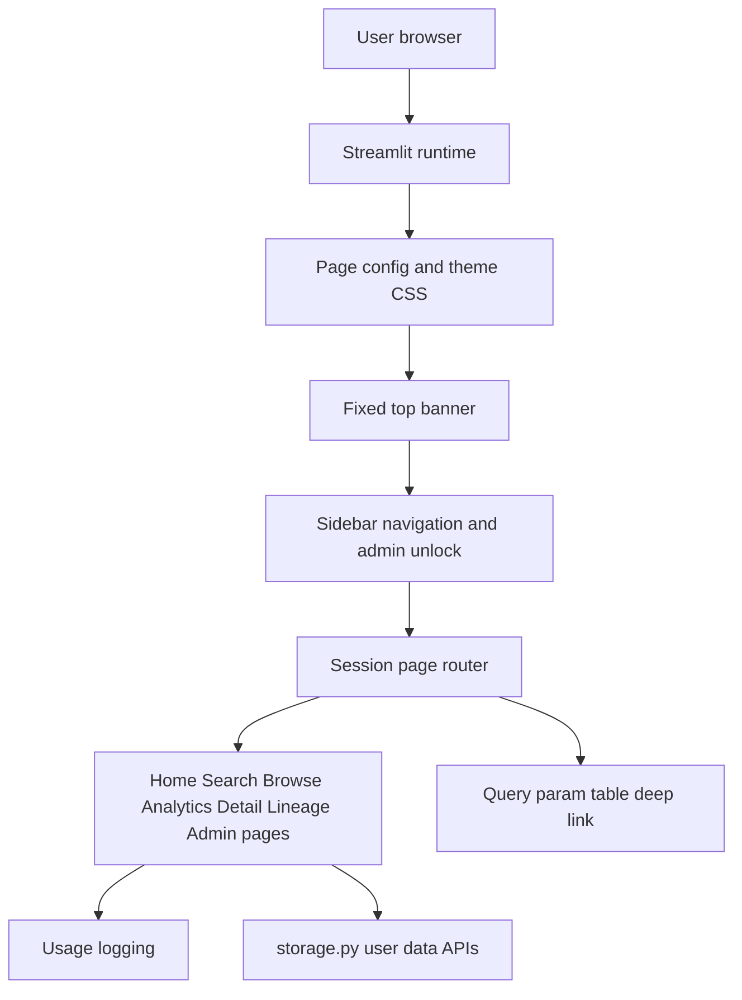
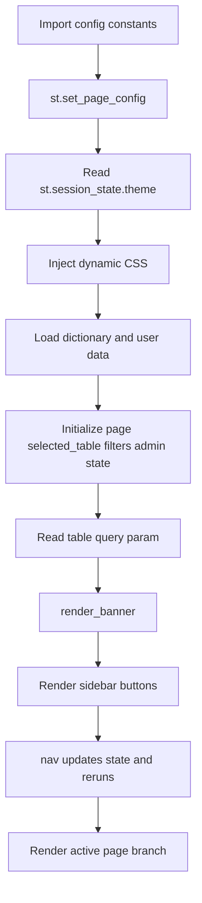
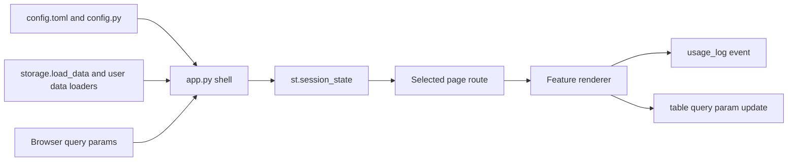

# App Shell Stack

## Purpose

The app shell is the shared Streamlit frame around every feature: page setup, theme, top banner, sidebar navigation, admin access, URL deep linking, session state, and usage event logging. It controls how users move between features and how common app state is initialized.

## Stack Diagrams

### High Level Stack Diagram



### Detail Level Stack Diagram



### Lineage / Data Flow Diagram




## High Level Stack

| Layer | Responsibility | Source |
|---|---|---|
| Page setup | Imports config/storage helpers and configures Streamlit page title, icon, layout, and sidebar state. | `app.py:11-50` |
| Theme system | Reads `st.session_state.theme`, builds color tokens, and injects dynamic CSS. | `app.py:75-157` |
| Top banner | Renders fixed app identity bar, logo fallback, version/env badges, updated date, request-change link, notification badge, and sidebar toggle JS. | `app.py:161-424` |
| Data and derived state | Loads dictionary data, completeness, analytics outputs, and module summary before routing. | `app.py:1455-1482` |
| Session state | Initializes page, selected table, filters, recently viewed, theme, and admin authentication. | `app.py:1486-1497` |
| User data state | Loads translations, tags, and metadata into session state. | `app.py:1499-1506` |
| Deep linking | Reads and writes `?table=TABLE_NAME` query parameter for table detail pages. | `app.py:1517-1533` |
| Admin gate | Restricts locked pages with passcode form and session-scoped unlock state. | `app.py:1536-1556`, `app.py:3446-3449`, `app.py:3593-3596` |
| Navigation | Updates `st.session_state.page`, selected table, recently viewed, and reruns. | `app.py:1559-1569`, `app.py:1586-1642` |
| Usage logging | Logs session start, page views, and table views through storage. | `app.py:1508-1511`, `app.py:1572-1582` |

## High Level Flow

```text
Streamlit runs app.py
  -> config and storage imports set constants and storage API
     app.py:11-32
  -> page config and CSS/theme are applied
     app.py:45-50, app.py:75-157
  -> banner is rendered
     app.py:161-424, app.py:1514
  -> dictionary and user data are loaded
     app.py:1455-1506
  -> query params and session state decide current route
     app.py:1517-1533
  -> sidebar buttons call nav()
     app.py:1559-1569, app.py:1586-1608
  -> page route block renders the active feature
     app.py:1646 onward
```

## Detail Level Stack

### 1. App Entry and Imports

| Detail | Source |
|---|---|
| Streamlit, pandas, Plotly, and components are imported at module load. | `app.py:1-10` |
| Config constants include app identity, UI defaults, lock settings, limits, and theme defaults. | `app.py:11-23` |
| Storage functions include dictionary loading, runtime user data load/save, changelog, usage logging, and `BACKEND`. | `app.py:25-32` |
| Lineage Finder helpers are imported separately from `lineage_finder.py`. | `app.py:34-40` |
| `st.set_page_config()` sets title, icon, wide layout, and expanded sidebar. | `app.py:45-50` |
| Admin passcode uses `st.secrets["admin_passcode"]` and falls back to config default. | `app.py:54-57` |

### 2. Theme and CSS

| Detail | Source |
|---|---|
| `_is_dark()` treats `"dark"` session theme as dark mode. | `app.py:75-76` |
| `_theme()` returns color tokens for background, sidebar, cards, borders, text, Mermaid, Plotly, and hover colors. | `app.py:78-92` |
| `_apply_css()` builds separate dark/light CSS blocks for sidebar, card-style buttons, metrics, badges, dividers, and headings. | `app.py:96-155` |
| CSS is applied immediately after helper definition. | `app.py:157` |
| Sidebar theme toggle flips `st.session_state.theme` and reruns the app. | `app.py:1637-1642` |

### 3. Top Banner

| Detail | Source |
|---|---|
| `render_banner()` is the shared banner renderer. | `app.py:161-162` |
| Logo uses configured `LOGO_FILE`; failure falls back to an `SI` text badge. | `app.py:166-173` |
| Notification badge counts changelog entries within `NOTIFICATION_WINDOW_DAYS`. | `app.py:175-185` |
| Last updated date comes from the workbook file modification time. | `app.py:187-193` |
| Banner CSS fixes the top bar, shifts sidebar down, and styles identity/actions/user avatar. | `app.py:195-276` |
| Banner HTML includes hamburger, logo, app name, version, environment, updated date, request-change link, changelog bell, and guest avatar. | `app.py:278-316` |
| Sidebar toggle JavaScript finds Streamlit's native sidebar toggle and attaches custom hamburger/hover strip behavior. | `app.py:318-424` |
| App shell calls `render_banner()` after session data initialization. | `app.py:1513-1514` |

### 4. Data and Session Initialization

| Detail | Source |
|---|---|
| Dictionary data is loaded into `tables`, `fields`, `fk`, `classes`, and `members`; fatal load errors stop rendering. | `app.py:1455-1459` |
| English description completeness is computed from `fields`. | `app.py:1461-1464`, `app.py:435-446` |
| Analytics-derived frames are precomputed for hub/orphan/dependency features. | `app.py:1466-1471` |
| Module summary groups table counts by module and prefix. | `app.py:1473-1482` |
| Session defaults include page, selected table, browse filters, recently viewed, analytics tab, theme, and admin authentication. | `app.py:1486-1497` |
| Translations, tags, and metadata are loaded into session state once. | `app.py:1499-1506` |
| A `session_start` event is logged only once per browser session. | `app.py:1508-1511` |

### 5. URL Deep Linking

| Detail | Source |
|---|---|
| On first Home load, `?table=TABLE_NAME` is read from `st.query_params`. | `app.py:1517-1519` |
| Valid table query param switches page to `detail` and sets `selected_table`. | `app.py:1520-1522` |
| Deep-linked table is moved to the front of recently viewed and trimmed to `MAX_RECENTLY_VIEWED`. | `app.py:1523-1527` |
| Detail pages keep the URL bar synchronized with the selected table. | `app.py:1529-1531` |
| Non-detail pages remove the `table` query parameter. | `app.py:1532-1533` |

### 6. Admin Access Control

| Detail | Source |
|---|---|
| `render_admin_gate()` displays an admin-only message and passcode form. | `app.py:1536-1547` |
| Correct passcode sets `admin_authenticated` and reruns; incorrect passcode shows an error. | `app.py:1548-1553` |
| Gate includes a Back to Home button through `nav("home")`. | `app.py:1554-1556` |
| Sidebar marks locked pages when they are in `LOCKED_PAGES` and admin mode is not active. | `app.py:1599-1605` |
| Admin mode can be locked again from the sidebar; if currently on a locked page, user is returned to Home. | `app.py:1610-1618` |
| Usage Stats checks admin auth before rendering. | `app.py:3446-3449` |
| Changelog checks admin auth before rendering. | `app.py:3593-3596` |

### 7. Navigation and Sidebar

| Detail | Source |
|---|---|
| `nav()` sets current page, optionally selected table, recently viewed, and reruns. | `app.py:1559-1569` |
| Page view events are logged when `_cur_page` changes. | `app.py:1572-1576` |
| Table view events are logged when detail table changes. | `app.py:1578-1582` |
| Sidebar defines main pages: Home, Search, Browse, Analytics, Lineage Finder, Changelog, and Usage Stats. | `app.py:1586-1598` |
| Active state treats Detail as part of Browse for sidebar highlighting. | `app.py:1600-1603` |
| Sidebar buttons call `nav(pid)`. | `app.py:1604-1608` |
| Sidebar shows app-wide counts for tables, relationships, modules, completeness, Thai translations, and backend. | `app.py:1620-1635` |
| Route blocks start with Home and continue through each page-specific `if/elif`. | `app.py:1646` |

## Data Inputs

| Data | Required fields | Usage | Source |
|---|---|---|---|
| Config constants | App identity, defaults, limits, locked pages, theme | Page setup, banner, sidebar, route defaults. | `app.py:11-23`, `config.py:55-119` |
| `tables` dataframe | `sql_table_name`, `module_name`, `module_prefix` | Deep links, sidebar counts, module summary, table navigation. | `app.py:1456`, `app.py:1473-1482`, `app.py:1518-1527`, `app.py:1621-1623` |
| `fields` dataframe | `class_name`, `description` | Completeness, sidebar field counts, translation coverage. | `app.py:1456`, `app.py:435-446`, `app.py:1631-1634` |
| `fk` dataframe | Relationship rows | Sidebar relationship count and analytics precompute. | `app.py:1456`, `app.py:1466-1471`, `app.py:1622` |
| Runtime user data | translations, tags, metadata, changelog, usage log | Banner notification, sidebar translation count, admin pages, feature state. | `app.py:1499-1511`, `app.py:175-185` |
| Query params | `table` | URL deep link into detail page. | `app.py:1517-1533` |

## Ownership

| Area | Owner file | Source |
|---|---|---|
| Shared app setup, theme, banner, session state, routing, admin gate, sidebar | `app.py` | `app.py:45-424`, `app.py:1455-1646` |
| Config values used by the shell | `config.py`, `config.toml` | `config.py:55-119`, `config.toml:5-78` |
| Persistence used by shell events and badge counts | `storage.py` | `storage.py:313-456` |
| Locked page list and admin fallback | `config.py`, `.streamlit/secrets.toml` | `config.py:117-119`, `app.py:54-57` |

## Manual Verification

| Check | Steps | Expected result |
|---|---|---|
| App shell loads | Run `streamlit run app.py`. | Top banner, sidebar, Home page, and app metrics render without fatal errors. |
| Theme toggle | Click the sidebar theme toggle. | Theme changes between light and dark and persists in the session after rerun. |
| Sidebar navigation | Click each sidebar page button. | Active page changes and selected route renders; Detail still highlights Browse when opened through a table. |
| Deep link | Open `/?table=<valid_table_name>`. | App opens Detail page for that table, URL remains synced, and table appears in Recently Viewed. |
| Admin gate | Open Usage Stats or Changelog without admin mode. | Passcode gate renders and blocks page content. |
| Admin unlock/lock | Enter correct passcode, then click Lock Admin in sidebar. | Locked pages become available after unlock, then lock again and return to Home if needed. |
| Usage events | Navigate across pages and open a table. | App remains responsive and storage receives page/table usage events when logging backend is available. |

