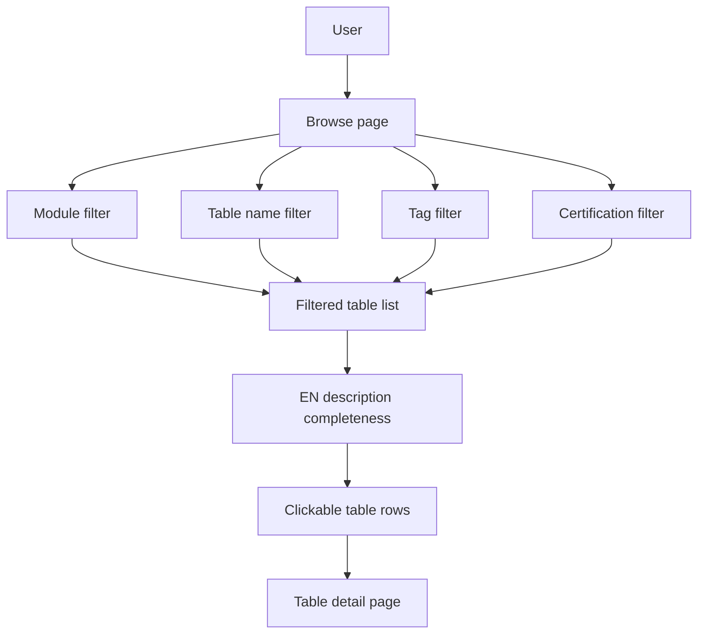
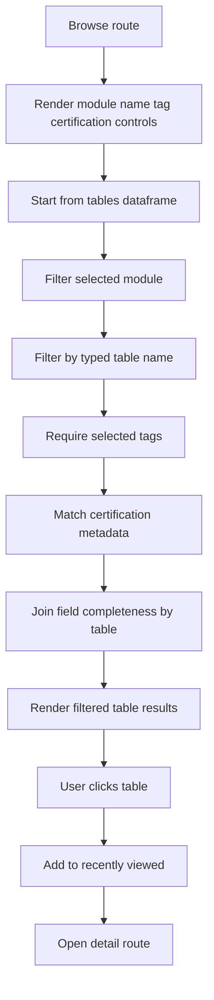
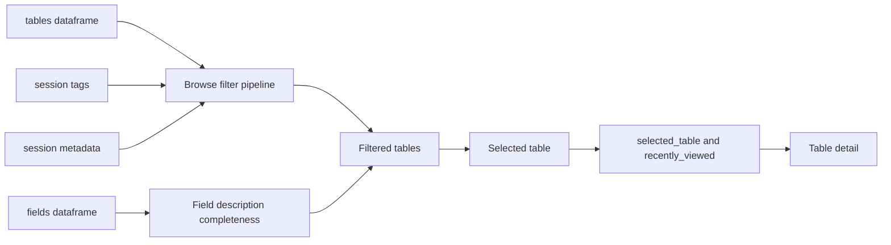

# Browse Stack

## Purpose

Browse lets users scan the table catalog by module, table name, tag, and certification status. It shows table-level completeness, tags, certification, owner, and truncated descriptions, then opens the selected table in the shared Detail route.

## Stack Diagrams

### High Level Stack Diagram



### Detail Level Stack Diagram



### Lineage / Data Flow Diagram




## High Level Stack

| Layer | Responsibility | Source |
|---|---|---|
| Page route | Handles both Browse and Detail in one route block. | `app.py:1889-1891` |
| Filter controls | Provides module, table-name, tag, and certification filters. | `app.py:1893-1912` |
| Filter logic | Applies selected filters to the `tables` dataframe. | `app.py:1914-1930` |
| Display shaping | Adds completeness, tags, certification, owner, and presentation columns. | `app.py:1932-1952` |
| Dataframe UI | Renders selectable table list with completeness progress column. | `app.py:1953-1963` |
| Detail handoff | Selected row sets `selected_table` and switches page to `detail`. | `app.py:1965-1968` |
| Downstream detail | Detail route renders when selected table exists. | `app.py:1971-1977` |

## High Level Flow

```text
User opens Browse
  -> app renders Browse route and filter controls
     app.py:1889-1912
  -> tables dataframe is filtered by module/name/tag/certification
     app.py:1914-1930
  -> display dataframe adds governance and completeness columns
     app.py:1932-1952
  -> user selects one row in st.dataframe
     app.py:1953-1963
  -> app sets selected_table and page = detail
     app.py:1965-1968
  -> same route block renders table detail
     app.py:1971 onward
```

## Detail Level Stack

### 1. Entry Point

| Detail | Source |
|---|---|
| Sidebar exposes Browse page key. | `app.py:1590-1594` |
| Browse and Detail share one `elif st.session_state.page in ("browse", "detail")` route block. | `app.py:1889` |
| Browse title renders only when current page is `browse`. | `app.py:1890-1891` |

### 2. Filter Controls

| Control | Behavior | Source |
|---|---|---|
| Module | Selectbox from `All modules` plus sorted unique `tables["module_name"]`; default comes from `st.session_state.browse_module`. | `app.py:1893-1902` |
| Table name | Text input initialized from `st.session_state.browse_filter`. | `app.py:1903-1906` |
| Tag | Selectbox from `All` plus configured `PREDEFINED_TAGS`. | `app.py:1907-1908` |
| Certification | Selectbox from `All` plus configured certification options except blank. | `app.py:1909-1912` |

### 3. Filter Logic

| Detail | Source |
|---|---|
| Filtering starts from a copy of the full `tables` dataframe. | `app.py:1914` |
| Module filter keeps only rows with the selected `module_name`. | `app.py:1915-1916` |
| Name filter performs case-insensitive contains against `sql_table_name`. | `app.py:1917-1920` |
| Tag filter keeps tables whose `st.session_state.tags[table]` contains the selected tag. | `app.py:1921-1923` |
| Certification filter keeps tables whose metadata certification matches the selected value. | `app.py:1924-1929` |
| Filtered table list is sorted by `sql_table_name` and index reset. | `app.py:1930` |

### 4. Display Dataframe

| Detail | Source |
|---|---|
| Caption shows filtered table count. | `app.py:1932` |
| Display starts with table name, prefix, module, description, and class name. | `app.py:1934-1936` |
| Completeness is mapped from `COMPLETENESS` by class name. | `app.py:1937`, `app.py:435-446` |
| Tags are joined from `st.session_state.tags`. | `app.py:1938-1940` |
| Certification and owner are mapped from `st.session_state.metadata`. | `app.py:1941-1946` |
| `class_name` is dropped after completeness mapping and columns are renamed for display. | `app.py:1947-1950` |
| Description is flattened and truncated to 100 characters. | `app.py:1951` |
| `st.dataframe` renders a progress column for English description completeness. | `app.py:1953-1963` |

### 5. Navigation to Detail

| Detail | Source |
|---|---|
| Dataframe selection mode is `single-row` and reruns on selection. | `app.py:1953-1963` |
| When a row is selected, selected table name comes from the filtered dataframe row. | `app.py:1965-1966` |
| Page is switched to `detail`. | `app.py:1967` |
| Detail rendering begins when `page == "detail"` and `selected_table` is set. | `app.py:1971` |
| Missing selected table shows an error. | `app.py:1972-1977` |

### 6. Related Navigation Sources

| Detail | Source |
|---|---|
| Home module cards set `browse_module` and navigate to Browse. | `app.py:1660-1669` |
| Home Recently Viewed buttons navigate directly to Detail. | `app.py:1671-1682` |
| `nav()` updates page, selected table, recently viewed, and reruns. | `app.py:1559-1569` |
| Detail route is highlighted as Browse in the sidebar. | `app.py:1600-1603` |

## Data Inputs

| Data | Required fields | Usage | Source |
|---|---|---|---|
| `tables` | `sql_table_name`, `module_name`, `module_prefix`, `class_description`, `class_name` | Filter options, filtered rows, display dataframe, detail handoff. | `app.py:1893-1936`, `app.py:1965-1979` |
| `COMPLETENESS` | class-to-percent mapping | English description progress column. | `app.py:1937`, `app.py:435-446` |
| `st.session_state.tags` | table tag list | Tag filtering and display. | `app.py:1921-1923`, `app.py:1938-1940` |
| `st.session_state.metadata` | certification and owner | Certification filtering and display. | `app.py:1924-1929`, `app.py:1941-1946` |
| Config constants | `PREDEFINED_TAGS`, `CERT_OPTIONS`, default browse module/filter | Filter option lists and default state. | `app.py:15`, `app.py:1486-1490`, `app.py:1907-1912` |

## Ownership

| Area | Owner file | Source |
|---|---|---|
| Browse route, filters, result table, row selection | `app.py` | `app.py:1889-1968` |
| Detail handoff and selected table validation | `app.py` | `app.py:1971-1977` |
| Completeness calculation | `app.py` | `app.py:435-446` |
| Tags and metadata persistence used by filters | `storage.py` | `storage.py:173-308` |

## Manual Verification

| Check | Steps | Expected result |
|---|---|---|
| Browse opens | Click Browse in sidebar. | Browse Tables page renders filters and table list. |
| Module filter | Select a module. | Table list contains only that module and count updates. |
| Name filter | Type part of a known table name. | Table list narrows case-insensitively. |
| Tag filter | Select a predefined tag known to exist. | Table list contains only tagged tables. |
| Certification filter | Select a certification known to exist. | Table list contains only matching certified/draft/deprecated/experimental tables. |
| Completeness column | Inspect table list. | EN Desc % renders as progress values from 0 to 100. |
| Row selection | Select a table row. | App switches to Detail for that table. |
| Home module navigation | Click a module card on Home. | Browse opens with that module selected. |

