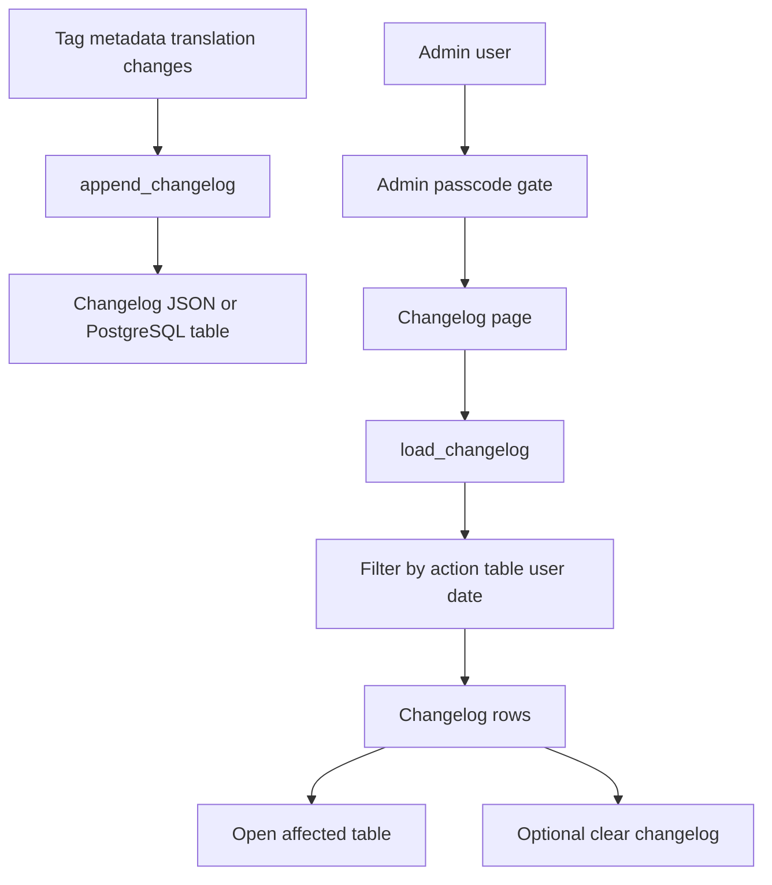
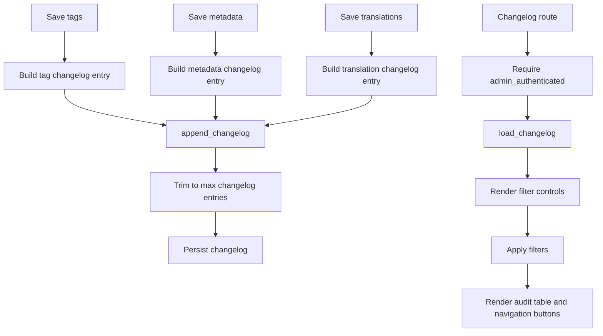
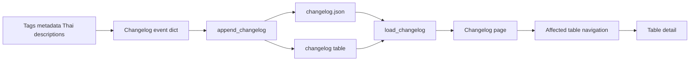

# Changelog Stack

## Purpose

Changelog is an admin-only audit page for user-maintained metadata actions such as Thai translation saves, tag changes, and metadata saves. It supports filtering by action, table, and free-text details, row navigation to table detail, and clearing all entries.

## Stack Diagrams

### High Level Stack Diagram



### Detail Level Stack Diagram



### Lineage / Data Flow Diagram




## High Level Stack

| Layer | Responsibility | Source |
|---|---|---|
| Event producers | Tag, metadata, and translation saves append changelog entries. | `app.py:2043-2044`, `app.py:2062-2063`, `app.py:2075-2076`, `app.py:2131-2133`, `app.py:2430-2435` |
| Storage | `load_changelog()`, `append_changelog()`, and `clear_changelog()` use file or PostgreSQL backend. | `storage.py:313-383`, `storage.py:482-493` |
| Admin gate | Changelog page requires admin authentication. | `app.py:3593-3596` |
| Filters | Filters entries by action, table, and free-text search. | `app.py:3603-3628` |
| Table UI | Renders filtered changelog rows and navigates selected valid table rows to detail. | `app.py:3630-3641` |
| Clear action | Clears all changelog entries and reruns. | `app.py:3643-3648` |

## High Level Flow

```text
User edits tags/metadata/translations
  -> append_changelog(action, table, details)
     app.py:2043-2044, app.py:2131-2133, app.py:2430-2435
Admin opens Changelog
  -> admin gate checks authentication
     app.py:3593-3596
  -> load_changelog() returns audit entries
     app.py:3603 -> storage.py:313-383
  -> filters reduce entries and table renders
     app.py:3608-3637
  -> row selection can navigate to table detail
     app.py:3638-3641
```

## Detail Level Stack

### 1. Event Producers

| Detail | Source |
|---|---|
| Predefined tag add appends `tag_added`. | `app.py:2043-2044` |
| Custom tag add appends `tag_added`. | `app.py:2062-2063` |
| Tag removal appends `tag_removed`. | `app.py:2075-2076` |
| Metadata save appends `metadata_saved` with certification/owner/frequency details. | `app.py:2131-2133` |
| Thai translation save appends `translation_saved` with saved count. | `app.py:2430-2435` |

### 2. Storage

| Detail | Source |
|---|---|
| `load_changelog()` switches by backend. | `storage.py:313-316` |
| `append_changelog()` switches by backend. | `storage.py:319-323` |
| PostgreSQL load returns latest rows up to `MAX_CHANGELOG_ENTRIES`. | `storage.py:326-346` |
| PostgreSQL append inserts action/table/details and prunes old entries. | `storage.py:349-369` |
| File append inserts newest entry at front and trims to limit. | `storage.py:372-383` |
| `clear_changelog()` truncates PostgreSQL table or writes empty JSON list. | `storage.py:482-493` |

### 3. Page and Filters

| Detail | Source |
|---|---|
| Changelog route starts when `page == "changelog"`. | `app.py:3593` |
| Unauthenticated users see admin gate and rendering stops. | `app.py:3594-3596` |
| Page title and audit description render. | `app.py:3597-3601` |
| Empty changelog shows info message. | `app.py:3603-3606` |
| Action filter options are unique actions plus `All`. | `app.py:3608-3612` |
| Table filter options are unique non-empty table names plus `All`. | `app.py:3613-3615` |
| Text search checks details and table string. | `app.py:3616-3626` |
| Filtered entry count is shown. | `app.py:3628` |

### 4. Table and Clear Behavior

| Detail | Source |
|---|---|
| Filtered log becomes dataframe with Timestamp, Action, Table, and Details columns. | `app.py:3630-3633` |
| Changelog dataframe supports single-row selection. | `app.py:3634-3637` |
| Selecting a row navigates to detail if table exists in `tables`. | `app.py:3638-3641` |
| Clear button calls `clear_changelog()`, shows success, and reruns. | `app.py:3643-3648` |

## Data Inputs

| Data | Required fields | Usage | Source |
|---|---|---|---|
| Changelog entries | `timestamp`, `action`, `table`, `details` | Filters, display table, row navigation. | `storage.py:313-383`, `app.py:3603-3641` |
| `tables` | `sql_table_name` | Validates row navigation target. | `app.py:3640-3641` |
| Session state | `admin_authenticated` | Admin gate. | `app.py:3593-3596` |

## Ownership

| Area | Owner file | Source |
|---|---|---|
| Changelog producers and UI | `app.py` | `app.py:2043-2044`, `app.py:2062-2063`, `app.py:2075-2076`, `app.py:2131-2133`, `app.py:2430-2435`, `app.py:3593-3648` |
| Changelog persistence and clearing | `storage.py` | `storage.py:313-383`, `storage.py:482-493` |
| Changelog retention limit | `config.py`, `config.toml` | `config.py:75-77`, `config.toml:29-31` |

## Manual Verification

| Check | Steps | Expected result |
|---|---|---|
| Admin gate | Open Changelog without admin mode. | Passcode gate blocks page. |
| Translation audit | Save Thai descriptions. | `translation_saved` entry appears. |
| Tag audit | Add and remove a tag. | `tag_added` and `tag_removed` entries appear. |
| Metadata audit | Save table metadata. | `metadata_saved` entry appears. |
| Filters | Filter by action/table/search text. | Changelog row count and table update. |
| Row navigation | Select a changelog row for an existing table. | Detail opens for that table. |
| Clear | Click clear changelog. | Entries are removed and empty message appears. |

