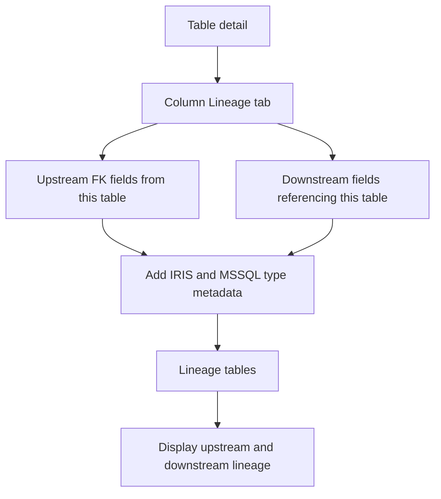
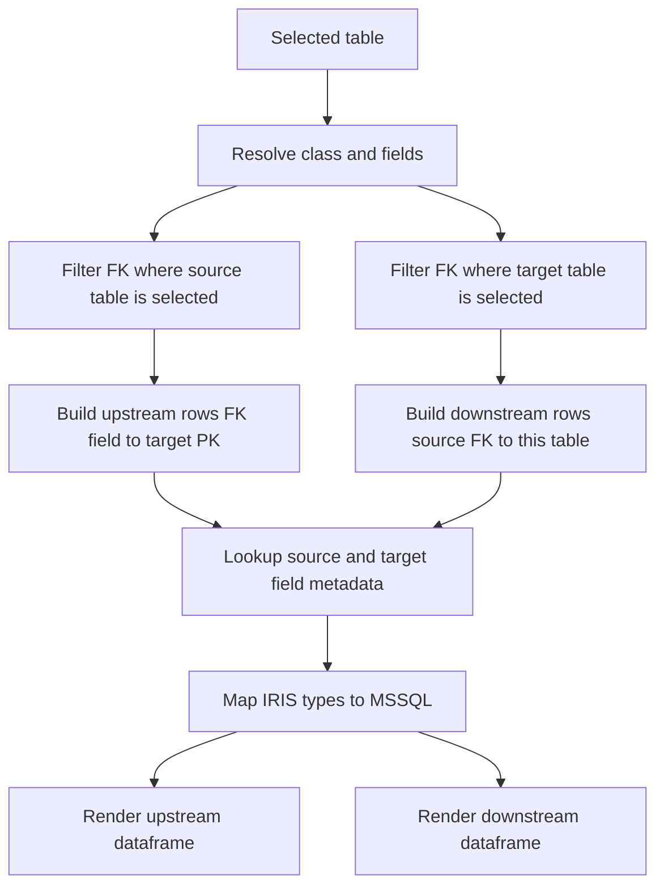
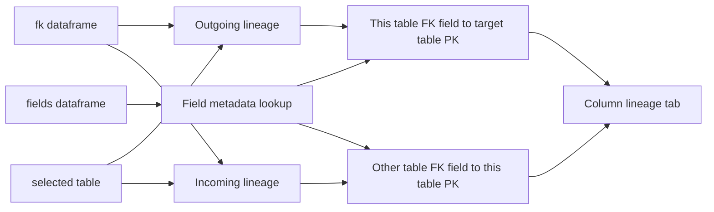

# Column Lineage Stack

## Purpose

The Column-level Lineage tab shows direct FK-based upstream and downstream field relationships for the selected table. Upstream lists fields in this table that reference target tables. Downstream lists fields in other tables that reference this table. It also provides a field type reference for IRIS-to-MSSQL type mapping.

## Stack Diagrams

### High Level Stack Diagram



### Detail Level Stack Diagram



### Lineage / Data Flow Diagram




## High Level Stack

| Layer | Responsibility | Source |
|---|---|---|
| Tab entry | Renders Column-level Lineage tab and description. | `app.py:2795-2801` |
| Upstream view | Lists outgoing FK fields from selected table to target table/PK. | `app.py:2803-2837` |
| Downstream view | Lists incoming FK fields from other tables to selected table/PK. | `app.py:2839-2875` |
| Type reference | Lists all selected-table fields with IRIS and MSSQL types. | `app.py:2877-2890` |
| Navigation | Selecting upstream/downstream rows opens related table detail. | `app.py:2831-2837`, `app.py:2869-2875` |

## High Level Flow

```text
User opens Lineage tab in table detail
  -> app uses precomputed resolved_fk and incoming
     app.py:2173-2175
  -> upstream column shows selected table outgoing FK fields
     app.py:2803-2837
  -> downstream column shows external fields pointing to selected table
     app.py:2839-2875
  -> type reference summarizes selected table field type mapping
     app.py:2877-2890
```

## Detail Level Stack

### 1. Entry Point

| Detail | Source |
|---|---|
| Lineage tab starts under `with tab_lineage`. | `app.py:2795` |
| Subheader and explanatory text define field-to-field FK paths. | `app.py:2796-2801` |
| Upstream and downstream sections are arranged in two columns. | `app.py:2803` |

### 2. Upstream / Outgoing FK

| Detail | Source |
|---|---|
| Upstream section is labeled `Upstream (Outgoing FK)`. | `app.py:2805-2808` |
| Empty `resolved_fk` shows `No outgoing FK relationships.` | `app.py:2810-2811` |
| For each resolved FK, source field falls back to `source_member_name` when SQL field is blank or `nan`. | `app.py:2813-2819` |
| Source field MSSQL type is resolved from `tbl_fields` and `iris_to_mssql()`. | `app.py:2820-2822` |
| Upstream rows include this field, MSSQL type, target table, target PK, and cardinality. | `app.py:2823-2830` |
| Upstream dataframe is selectable. | `app.py:2830-2835` |
| Selecting a row navigates to target table detail. | `app.py:2836-2837` |

### 3. Downstream / Incoming FK

| Detail | Source |
|---|---|
| Downstream section is labeled `Downstream (Incoming FK)`. | `app.py:2839-2842` |
| Empty `incoming` shows `No incoming FK relationships.` | `app.py:2844-2845` |
| Incoming source class is mapped to SQL table name through `tables`. | `app.py:2847-2850` |
| Source field falls back to `source_member_name` when SQL field is blank or `nan`. | `app.py:2851-2853` |
| Source field MSSQL type is resolved from global `fields` and `iris_to_mssql()`. | `app.py:2854-2859` |
| Downstream rows include source table, source field, MSSQL type, this PK, and cardinality. | `app.py:2860-2868` |
| Downstream dataframe is selectable. | `app.py:2868-2873` |
| Selecting a row navigates to source table detail. | `app.py:2874-2875` |

### 4. Type Reference

| Detail | Source |
|---|---|
| Type reference starts after a divider. | `app.py:2877-2880` |
| For each selected-table field, the tab shows field, IRIS type, and MSSQL type. | `app.py:2881-2889` |
| Type reference renders with `st.dataframe`. | `app.py:2890` |

## Data Inputs

| Data | Required fields | Usage | Source |
|---|---|---|---|
| `resolved_fk` | `source_sql_field_name`, `source_member_name`, `target_sql_table_name`, `target_pk_fields`, `relationship_cardinality` | Upstream lineage rows. | `app.py:2173-2174`, `app.py:2810-2837` |
| `incoming` | `source_class_name`, `source_sql_field_name`, `source_member_name`, `target_pk_fields`, `relationship_cardinality` | Downstream lineage rows. | `app.py:2175`, `app.py:2844-2875` |
| `tbl_fields` | `sql_field_name`, `member_type` | Upstream source type and type reference. | `app.py:2171-2172`, `app.py:2820-2822`, `app.py:2881-2889` |
| `fields` | `class_name`, `sql_field_name`, `member_type` | Downstream source type lookup. | `app.py:2854-2859` |
| `tables` | `class_name`, `sql_table_name` | Downstream source table lookup. | `app.py:2847-2850` |
| `iris_to_mssql()` | IRIS type string | MSSQL type display. | `app.py:787-826`, `app.py:2822`, `app.py:2859`, `app.py:2888` |

## Ownership

| Area | Owner file | Source |
|---|---|---|
| Column-level lineage tab UI | `app.py` | `app.py:2795-2890` |
| FK context setup | `app.py` | `app.py:2173-2175` |
| Type mapping | `app.py` | `app.py:787-826` |

## Manual Verification

| Check | Steps | Expected result |
|---|---|---|
| Upstream rows | Open Lineage tab for a table with outgoing FK. | Upstream table lists target table/PK and cardinality. |
| Upstream navigation | Select an upstream row. | Detail opens for target table. |
| Downstream rows | Open Lineage tab for a table referenced by other tables. | Downstream table lists source table/field and this PK. |
| Downstream navigation | Select a downstream row. | Detail opens for source table. |
| Empty states | Open a table with no outgoing or incoming FK. | Relevant info messages appear. |
| Type reference | Inspect bottom type reference table. | All selected table fields show IRIS and MSSQL type mapping. |

