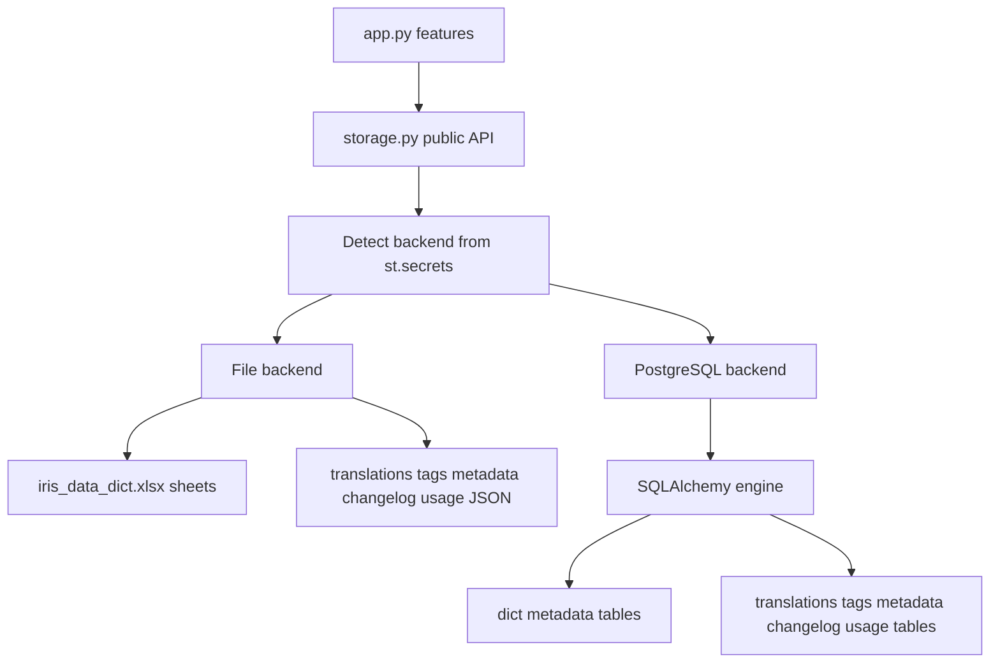
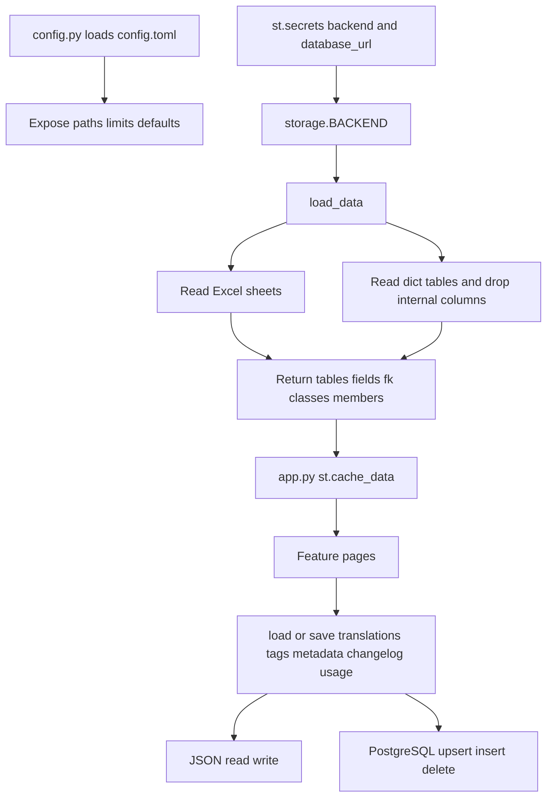
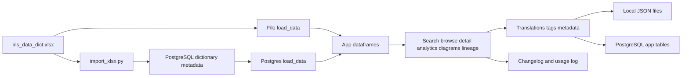

# Data Storage Stack

## Purpose

The data storage stack gives `app.py` one stable interface for dictionary data, user annotations, audit logs, and usage logs. It supports local file mode for development and PostgreSQL mode for shared deployment without changing feature code in the Streamlit app.

## Stack Diagrams

### High Level Stack Diagram



### Detail Level Stack Diagram



### Lineage / Data Flow Diagram




## High Level Stack

| Layer | Responsibility | Source |
|---|---|---|
| App imports | `app.py` imports storage load/save functions and the active backend name. | `app.py:25-32` |
| Cached dictionary load | Streamlit caches `load_data()` and assigns `tables`, `fields`, `fk`, `classes`, and `members`. | `app.py:429-432`, `app.py:1455-1459` |
| Session user data load | Translations, tags, and metadata are loaded into `st.session_state` once. | `app.py:1499-1506` |
| Config layer | `config.py` reads `config.toml` and exposes defaults for file paths, limits, UI defaults, and admin settings. | `config.py:31-52`, `config.py:55-119`, `config.toml:1-78` |
| Backend detection | `storage.py` reads `st.secrets["backend"]`, defaulting to file mode. | `storage.py:34-42` |
| File backend | Reads Excel sheets and persists runtime data to JSON files. | `storage.py:81-88`, `storage.py:461-477` |
| PostgreSQL backend | Reads dictionary data from `dict_*` tables and persists runtime data to app-owned tables. | `storage.py:48-65`, `storage.py:91-106`, `models.py:20-132` |
| Import workflow | `import_xlsx.py` imports workbook sheets into PostgreSQL `dict_*` tables. | `import_xlsx.py:32-39`, `import_xlsx.py:88-253` |

## High Level Flow

```text
Streamlit starts
  -> app imports config and storage functions
     app.py:11-32
  -> app caches dictionary data
     app.py:429-432 -> storage.py:70-78
  -> storage chooses file or PostgreSQL backend
     storage.py:34-42, storage.py:76-78
  -> file backend reads iris_data_dict.xlsx
     storage.py:81-88
  -> or PostgreSQL backend reads dict_* tables
     storage.py:91-106
  -> app loads user data into session state
     app.py:1499-1506
  -> app features read/write through storage helpers
     storage.py:111-508
```

## Detail Level Stack

### 1. Configuration Entry Point

| Detail | Source |
|---|---|
| `app.py` imports identity, source, limits, UI defaults, admin settings, and default session values from `config.py`. | `app.py:11-23` |
| `config.py` documents that secrets belong in `.streamlit/secrets.toml`, not committed config. | `config.py:1-13` |
| TOML loading uses stdlib `tomllib` or fallback `tomli`; missing parser/config returns empty config. | `config.py:19-38` |
| `_get()` resolves dot-notation config keys with per-key default fallbacks. | `config.py:44-52` |
| App identity and request-change URL come from `[app]` and `[app.links]`. | `config.py:55-63`, `config.toml:5-14` |
| Workbook path comes from `[data]`. | `config.py:65-66`, `config.toml:17-18` |
| Runtime JSON file paths come from `[storage]`. | `config.py:68-73`, `config.toml:21-26` |
| Capacity limits come from `[limits]`. | `config.py:75-80`, `config.toml:29-34` |
| UI defaults and metadata/admin option lists come from `[ui.*]`, `[defaults]`, `[tags]`, `[metadata]`, and `[admin]`. | `config.py:82-119`, `config.toml:37-78` |

### 2. Dictionary Data Loading

| Detail | Source |
|---|---|
| `app.py` imports `load_data` from `storage.py`. | `app.py:25-26` |
| `_cached_load_data()` wraps `storage.load_data()` with `st.cache_data`. | `app.py:429-432` |
| App startup assigns `tables`, `fields`, `fk`, `classes`, and `members`; load failures stop the app. | `app.py:1455-1459` |
| `storage.load_data()` returns the same five dataframe tuple for both backends. | `storage.py:70-78` |
| File backend opens `EXCEL_PATH` and parses `sql_tables`, `sql_fields`, `fk_relationships`, `classes`, and `members`. | `storage.py:81-88` |
| PostgreSQL backend reads `dict_tables`, `dict_fields`, `dict_fk`, `dict_classes`, and `dict_members`. | `storage.py:91-99` |
| PostgreSQL backend drops internal `id` and `imported_at` columns before returning dataframes to the app. | `storage.py:100-106` |

### 3. Backend Selection and Database Engine

| Detail | Source |
|---|---|
| `_detect_backend()` reads `st.secrets.get("backend", "file")` and falls back to `"file"` on any exception. | `storage.py:34-40` |
| Global `BACKEND` is set once from `_detect_backend()`. | `storage.py:42` |
| `_get_engine()` lazily creates and caches a SQLAlchemy engine. | `storage.py:46-65` |
| PostgreSQL connection URL is read from `st.secrets["database_url"]`. | `storage.py:52-56` |
| Engine options include pool size, overflow, pre-ping, and connect timeout. | `storage.py:56-62` |
| `init_db()` creates all SQLAlchemy-defined tables when backend is postgres. | `storage.py:498-508` |

### 4. Runtime User Data APIs

| Data | Public API | File backend | PostgreSQL backend | Source |
|---|---|---|---|---|
| Thai translations | `load_translations()`, `save_translations()` | JSON file at `TRANSLATIONS_PATH` | `translations` table | `storage.py:111-168` |
| Table tags | `load_tags()`, `save_tags()` | JSON file at `TAGS_PATH` | `table_tags` table | `storage.py:173-225` |
| Governance metadata | `load_metadata()`, `save_metadata()` | JSON file at `METADATA_PATH` | `table_metadata` table | `storage.py:230-308` |
| Changelog | `load_changelog()`, `append_changelog()`, `clear_changelog()` | JSON file at `CHANGELOG_PATH` | `changelog` table | `storage.py:313-383`, `storage.py:482-493` |
| Usage log | `load_usage_log()`, `log_event()` | JSON file at `USAGE_LOG_PATH` | `usage_log` table | `storage.py:388-456` |

### 5. File Backend Detail

| Detail | Source |
|---|---|
| Storage file paths are imported from `config.py`. | `storage.py:23-32` |
| `_file_load_json()` returns default data when the file is missing, invalid JSON, or unreadable. | `storage.py:461-468` |
| `_file_save_json()` writes UTF-8 JSON with `ensure_ascii=False` and two-space indentation. | `storage.py:471-474` |
| File save errors are shown as Streamlit warnings. | `storage.py:475-477` |
| Changelog file append inserts new entries at the front and trims to `MAX_CHANGELOG_ENTRIES`. | `storage.py:372-383` |
| Usage file logging appends events and keeps the latest `MAX_USAGE_LOG_ENTRIES`. | `storage.py:446-456` |

### 6. PostgreSQL Schema Detail

| Table group | Purpose | Source |
|---|---|---|
| `dict_tables` | Imported table metadata keyed by SQL table name. | `models.py:20-29` |
| `dict_fields` | Imported field definitions indexed by class. | `models.py:31-40` |
| `dict_fk` | Imported FK/object-reference relationships with source/target indexes. | `models.py:42-57` |
| `dict_classes` | Imported class declarations and database names. | `models.py:59-65` |
| `dict_members` | Imported class members, parameters, and triggers. | `models.py:67-77` |
| `translations` | Runtime Thai descriptions with composite primary key. | `models.py:81-94` |
| `table_tags` | Runtime table tags with composite primary key. | `models.py:96-104` |
| `table_metadata` | Runtime owner, steward, certification, frequency, and refresh metadata. | `models.py:106-116` |
| `changelog` | Runtime audit log. | `models.py:118-125` |
| `usage_log` | Runtime usage events with JSONB details. | `models.py:127-132` |

### 7. PostgreSQL Import Workflow

| Detail | Source |
|---|---|
| CLI supports `--db`, `--xlsx`, and `--drop`. | `import_xlsx.py:32-39` |
| Database URL priority is CLI `--db`, `.streamlit/secrets.toml`, then `DATABASE_URL`. | `import_xlsx.py:44-73` |
| `run()` verifies workbook existence and database connectivity. | `import_xlsx.py:88-107` |
| Import temporarily points `storage` at the target engine, then calls `storage.init_db()`. | `import_xlsx.py:109-117` |
| `--drop` truncates only `dict_*` tables, not runtime user data tables. | `import_xlsx.py:119-125` |
| Workbook sheets are parsed into five dataframes. | `import_xlsx.py:127-138` |
| `dict_tables` and `dict_classes` use generic upsert. | `import_xlsx.py:140-155`, `import_xlsx.py:213-226`, `import_xlsx.py:258` |
| `dict_fields`, `dict_fk`, and `dict_members` are truncated and reinserted. | `import_xlsx.py:157-211`, `import_xlsx.py:228-251` |

## Data Inputs

| Data | Required fields | Usage | Source |
|---|---|---|---|
| `iris_data_dict.xlsx` / `sql_tables` | `sql_table_name`, `class_name`, `module_name`, `module_prefix`, `class_description` | Main table catalog and module grouping. | `storage.py:83`, `models.py:20-29`, `import_xlsx.py:140-155` |
| `iris_data_dict.xlsx` / `sql_fields` | `class_name`, `sql_field_name`, `member_type`, `description`, `member_order` | Schema, search, completeness, export, lineage enrichment. | `storage.py:84`, `models.py:31-40`, `import_xlsx.py:157-180` |
| `iris_data_dict.xlsx` / `fk_relationships` | Source/target table and field metadata, resolve status, cardinality, evidence | FK diagrams, lineage, analytics, search filters. | `storage.py:85`, `models.py:42-57`, `import_xlsx.py:182-211` |
| `iris_data_dict.xlsx` / `classes` | `class_name`, `class_decl`, `db` | Storage metadata and class declaration context. | `storage.py:86`, `models.py:59-65`, `import_xlsx.py:213-226` |
| `iris_data_dict.xlsx` / `members` | `class_name`, `member_name`, `member_kind`, `member_type`, `member_decl`, `description` | Parameters, triggers, and class member detail. | `storage.py:87`, `models.py:67-77`, `import_xlsx.py:228-251` |
| Runtime JSON or PostgreSQL app tables | Translation/tag/metadata/changelog/usage structures | User annotations, governance, audit, analytics. | `storage.py:111-508`, `models.py:81-132` |

## Ownership

| Area | Owner file | Source |
|---|---|---|
| Runtime feature usage of storage APIs | `app.py` | `app.py:25-32`, `app.py:1455-1506`, `app.py:1511`, `app.py:1576-1582` |
| Config defaults and committed settings | `config.py`, `config.toml` | `config.py:31-119`, `config.toml:1-78` |
| Backend abstraction and read/write helpers | `storage.py` | `storage.py:34-508` |
| PostgreSQL table definitions | `models.py` | `models.py:16-132` |
| Workbook-to-PostgreSQL import | `import_xlsx.py` | `import_xlsx.py:32-253` |

## Manual Verification

| Check | Steps | Expected result |
|---|---|---|
| File backend starts | Ensure no `backend = "postgres"` secret is active, then run `streamlit run app.py`. | App loads `iris_data_dict.xlsx`, sidebar shows `Backend: file`, and core pages render. |
| Dictionary data loads | Open Home page after startup. | Tables, fields, relationships, and modules metrics are nonzero when workbook data exists. |
| Runtime JSON fallback | Temporarily move a local runtime JSON file aside in a disposable copy of the repo and start the app. | App uses default empty structure and does not crash. |
| PostgreSQL schema import | In a disposable database, run `python import_xlsx.py --db <url> --drop`. | `dict_*` tables are populated and runtime user tables are preserved. |
| PostgreSQL backend starts | Configure `.streamlit/secrets.toml` with `backend = "postgres"` and `database_url`, then run the app. | App loads data from `dict_*` tables and sidebar shows `Backend: postgres`. |
| Usage logging is non-blocking | Navigate between pages. | App remains responsive even if logging fails; usage events are written when storage is available. |

