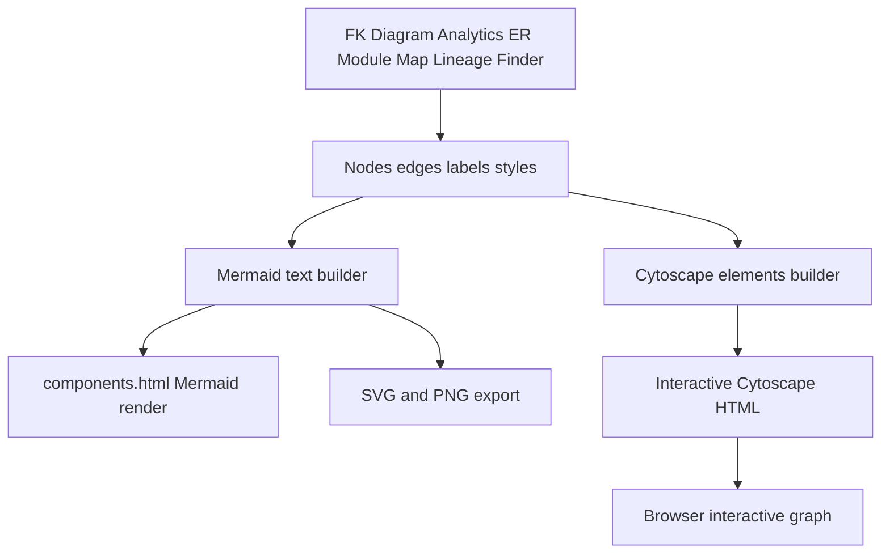
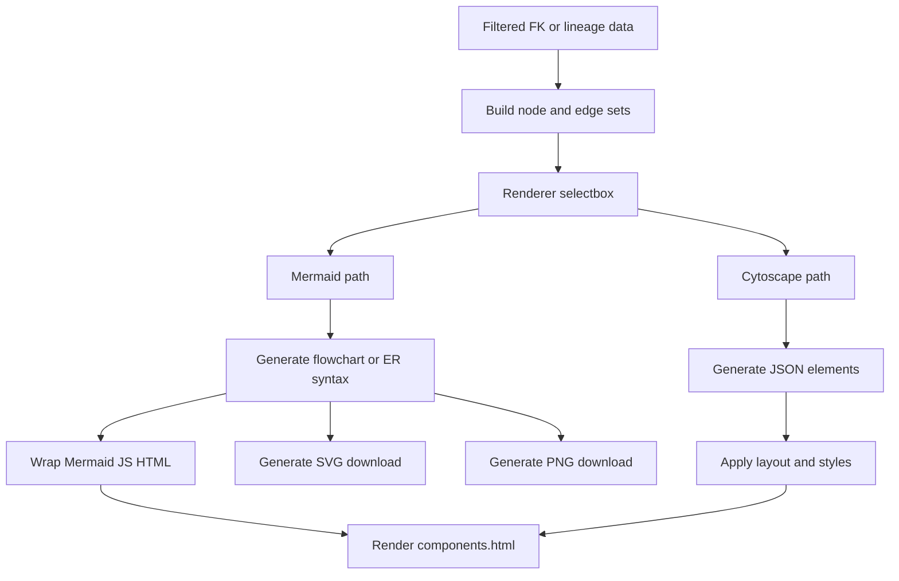
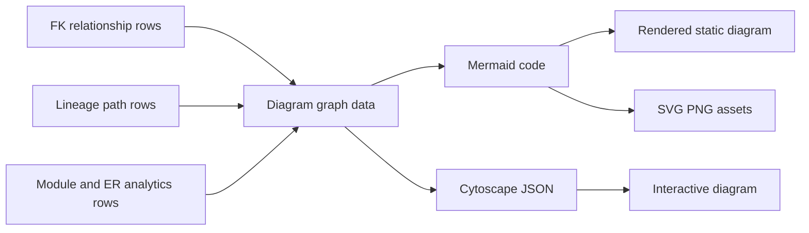

# Diagram Rendering Stack

## Purpose

Diagram rendering is shared across module dependency diagrams, table ER diagrams, per-table FK diagrams, and analytics ER diagrams. The app supports Mermaid static diagrams with SVG/PNG export and Cytoscape interactive diagrams with drag, zoom/pan, and clickable field details.

## Stack Diagrams

### High Level Stack Diagram



### Detail Level Stack Diagram



### Lineage / Data Flow Diagram




## High Level Stack

| Layer | Responsibility | Source |
|---|---|---|
| Mermaid wrapper | Wraps Mermaid code in HTML, theme settings, render script, and SVG/PNG export buttons. | `app.py:601-682` |
| Module Mermaid | Converts module dependency counts into Mermaid flowchart HTML and raw code. | `app.py:685-759` |
| ER Mermaid | Converts selected table set and FK edges into Mermaid `erDiagram` HTML and raw code. | `app.py:828-1016` |
| Cytoscape | Converts selected table set and FK edges into interactive Cytoscape.js HTML. | `app.py:1019-1440` |
| Error fallback | Returns user-visible Cytoscape error HTML. | `app.py:1442-1448` |
| Feature consumers | Analytics, FK Diagram tab, and ER Diagram tab call these helpers. | `app.py:3158-3167`, `app.py:2676-2687`, `app.py:2711-2791`, `app.py:3416-3440` |

## High Level Flow

```text
Feature chooses diagram scope and renderer
  -> module dependency calls build_module_mermaid()
     app.py:3158-3167
  -> ER/FK Mermaid calls build_er_mermaid()
     app.py:2711-2791, app.py:3429-3440
  -> interactive ER/FK calls build_cytoscape_html()
     app.py:2676-2687, app.py:3416-3428
  -> helpers return HTML for components.html() and raw Mermaid where applicable
     app.py:601-1448
```

## Detail Level Stack

### 1. Mermaid HTML Wrapper

| Detail | Source |
|---|---|
| `_module_mermaid_html()` reads theme colors from `_theme()`. | `app.py:601-603` |
| Mermaid code is escaped for JavaScript template literal use. | `app.py:603` |
| HTML includes Mermaid CDN script. | `app.py:623` |
| Mermaid is initialized with app theme and loose security. | `app.py:625-629` |
| Render function writes SVG to `#diagram` and shows export buttons. | `app.py:630-647` |
| SVG export creates an SVG blob and downloads `module_dependency.svg`. | `app.py:648-654` |
| PNG export draws SVG to a scaled canvas and downloads `module_dependency.png`. | `app.py:655-680` |

### 2. Module Mermaid Builder

| Detail | Source |
|---|---|
| `build_module_mermaid()` accepts filtered dependency counts, direction, bidirectional-collapse flag, and optional center module. | `app.py:685-690` |
| Empty dependency data returns a no-data flowchart. | `app.py:701-703` |
| Module prefix and table count maps come from global `tables`. | `app.py:705-706` |
| Edges can collapse A-to-B and B-to-A into one bidirectional edge. | `app.py:710-734` |
| Nodes display module prefix, module name, and table count. | `app.py:735-744` |
| Edges are labeled with reference counts. | `app.py:745-749` |
| Center module can be highlighted with custom style. | `app.py:751-756` |
| Function returns wrapped HTML and raw Mermaid code. | `app.py:758-759` |

### 3. ER Mermaid Builder

| Detail | Source |
|---|---|
| `build_er_mermaid()` accepts table names, field display flag, max fields, cross-module expansion, and layout direction. | `app.py:828-834` |
| Resolved FK rows are the edge source. | `app.py:846-849` |
| Cross-module mode pulls in target tables referenced by primary tables. | `app.py:851-860` |
| Edges are limited to relationships where both ends are in `all_tables`. | `app.py:862-867` |
| Entity definitions optionally include field rows, simplified types, FK markers, and truncated descriptions. | `app.py:869-900` |
| Relationship lines deduplicate by source/target/field and choose arrow by cardinality. | `app.py:902-920` |
| HTML includes Mermaid ER config, SVG/PNG export buttons, and error display. | `app.py:921-1004` |
| Builder returns fallback HTML plus error code on exception. | `app.py:1006-1016` |

### 4. Cytoscape Builder

| Detail | Source |
|---|---|
| `build_cytoscape_html()` accepts table names, field display flag, max fields, cross-module expansion, center table, and height. | `app.py:1019-1026` |
| Resolved FK rows define edges, with optional cross-module target expansion. | `app.py:1037-1055` |
| Table-to-class and table-to-module maps come from global `tables`. | `app.py:1057-1058` |
| Module colors are assigned from a fixed palette. | `app.py:1060-1068` |
| `_node_svg()` builds SVG card node backgrounds when fields are shown. | `app.py:1070-1132` |
| Node list includes module, color, field list, class name, center flag, and optional SVG style. | `app.py:1134-1197` |
| Edge list deduplicates by source/target/field and includes label/cardinality. | `app.py:1199-1221` |
| Cytoscape layout spacing changes when field-card nodes are enabled. | `app.py:1221-1228` |
| `_cytoscape_error_html()` returns themed fallback error markup. | `app.py:1442-1448` |

### 5. Consumers

| Consumer | Renderer use | Source |
|---|---|---|
| Analytics Module Dependency | `build_module_mermaid()` plus raw code expander. | `app.py:3158-3167` |
| Table FK Diagram Cytoscape | `build_cytoscape_html()` with fallback. | `app.py:2676-2687` |
| Table FK Diagram Mermaid | `build_er_mermaid()` in split or single mode. | `app.py:2711-2791` |
| Analytics ER Diagram Cytoscape | `build_cytoscape_html()` with fallback. | `app.py:3416-3428` |
| Analytics ER Diagram Mermaid | `build_er_mermaid()` plus raw code expander. | `app.py:3429-3440` |

## Data Inputs

| Data | Required fields | Usage | Source |
|---|---|---|---|
| `DEP_COUNTS` | `source_module`, `target_module`, `count` | Module flowchart. | `app.py:685-759`, `app.py:3158-3167` |
| `tables` | `sql_table_name`, `class_name`, `module_name`, `module_prefix` | Module labels, ER nodes, Cytoscape modules/classes. | `app.py:705-706`, `app.py:869-881`, `app.py:1057-1058` |
| `fields` | `class_name`, `sql_field_name`, `member_type`, `description`, `member_order` | Mermaid/Cytoscape field rows. | `app.py:881-900`, `app.py:1146-1165` |
| `fk` | `resolve_status`, `source_sql_table_name`, `target_sql_table_name`, `source_sql_field_name`, `relationship_cardinality` | ER/Cytoscape edges. | `app.py:846-867`, `app.py:1037-1055`, `app.py:1199-1221` |
| Theme tokens | background, text, card, border, Mermaid theme | HTML styling and export background. | `app.py:78-92`, `app.py:601-682`, `app.py:925-1004` |

## Ownership

| Area | Owner file | Source |
|---|---|---|
| Mermaid HTML/export wrapper | `app.py` | `app.py:601-682` |
| Module dependency Mermaid | `app.py` | `app.py:685-759` |
| ER Mermaid | `app.py` | `app.py:828-1016` |
| Cytoscape HTML | `app.py` | `app.py:1019-1448` |
| Diagram feature consumers | `app.py` | `app.py:2441-2791`, `app.py:3028-3442` |

## Manual Verification

| Check | Steps | Expected result |
|---|---|---|
| Module Mermaid | Open Analytics > Module Dependency Map. | Flowchart renders and raw Mermaid is available. |
| Mermaid export | Click SVG/PNG export buttons in a Mermaid diagram iframe. | Browser downloads diagram image. |
| ER Mermaid | Open FK Diagram or Analytics ER with Mermaid renderer. | Diagram renders with chosen scope and layout. |
| Cytoscape | Switch FK/ER renderer to Interactive. | Nodes and edges render interactively. |
| Field cards | Enable Show fields. | Nodes include field rows and FK markers up to max fields. |
| Error fallback | Force invalid diagram data in a disposable debug branch. | Fallback error HTML appears instead of crashing app. |

