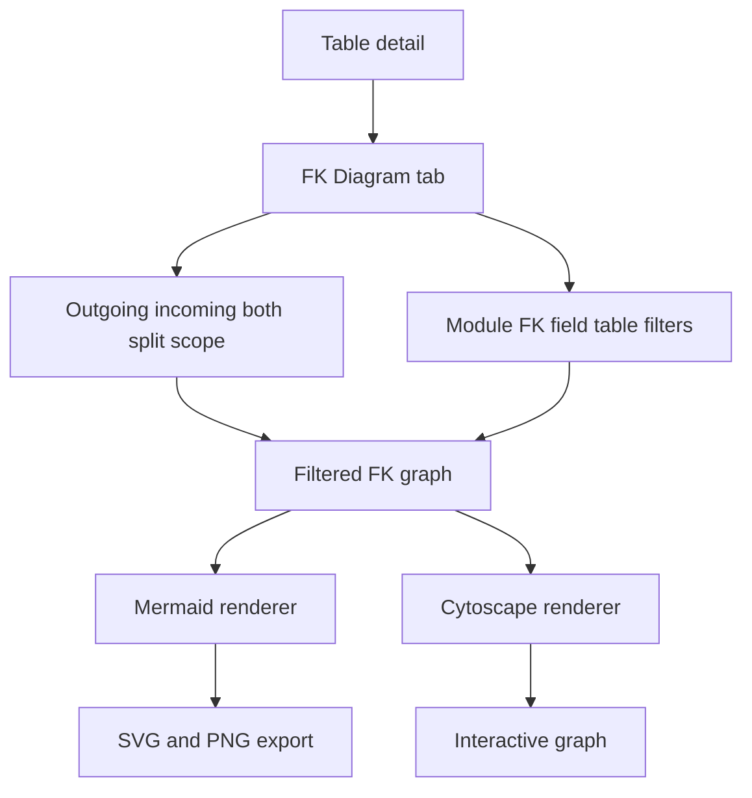
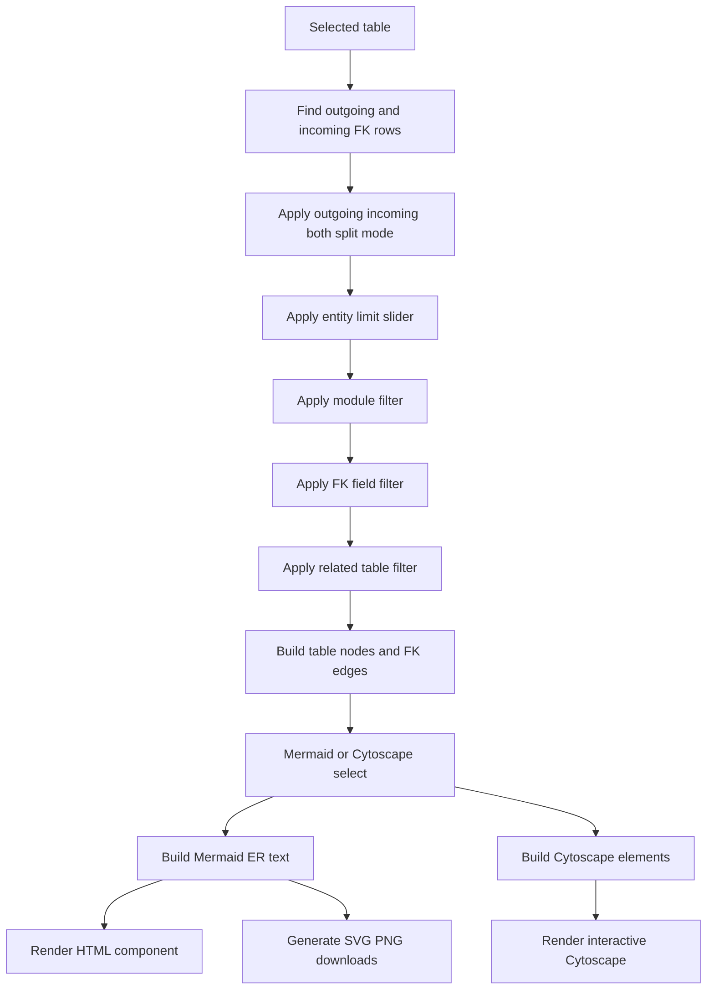
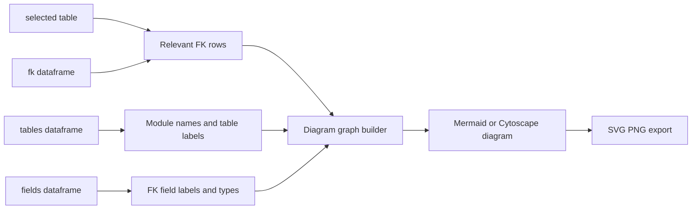

# FK Diagram Stack

## Purpose

The FK Diagram tab visualizes resolved foreign-key relationships around the selected table. It supports Mermaid and Cytoscape renderers, outgoing/incoming/split views, field/table/module filters, entity limits, optional field display, and raw Mermaid output.

## Stack Diagrams

### High Level Stack Diagram



### Detail Level Stack Diagram



### Lineage / Data Flow Diagram




## High Level Stack

| Layer | Responsibility | Source |
|---|---|---|
| Tab entry | Renders FK Diagram tab and introductory text. | `app.py:2441-2446` |
| Relationship discovery | Builds outgoing and incoming neighbor table lists from resolved FK rows. | `app.py:2448-2458` |
| Controls | Captures renderer, direction/include mode, show fields, layout, max entities, module/field/table filters, and cross-module toggle. | `app.py:2474-2581` |
| Filter helpers | Applies module, FK-field, and table filters. | `app.py:2583-2638` |
| Interactive rendering | Builds Cytoscape HTML and fallback error HTML. | `app.py:2651-2687`, `app.py:1019`, `app.py:1442` |
| Split Mermaid rendering | Renders outgoing and incoming Mermaid diagrams side by side. | `app.py:2689-2746` |
| Single Mermaid rendering | Renders outgoing-only, incoming-only, or combined Mermaid diagram. | `app.py:2748-2791` |

## High Level Flow

```text
User opens FK Diagram tab
  -> app finds resolved outgoing and incoming FK neighbors
     app.py:2448-2458
  -> user sets renderer, include mode, field/table/module filters
     app.py:2474-2581
  -> app applies filters and updates counts
     app.py:2583-2649
  -> Cytoscape renderer builds interactive HTML
     app.py:2651-2687
  -> or Mermaid renderer builds split/single diagrams and raw code
     app.py:2689-2791
```

## Detail Level Stack

### 1. Relationship Discovery

| Detail | Source |
|---|---|
| FK Diagram tab starts under `with tab_fk_er`. | `app.py:2441` |
| Only resolved FK rows are considered. | `app.py:2448` |
| Outgoing neighbors are target tables for resolved FK rows sourced from selected table with non-empty source field. | `app.py:2450-2453` |
| Incoming neighbors are source tables for resolved FK rows targeting selected table with non-empty source field. | `app.py:2455-2458` |
| FK field filter options include fields from outgoing and incoming relationships. | `app.py:2460-2470` |
| Table filter options are all FK neighbor tables. | `app.py:2471-2472` |

### 2. Controls

| Control | Behavior | Source |
|---|---|---|
| Renderer | Selects Mermaid static or Interactive Cytoscape. | `app.py:2474-2482` |
| Show | Selects outgoing+incoming, outgoing only, incoming only, or split view. | `app.py:2483-2497` |
| Show fields | Enables field display and max fields/table input. | `app.py:2498-2506` |
| Layout | Selects Mermaid LR/TB layout; disabled for Cytoscape. | `app.py:2507-2514` |
| Max entities | Limits diagram node count. | `app.py:2515-2520` |
| Module filter | Keeps only selected modules while always keeping center table. | `app.py:2522-2546` |
| FK field filter | Keeps links involving selected FK fields. | `app.py:2547-2558` |
| Cross-module refs | Includes neighbor cross-module refs for Mermaid only. | `app.py:2559-2569` |
| Table filter | Pins diagram to selected neighbor tables. | `app.py:2571-2581` |

### 3. Filter Logic

| Detail | Source |
|---|---|
| `_apply_module_filter()` keeps center table and selected module neighbors. | `app.py:2583-2590` |
| `_apply_fk_field_filter()` computes allowed outgoing/incoming neighbors from selected source field names. | `app.py:2592-2612` |
| `_apply_table_filter()` keeps explicitly selected neighbor tables. | `app.py:2614-2622` |
| Field and table filters use OR logic when both are active. | `app.py:2624-2638` |
| Caption shows current outgoing/incoming counts plus active filter labels. | `app.py:2640-2649` |

### 4. Renderers

| Detail | Source |
|---|---|
| Cytoscape candidate tables include center, filtered outgoing, and filtered incoming tables. | `app.py:2651-2656` |
| Cytoscape path truncates candidates to max entities and warns when truncated. | `app.py:2657-2672` |
| Cytoscape path shows no-relationship info when only center table remains. | `app.py:2673-2674` |
| Cytoscape HTML is built with `build_cytoscape_html()`. | `app.py:2676-2685`, `app.py:1019` |
| Cytoscape failures render `_cytoscape_error_html()`. | `app.py:2686-2687`, `app.py:1442` |
| Split Mermaid renders outgoing and incoming diagrams in two columns. | `app.py:2689-2746` |
| Single Mermaid chooses candidate pool from include mode. | `app.py:2748-2755` |
| Single Mermaid applies module filter, truncates by entity limit, and warns when truncated. | `app.py:2757-2777` |
| Mermaid diagrams are generated by `build_er_mermaid()` and rendered with `components.html`. | `app.py:2711-2718`, `app.py:2737-2744`, `app.py:2782-2789`, `app.py:828` |
| Raw Mermaid code is exposed in expanders. | `app.py:2719-2720`, `app.py:2745-2746`, `app.py:2790-2791` |

## Data Inputs

| Data | Required fields | Usage | Source |
|---|---|---|---|
| `fk` / `fk_res_all` | `resolve_status`, `source_sql_table_name`, `target_sql_table_name`, `source_sql_field_name` | Relationship discovery and filters. | `app.py:2448-2472`, `app.py:2592-2612` |
| `tables` | `sql_table_name`, `module_name` | Module filter map. | `app.py:2522-2533` |
| Config diagram constants | max fields/entities/defaults/steps | Control defaults and bounds. | `config.py:82-88`, `app.py:2502-2520` |
| `tbl_name` | selected table | Center table for filters/renderers. | `app.py:1972`, `app.py:2448-2791` |

## Ownership

| Area | Owner file | Source |
|---|---|---|
| FK Diagram tab UI and filtering | `app.py` | `app.py:2441-2791` |
| Mermaid ER generation | `app.py` | `app.py:828-1016` |
| Cytoscape generation | `app.py` | `app.py:1019-1440` |
| Cytoscape fallback | `app.py` | `app.py:1442-1448` |
| Diagram defaults | `config.py`, `config.toml` | `config.py:82-88`, `config.toml:37-43` |

## Manual Verification

| Check | Steps | Expected result |
|---|---|---|
| Mermaid combined | Open FK Diagram with default Mermaid and outgoing+incoming. | Diagram renders or no-relationship info appears. |
| Direction modes | Switch outgoing only/incoming only/split view. | Candidate diagram changes accordingly. |
| Cytoscape | Select Interactive renderer. | Interactive diagram renders; split view is disabled. |
| Field/table filters | Select an FK field or neighbor table. | Counts and diagram narrow to selected relationships. |
| Module filter | Select a module. | Neighbor tables outside module are hidden except center. |
| Entity limit | Lower max entities on a high-degree table. | Truncation warning appears. |
| Raw Mermaid | Open raw code expander. | Mermaid source is visible for copy/export workflows. |

