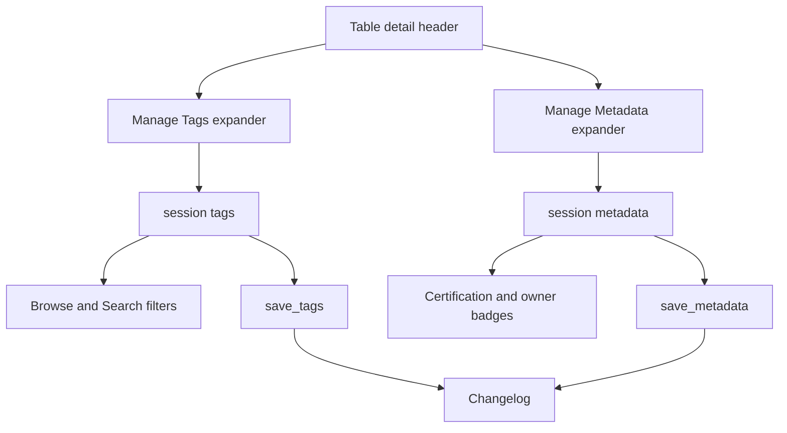
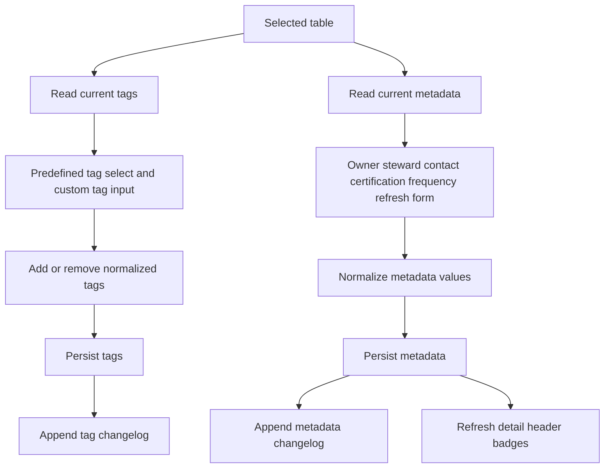
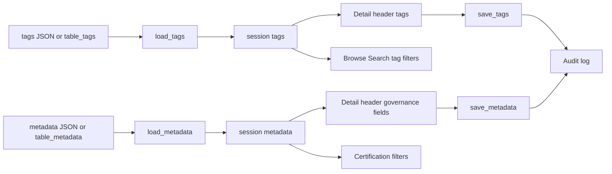

# Governance Metadata Stack

## Purpose

Governance metadata covers table tags, custom tags, certification status, owner, steward, contact, update frequency, and last refresh date. These values are shown in table headers and used by Browse/Search filters.

## Stack Diagrams

### High Level Stack Diagram



### Detail Level Stack Diagram



### Lineage / Data Flow Diagram




## High Level Stack

| Layer | Responsibility | Source |
|---|---|---|
| Startup state | Loads tags and metadata into `st.session_state`. | `app.py:1502-1506` |
| Header badges | Renders tags and certification in table detail header. | `app.py:1992-2003` |
| Metadata row | Renders owner, steward, contact, update frequency, and last refresh. | `app.py:2005-2023` |
| Tag editor | Adds/removes predefined and custom tags. | `app.py:2027-2079` |
| Metadata editor | Edits owner/steward/contact/certification/frequency/refresh fields. | `app.py:2081-2135` |
| Storage | Persists tags/metadata and writes changelog entries. | `storage.py:173-308`, `storage.py:313-383` |
| Filter consumers | Browse and Search use tags/certification/owner. | `app.py:1760-1772`, `app.py:1848-1853`, `app.py:1907-1929`, `app.py:1938-1946` |

## High Level Flow

```text
App starts
  -> tags and metadata load into session state
     app.py:1502-1506
User opens table detail
  -> header renders current tags and metadata
     app.py:1992-2023
  -> user edits tags or metadata
     app.py:2027-2135
  -> storage persists changes and changelog records audit
     storage.py:173-383
Browse/Search consume saved governance metadata
  -> app.py:1760-1772, app.py:1907-1946
```

## Detail Level Stack

### 1. Display

| Detail | Source |
|---|---|
| Tag colors are defined in `TAG_COLORS`. | `app.py:59-65` |
| Certification colors are defined in `CERT_COLORS`. | `app.py:67-72` |
| Header reads current table tags from session state. | `app.py:1992-1994` |
| Each tag renders as a badge class from `TAG_COLORS` or default badge. | `app.py:1994-1997` |
| Header reads current table metadata from session state. | `app.py:1998` |
| Certification renders as a colored badge when present. | `app.py:1999-2003` |
| Owner, steward, contact, update frequency, and last refresh render when present. | `app.py:2005-2023` |

### 2. Tag Management

| Detail | Source |
|---|---|
| Manage Tags expander contains predefined and custom tag controls. | `app.py:2027-2028` |
| Predefined tag dropdown excludes already assigned tags. | `app.py:2029-2036` |
| Add predefined tag updates session state, saves tags, appends `tag_added`, and reruns. | `app.py:2037-2045` |
| Custom tag input uses configured max length and placeholder examples. | `app.py:2046-2054` |
| Custom tag normalization strips, lowercases, and replaces spaces with hyphens. | `app.py:2055-2058` |
| Add custom tag saves/appends/reruns; duplicate custom tag shows warning. | `app.py:2059-2066` |
| Existing tags render with remove buttons. | `app.py:2067-2079` |
| Removing a tag updates session state, saves tags, appends `tag_removed`, and reruns. | `app.py:2072-2077` |

### 3. Metadata Management

| Detail | Source |
|---|---|
| Manage Metadata expander reads current metadata for selected table. | `app.py:2081-2084` |
| Left column captures owner, steward, and contact text. | `app.py:2085-2100` |
| Right column captures certification, update frequency, and last refresh. | `app.py:2101-2118` |
| Certification and frequency selectboxes preserve current values when configured. | `app.py:2102-2112` |
| Save Metadata builds a dict, strips text fields, and removes empty values. | `app.py:2119-2129` |
| Save persists metadata, appends `metadata_saved`, shows success, and reruns. | `app.py:2130-2135` |

### 4. Storage and Consumers

| Detail | Source |
|---|---|
| Tags load/save public APIs switch between file and PostgreSQL backend. | `storage.py:173-183` |
| PostgreSQL tags read `table_tags` ordered by `added_at`. | `storage.py:186-198` |
| PostgreSQL tag save replaces tags for tables present in the payload. | `storage.py:201-225` |
| Metadata load/save public APIs switch between file and PostgreSQL backend. | `storage.py:230-240` |
| PostgreSQL metadata load returns non-empty metadata keys per table. | `storage.py:243-269` |
| PostgreSQL metadata save upserts by table name. | `storage.py:272-308` |
| Browse tag/certification filters use session tags and metadata. | `app.py:1907-1929` |
| Browse display includes tags, certification, and owner. | `app.py:1938-1946` |
| Search advanced filters use certification and tags. | `app.py:1760-1772` |

## Data Inputs

| Data | Required fields | Usage | Source |
|---|---|---|---|
| `PREDEFINED_TAGS` | configured tag list | Tag dropdowns and filters. | `config.py:103-107`, `app.py:2032-2035`, `app.py:1907-1908` |
| `CERT_OPTIONS` | configured certification list | Metadata editor and filters. | `config.py:109-112`, `app.py:2102-2107`, `app.py:1910-1912` |
| `UPDATE_FREQ_OPTIONS` | configured frequency list | Metadata editor. | `config.py:113-115`, `app.py:2108-2112` |
| `st.session_state.tags` | `{table: [tags]}` | Header, editor, Browse/Search filters. | `app.py:1502-1503`, `app.py:1992-2079`, `app.py:1767-1772`, `app.py:1921-1923` |
| `st.session_state.metadata` | `{table: metadata}` | Header, editor, Browse/Search filters. | `app.py:1505-1506`, `app.py:1998-2135`, `app.py:1760-1765`, `app.py:1924-1929` |

## Ownership

| Area | Owner file | Source |
|---|---|---|
| Governance UI in table detail | `app.py` | `app.py:1992-2135` |
| Governance filter consumers | `app.py` | `app.py:1760-1772`, `app.py:1907-1946` |
| Tags persistence | `storage.py` | `storage.py:173-225` |
| Metadata persistence | `storage.py` | `storage.py:230-308` |
| Changelog persistence | `storage.py` | `storage.py:313-383` |
| Option defaults | `config.py`, `config.toml` | `config.py:103-119`, `config.toml:61-78` |

## Manual Verification

| Check | Steps | Expected result |
|---|---|---|
| Add predefined tag | Open detail, add a predefined tag. | Badge appears, persists after rerun, and changelog records `tag_added`. |
| Add custom tag | Add `Patient Data` as custom tag. | Saved tag is normalized to `patient-data`. |
| Remove tag | Remove an existing tag. | Badge disappears and changelog records `tag_removed`. |
| Save metadata | Fill owner/certification/frequency and save. | Header metadata row updates and persists. |
| Browse filters | Filter Browse by saved tag/certification. | Table appears in matching filtered results. |
| Search filters | Use advanced Search tag/certification filters. | Matching table appears in Search results. |

