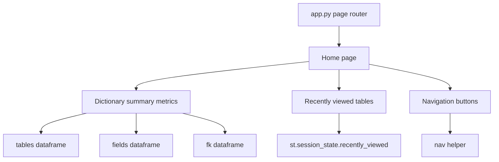
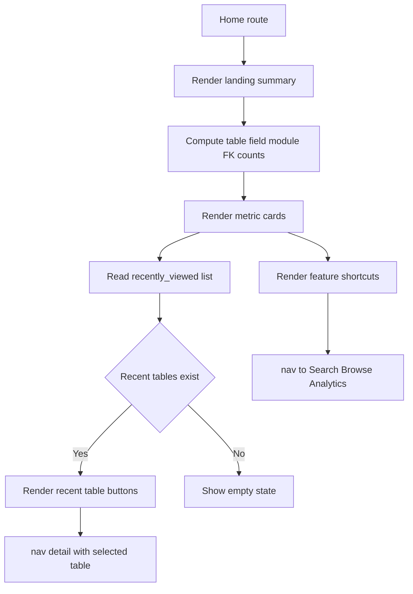
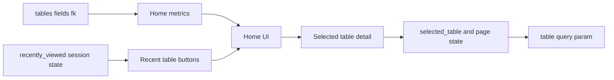

# Home Stack

## Purpose

Home is the app landing page. It gives users a quick summary of dictionary size, module entry points into Browse, and Recently Viewed shortcuts back to table detail pages.

## Stack Diagrams

### High Level Stack Diagram



### Detail Level Stack Diagram



### Lineage / Data Flow Diagram




## High Level Stack

| Layer | Responsibility | Source |
|---|---|---|
| Page route | Renders Home when `st.session_state.page == "home"`. | `app.py:1646-1651` |
| Summary metrics | Shows counts for tables, fields, relationships, and modules. | `app.py:1653-1657` |
| Module cards | Shows module cards from `MODULE_SUMMARY` and routes selected modules to Browse. | `app.py:1659-1669` |
| Recently Viewed | Shows recent table shortcuts from session state. | `app.py:1671-1682` |
| Navigation state | `nav()` and deep links maintain `recently_viewed` and selected table state. | `app.py:1517-1527`, `app.py:1559-1569` |

## High Level Flow

```text
User opens app or navigates Home
  -> route renders title and summary text
     app.py:1646-1651
  -> metrics summarize loaded dataframes
     app.py:1653-1657
  -> module cards are built from MODULE_SUMMARY
     app.py:1659-1669
  -> clicking a module sets browse_module and opens Browse
     app.py:1667-1669
  -> recently viewed table buttons open Detail
     app.py:1671-1682
```

## Detail Level Stack

### 1. Entry Point

| Detail | Source |
|---|---|
| Sidebar exposes the Home page key. | `app.py:1590-1592` |
| Home route starts with `if st.session_state.page == "home"`. | `app.py:1646` |
| Page title is `IRIS Data Dictionary`. | `app.py:1647` |
| Intro copy explains browsing/searching IRIS persistent class metadata. | `app.py:1648-1651` |

### 2. Summary Metrics

| Metric | Data source | Source |
|---|---|---|
| Tables | `len(tables)` | `app.py:1653-1655` |
| Fields | `len(fields)` | `app.py:1653-1655` |
| Relationships | `len(fk)` | `app.py:1653-1656` |
| Modules | `len(tables["module_name"].unique())` | `app.py:1653-1657` |

### 3. Module Cards

| Detail | Source |
|---|---|
| Module section starts after divider and subheader. | `app.py:1659-1660` |
| Cards are laid out in four columns. | `app.py:1662-1663` |
| Each card is built from `MODULE_SUMMARY` row values: prefix, module name, and table count. | `app.py:1664-1667` |
| Clicking a module sets `st.session_state.browse_module` to that module. | `app.py:1667-1668` |
| Module click navigates to Browse through `nav("browse")`. | `app.py:1668-1669` |

### 4. Recently Viewed

| Detail | Source |
|---|---|
| Recently Viewed renders only when `st.session_state.recently_viewed` has entries. | `app.py:1671-1675` |
| Recent table buttons are shown in up to five columns. | `app.py:1675-1677` |
| Each recent table button looks up module prefix from `tables`. | `app.py:1677-1680` |
| Clicking a recent table navigates to Detail through `nav("detail", table=tbl)`. | `app.py:1680-1682` |

### 5. Recently Viewed Maintenance

| Detail | Source |
|---|---|
| Session default initializes `recently_viewed` as an empty list. | `app.py:1486-1492` |
| URL deep link to a valid table inserts that table at the front of `recently_viewed`. | `app.py:1517-1527` |
| `nav("detail", table=...)` inserts selected tables at the front of `recently_viewed`. | `app.py:1559-1568` |
| Recent list is capped by `MAX_RECENTLY_VIEWED`. | `app.py:1527`, `app.py:1568`, `config.py:78`, `config.toml:32` |

## Data Inputs

| Data | Required fields | Usage | Source |
|---|---|---|---|
| `tables` | `sql_table_name`, `module_name`, `module_prefix` | Metrics, module count, module card data, recent table prefix lookup. | `app.py:1456`, `app.py:1473-1482`, `app.py:1653-1680` |
| `fields` | Any row per field | Field count metric. | `app.py:1456`, `app.py:1655` |
| `fk` | Any row per relationship | Relationship count metric. | `app.py:1456`, `app.py:1656` |
| `MODULE_SUMMARY` | `module_name`, `module_prefix`, `count` | Module card layout and navigation target. | `app.py:1473-1482`, `app.py:1662-1669` |
| `st.session_state.recently_viewed` | table names | Recent table shortcuts. | `app.py:1486-1492`, `app.py:1671-1682` |

## Ownership

| Area | Owner file | Source |
|---|---|---|
| Home UI, metrics, module cards, recently viewed shortcuts | `app.py` | `app.py:1646-1682` |
| Module summary calculation | `app.py` | `app.py:1473-1482` |
| Navigation and recent list maintenance | `app.py` | `app.py:1517-1527`, `app.py:1559-1569` |
| Recently viewed limit default | `config.py`, `config.toml` | `config.py:78`, `config.toml:32` |

## Manual Verification

| Check | Steps | Expected result |
|---|---|---|
| Home opens | Click Home in sidebar or start app with default page. | Home title, intro copy, summary metrics, and Modules section render. |
| Metrics display | Compare metrics with loaded dataframes in a known dataset. | Counts match table, field, FK, and module data. |
| Module navigation | Click a module card. | Browse opens with that module selected. |
| Recently viewed empty state | Start a fresh session without opening any tables. | Recently Viewed section is hidden. |
| Recently viewed population | Open a table detail, then return Home. | Table appears in Recently Viewed. |
| Recently viewed navigation | Click a recent table button. | Detail page opens for that table. |
| Recent list cap | Open more than configured max recent tables. | Home shows only the latest `MAX_RECENTLY_VIEWED` entries. |

