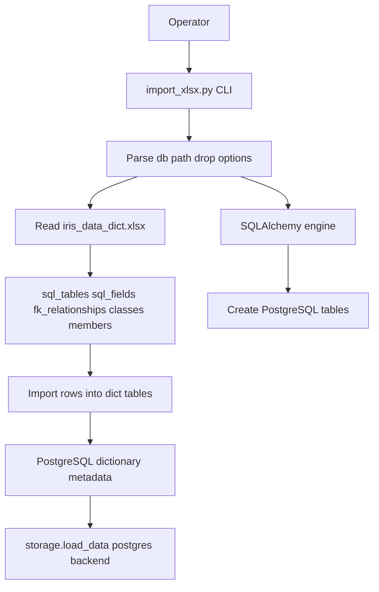
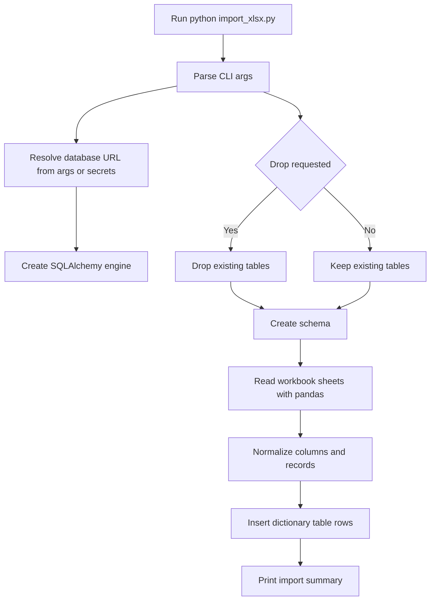
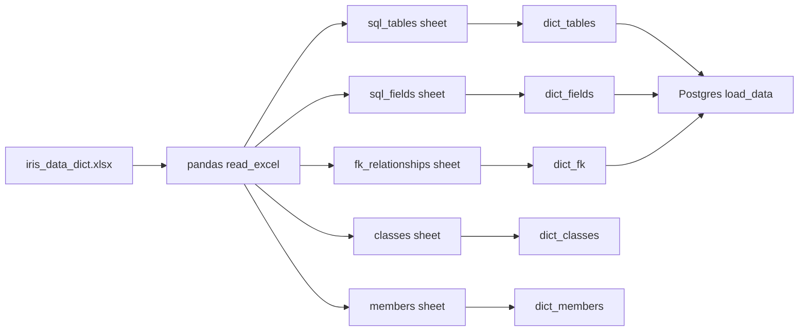

# Import XLSX Stack

## Purpose

`import_xlsx.py` imports `iris_data_dict.xlsx` into PostgreSQL `dict_*` tables. It is used when the PostgreSQL backend is enabled or refreshed. The script touches only imported dictionary tables and does not modify runtime user data tables such as translations, tags, metadata, changelog, or usage log.

## Stack Diagrams

### High Level Stack Diagram



### Detail Level Stack Diagram



### Lineage / Data Flow Diagram




## High Level Stack

| Layer | Responsibility | Source |
|---|---|---|
| CLI | Parses `--db`, `--xlsx`, and `--drop`. | `import_xlsx.py:32-39` |
| DB URL resolution | Reads database URL from CLI, `.streamlit/secrets.toml`, or `DATABASE_URL`. | `import_xlsx.py:44-73` |
| Connection/schema | Verifies DB connection and initializes SQLAlchemy schema. | `import_xlsx.py:88-117`, `storage.py:498-508`, `models.py:16-132` |
| Optional refresh | `--drop` truncates only `dict_*` tables. | `import_xlsx.py:119-125` |
| Workbook parsing | Reads five workbook sheets into dataframes. | `import_xlsx.py:127-138` |
| Table import | Upserts `dict_tables` and `dict_classes`; truncates/inserts `dict_fields`, `dict_fk`, and `dict_members`. | `import_xlsx.py:140-253` |
| Generic upsert | Builds PostgreSQL `ON CONFLICT` statements for tables with natural unique keys. | `import_xlsx.py:258-271` |

## High Level Flow

```text
Operator runs python import_xlsx.py [--db URL] [--xlsx PATH] [--drop]
  -> parse CLI args
     import_xlsx.py:32-39
  -> resolve database URL
     import_xlsx.py:44-73
  -> verify xlsx exists and DB connects
     import_xlsx.py:88-107
  -> create PostgreSQL tables through storage.init_db()
     import_xlsx.py:109-117
  -> optionally truncate dict_* tables
     import_xlsx.py:119-125
  -> parse workbook sheets and import rows
     import_xlsx.py:127-253
```

## Detail Level Stack

### 1. CLI and Inputs

| Detail | Source |
|---|---|
| Header documents usage and database URL priority. | `import_xlsx.py:1-18` |
| `--db` accepts PostgreSQL connection URL. | `import_xlsx.py:32-35` |
| `--xlsx` accepts workbook path, defaulting to `iris_data_dict.xlsx`. | `import_xlsx.py:35-36` |
| `--drop` enables full refresh of imported dictionary tables. | `import_xlsx.py:37-38` |
| Script entry point calls `run(parse_args())`. | `import_xlsx.py:274-277` |

### 2. Database Resolution and Setup

| Detail | Source |
|---|---|
| CLI `--db` wins when supplied. | `import_xlsx.py:44-46` |
| `.streamlit/secrets.toml` is checked for `database_url`. | `import_xlsx.py:48-62` |
| `DATABASE_URL` environment variable is fallback. | `import_xlsx.py:64-67` |
| Missing DB URL prints guidance and exits. | `import_xlsx.py:69-73` |
| Workbook path must exist before import proceeds. | `import_xlsx.py:88-94` |
| SQLAlchemy engine is created with `pool_pre_ping=True`. | `import_xlsx.py:96-98` |
| Connection is verified with `SELECT 1`. | `import_xlsx.py:100-107` |
| Import temporarily sets `storage.BACKEND = "postgres"` and injects engine for `init_db()`. | `import_xlsx.py:109-117` |
| `storage.init_db()` creates tables from `models.metadata`. | `storage.py:498-508` |

### 3. Refresh and Workbook Parsing

| Detail | Source |
|---|---|
| `--drop` truncates `dict_members`, `dict_classes`, `dict_fk`, `dict_fields`, and `dict_tables`. | `import_xlsx.py:119-125` |
| Workbook is opened with `pd.ExcelFile`. | `import_xlsx.py:127-130` |
| Sheets parsed: `sql_tables`, `sql_fields`, `fk_relationships`, `classes`, `members`. | `import_xlsx.py:131-135` |
| Import logs row counts for all five dataframes. | `import_xlsx.py:136-138` |

### 4. Table Imports

| Table | Import behavior | Source |
|---|---|---|
| `dict_tables` | Builds rows with table/class/module/description and upserts by `sql_table_name`. | `import_xlsx.py:140-155` |
| `dict_fields` | Builds field rows, truncates table, inserts all rows. | `import_xlsx.py:157-180` |
| `dict_fk` | Builds FK rows, truncates table, inserts all rows. | `import_xlsx.py:182-211` |
| `dict_classes` | Builds class rows and upserts by `class_name`. | `import_xlsx.py:213-226` |
| `dict_members` | Builds member rows, truncates table, inserts all rows. | `import_xlsx.py:228-251` |
| Generic upsert | Uses `ON CONFLICT (<conflict_col>) DO UPDATE SET ...`. | `import_xlsx.py:258-271` |

## Data Inputs

| Data | Required fields | Usage | Source |
|---|---|---|---|
| `.streamlit/secrets.toml` | `database_url` | DB URL fallback. | `import_xlsx.py:57-62` |
| Environment | `DATABASE_URL` | DB URL fallback. | `import_xlsx.py:64-67` |
| `iris_data_dict.xlsx` | five expected sheets | Source workbook. | `import_xlsx.py:127-138` |
| `models.py` metadata | SQLAlchemy table definitions | PostgreSQL schema creation. | `models.py:16-132`, `storage.py:506-507` |

## Ownership

| Area | Owner file | Source |
|---|---|---|
| Import CLI and row mapping | `import_xlsx.py` | `import_xlsx.py:32-277` |
| DB schema creation hook | `storage.py` | `storage.py:498-508` |
| PostgreSQL table definitions | `models.py` | `models.py:16-132` |

## Manual Verification

| Check | Steps | Expected result |
|---|---|---|
| Missing DB URL | Run without DB URL in a clean shell. | Script prints DB URL guidance and exits. |
| Missing workbook | Run with `--xlsx missing.xlsx`. | Script prints xlsx-not-found error and exits. |
| Disposable import | Run `python import_xlsx.py --db <url> --drop` against disposable DB. | Tables are created and `dict_*` rows are populated. |
| Runtime data safety | Populate a runtime table, then run import. | Runtime tables are not truncated by import workflow. |
| App backend | Configure app `backend = "postgres"` with same DB URL. | App loads dictionary data from imported `dict_*` tables. |

