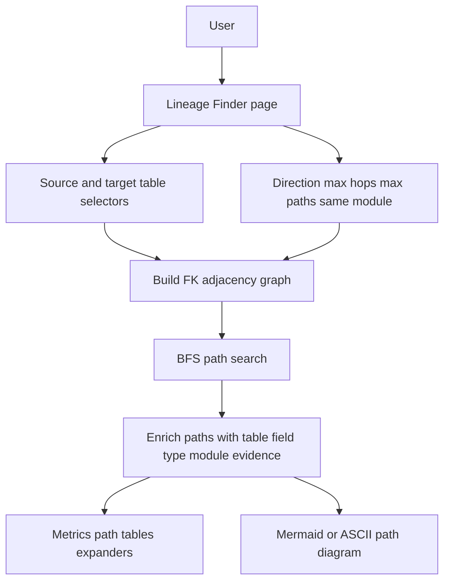
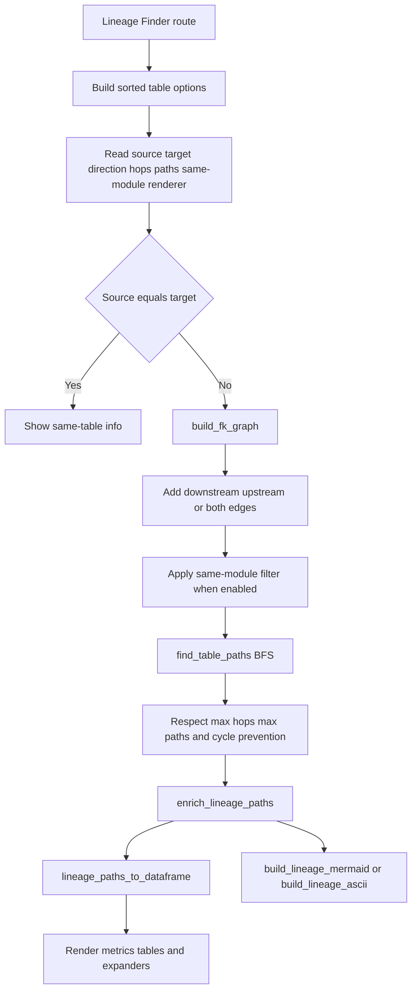
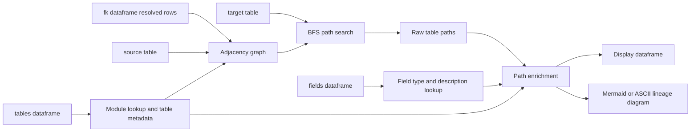

# Lineage Finder Stack

## Purpose

Lineage Finder lets a user choose a source table and target table, then searches resolved foreign-key relationships to find direct or indirect table paths. It is table-level lineage enriched with column, key, module, IRIS type, MSSQL type, cardinality, and evidence details.

## Stack Diagrams

### High Level Stack Diagram



### Detail Level Stack Diagram



### Lineage / Data Flow Diagram




## High Level Stack

| Layer | Responsibility | Source |
|---|---|---|
| Streamlit app shell | Imports storage and lineage helpers, then routes the sidebar page to Lineage Finder. | `app.py:25`, `app.py:34`, `app.py:1595`, `app.py:2894` |
| Data loading | Loads `tables`, `fields`, `fk`, `classes`, and `members` once through Streamlit cache. | `app.py:430`, `app.py:1456`, `storage.py:70` |
| Source backend | Reads from `iris_data_dict.xlsx` in file mode or `dict_*` PostgreSQL tables in postgres mode. | `storage.py:76`, `storage.py:81`, `storage.py:91` |
| User inputs | Lets users choose source table, target table, direction, max hops, max paths, same-module filter, and diagram renderer. | `app.py:2900`, `app.py:2907`, `app.py:2913`, `app.py:2922`, `app.py:2933`, `app.py:2941`, `app.py:2949`, `app.py:2955` |
| Graph build | Converts resolved FK rows into an adjacency-list graph. | `app.py:2965`, `lineage_finder.py:36` |
| Path search | Uses BFS to find shortest table paths while avoiding cycles and respecting hop/path limits. | `app.py:2971`, `lineage_finder.py:119` |
| Path enrichment | Adds module, class, field type, key type, and descriptions from `tables` and `fields`. | `app.py:2978`, `lineage_finder.py:184` |
| Result formatting | Flattens paths into display dataframes and adds MSSQL type mapping in the UI. | `app.py:2993`, `app.py:2995`, `app.py:3008`, `lineage_finder.py:233`, `app.py:787` |
| Visualization | Renders path details and either Mermaid HTML, ASCII text, or no diagram. | `app.py:2998`, `app.py:3002`, `app.py:3014`, `app.py:3018`, `app.py:3021`, `lineage_finder.py:256`, `lineage_finder.py:295`, `app.py:601` |

## High Level Flow

```text
User opens Lineage Finder page
  app.py:2894
    -> table options come from loaded tables dataframe
       app.py:2900
    -> user selects search controls
       app.py:2907-2960
    -> user clicks Find Relationship
       app.py:2960
    -> app builds FK graph
       app.py:2965-2970 -> lineage_finder.py:36-116
    -> app searches BFS paths
       app.py:2971-2977 -> lineage_finder.py:119-172
    -> app enriches paths
       app.py:2978 -> lineage_finder.py:184-230
    -> app renders metrics, tables, expanders, and diagram
       app.py:2980-3024
```

## Detail Level Stack

### 1. Imports and App Wiring

| Detail | Source |
|---|---|
| `app.py` imports `load_data` and storage helpers from `storage.py`. | `app.py:25-33` |
| `app.py` imports all Lineage Finder domain helpers from `lineage_finder.py`. | `app.py:34-40` |
| Sidebar/page map includes `"lineage_finder": "Lineage Finder"`. | `app.py:1595` |
| The Lineage Finder page is selected with `elif st.session_state.page == "lineage_finder"`. | `app.py:2894` |

### 2. Data Loading Stack

| Detail | Source |
|---|---|
| `_cached_load_data()` wraps `storage.load_data()` so the workbook or DB is not re-read on every rerun. | `app.py:430-432` |
| App assigns `tables, fields, fk, classes, members` from the cached loader. | `app.py:1456` |
| `load_data()` returns those five dataframes and switches backend by `BACKEND`. | `storage.py:70-78` |
| File backend reads Excel sheets: `sql_tables`, `sql_fields`, `fk_relationships`, `classes`, and `members`. | `storage.py:81-88` |
| PostgreSQL backend reads `dict_tables`, `dict_fields`, `dict_fk`, `dict_classes`, and `dict_members`. | `storage.py:91-99` |
| PostgreSQL backend drops internal `id` and `imported_at` columns before returning dataframes. | `storage.py:100-106` |

### 3. UI Input Stack

| Control | Behavior | Source |
|---|---|---|
| Table option list | Builds sorted unique table names from `tables["sql_table_name"]`. | `app.py:2900` |
| Minimum data guard | Warns if fewer than two tables exist. | `app.py:2901-2902` |
| Source table | `st.selectbox` stored as `lineage_source_table`. | `app.py:2907-2911` |
| Target table | `st.selectbox` stored as `lineage_target_table`. | `app.py:2913-2918` |
| Direction | Radio options: `Downstream`, `Upstream`, `Both`. | `app.py:2922-2931` |
| Max hops | Slider from 1 to 5, default 3. | `app.py:2933-2939` |
| Max paths | Slider from 1 to 25, default 10. | `app.py:2941-2947` |
| Same module only | Optional checkbox filter. | `app.py:2949-2953` |
| Diagram renderer | Options: Mermaid, ASCII, or Hide diagram. | `app.py:2955-2959` |
| Run action | Primary button `Find Relationship`. | `app.py:2960` |
| Same-table guard | Shows info message instead of searching when source equals target. | `app.py:2962-2963` |

### 4. Graph Build Detail

| Detail | Source |
|---|---|
| `app.py` calls `build_fk_graph(fk, direction, same_module_only, tables_df=tables)`. | `app.py:2965-2970` |
| `build_fk_graph()` signature accepts FK dataframe, direction, same-module flag, and optional tables dataframe. | `lineage_finder.py:36-41` |
| Empty FK input returns an empty graph. | `lineage_finder.py:48-50` |
| Graph build requires `source_sql_table_name` and `target_sql_table_name`. | `lineage_finder.py:52-54` |
| If `resolve_status` exists, only rows with `resolved` are included. | `lineage_finder.py:56-58` |
| Same-module filtering uses `tables_df.sql_table_name -> module_name`. | `lineage_finder.py:60-62`, `lineage_finder.py:74-76` |
| Direction flags decide whether downstream edges, upstream edges, or both are added. | `lineage_finder.py:64-65`, `lineage_finder.py:94-112` |
| Edge metadata includes source table/class/field, target table/key, cardinality, and evidence source. | `lineage_finder.py:78-92` |
| Edges are sorted by next table and source field for stable output. | `lineage_finder.py:114-116` |

### 5. Path Search Detail

| Detail | Source |
|---|---|
| `app.py` calls `find_table_paths(graph, source_table, target_table, max_hops, max_paths)`. | `app.py:2971-2977` |
| `find_table_paths()` cleans source and target and rejects empty or identical inputs. | `lineage_finder.py:119-130` |
| Hop and path limits are coerced to at least 1. | `lineage_finder.py:132-133` |
| BFS queue starts from the selected source table. | `lineage_finder.py:134-137` |
| Search stops expanding when current path length reaches `max_hops`. | `lineage_finder.py:139-142` |
| Each edge computes the next table through `_edge_next_table()`. | `lineage_finder.py:144-145`, `lineage_finder.py:32-33` |
| Cycle prevention skips tables already visited in the current path. | `lineage_finder.py:146-147` |
| Matching target paths are stored with `path_index`, `hop_count`, table chain, and edge list. | `lineage_finder.py:154-163` |
| Duplicate result chains and queued chains are skipped. | `lineage_finder.py:155-157`, `lineage_finder.py:167-170` |
| `_tables_for_path()` rebuilds the table chain from source plus path edges. | `lineage_finder.py:175-181` |

### 6. Enrichment Detail

| Detail | Source |
|---|---|
| `app.py` calls `enrich_lineage_paths(lineage_paths, fields, tables)`. | `app.py:2978` |
| Empty path input returns an empty list. | `lineage_finder.py:184-187` |
| Table lookup maps `sql_table_name` to `class_name` and `module_name`. | `lineage_finder.py:189-195` |
| Field lookup indexes `fields` by `(class_name, sql_field_name)`. | `lineage_finder.py:197-202` |
| Each edge resolves source/target classes, source field, and target key. | `lineage_finder.py:207-216` |
| Enriched edge fields include source/target module, source field type/description, and target key type/description. | `lineage_finder.py:218-226` |
| Enriched paths preserve original path metadata and replace `edges` with enriched edges. | `lineage_finder.py:229-230` |

### 7. Result and Output Detail

| Detail | Source |
|---|---|
| No-path result shows a warning with source, target, and hop limit. | `app.py:2980-2984` |
| Successful result shows metrics for paths found, shortest path, direction, and max hops. | `app.py:2986-2991` |
| `lineage_paths_to_dataframe()` flattens enriched paths into table rows. | `app.py:2993`, `lineage_finder.py:233-253` |
| Output columns include path/step, source/target tables/modules, FK/PK fields, types, cardinality, and evidence. | `lineage_finder.py:238-252` |
| `iris_to_mssql()` maps IRIS types to MSSQL display types. | `app.py:787-790` |
| UI adds `Source MSSQL Type` and `Target MSSQL Type` columns before display. | `app.py:2994-2996`, `app.py:3008-3011` |
| Flat detail table is rendered with `st.dataframe`. | `app.py:2998-3000` |
| Each found path is also rendered in an expander with a table-chain label. | `app.py:3002-3012` |

### 8. Diagram Detail

| Detail | Source |
|---|---|
| Diagram rendering is skipped when the selectbox value is `Hide diagram`. | `app.py:3014` |
| ASCII mode calls `build_lineage_ascii()` and renders with `st.code`. | `app.py:3017-3019`, `lineage_finder.py:295-326` |
| Mermaid mode calls `build_lineage_mermaid()` and renders through `components.html`. | `app.py:3020-3024`, `lineage_finder.py:256-292`, `app.py:601` |
| Mermaid output defines `flowchart LR`, unique nodes, labeled FK-to-PK edges, and source/target styles. | `lineage_finder.py:258-292` |
| ASCII output renders each path with hop count, FK-to-PK labels, direction note, and table chain. | `lineage_finder.py:300-326` |

## Data Inputs

| DataFrame | Required columns | Usage | Source |
|---|---|---|---|
| `fk` | `source_sql_table_name`, `target_sql_table_name` | Builds FK edges and graph adjacency. | `lineage_finder.py:52-54`, `lineage_finder.py:67-73` |
| `fk` | `source_sql_field_name`, `source_member_name`, `target_pk_fields` | Labels each path step from FK field to target key. | `lineage_finder.py:78-79` |
| `fk` | `resolve_status`, `relationship_cardinality`, `evidence_source` | Filters unresolved rows and explains relationship quality. | `lineage_finder.py:56-58`, `lineage_finder.py:80-81` |
| `fk` | `source_class_name` | Helps locate source field metadata during enrichment. | `lineage_finder.py:82`, `lineage_finder.py:210` |
| `tables` | `sql_table_name`, `class_name`, `module_name` | Builds class/module lookups and supports same-module filtering. | `lineage_finder.py:60-62`, `lineage_finder.py:189-195` |
| `fields` | `class_name`, `sql_field_name`, `member_type`, `description` | Adds source field type/description and target key type/description. | `lineage_finder.py:197-226` |

## Ownership

| Area | Owner file | Source |
|---|---|---|
| Streamlit controls, button action, metrics, tables, expanders, and renderer selection | `app.py` | `app.py:2894-3024` |
| Type mapping from IRIS to MSSQL display labels | `app.py` | `app.py:787-790`, `app.py:2994-2996`, `app.py:3008-3011` |
| FK graph traversal, path search, enrichment, dataframe shaping, and diagram text generation | `lineage_finder.py` | `lineage_finder.py:36-326` |
| Data backend selection and dataframe loading | `storage.py` | `storage.py:70-106` |

## Manual Verification

1. Run `streamlit run app.py`.
2. Open the sidebar and select `Lineage Finder`.
3. Choose two different tables that have a known FK relationship.
4. Run `Find Relationship` with `Direction = Downstream`, `Max hops = 1`, and confirm direct paths are listed when present.
5. Increase `Max hops` and confirm indirect paths can appear without cycles.
6. Switch `Direction` to `Upstream` and `Both` and confirm edge direction changes as expected.
7. Toggle `Same module only` and confirm cross-module paths are excluded.
8. Switch diagram renderer between Mermaid, ASCII, and Hide diagram.
9. Confirm the result table includes source/target table, module, field, PK, IRIS type, MSSQL type, cardinality, and evidence columns.

If future work adds tests, target `lineage_finder.py` first because it is pure Python logic and does not require Streamlit to run.
