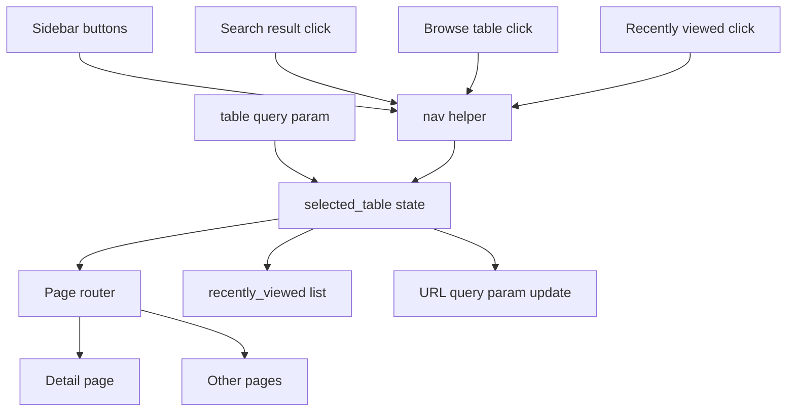
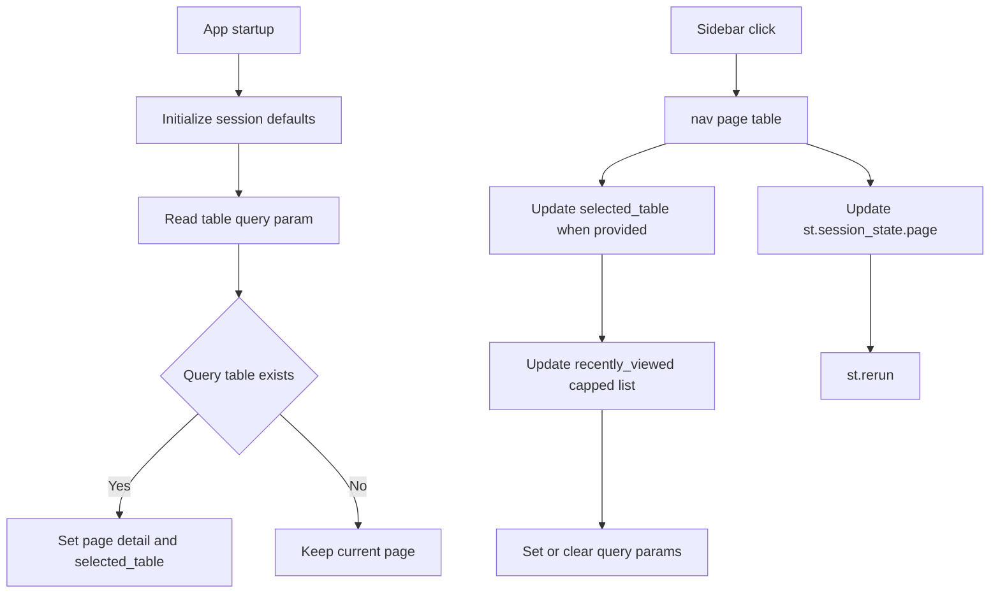
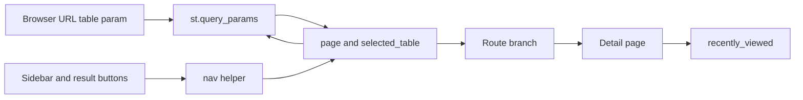

# Navigation State Stack

## Purpose

Navigation state controls the current page, selected table, route highlighting, URL deep links, recently viewed tables, admin mode, theme, and usage logging. It is implemented with `st.session_state`, `st.query_params`, and the shared `nav()` helper.

## Stack Diagrams

### High Level Stack Diagram



### Detail Level Stack Diagram



### Lineage / Data Flow Diagram




## High Level Stack

| Layer | Responsibility | Source |
|---|---|---|
| Session defaults | Initializes route, table, filters, recent list, analytics tab, theme, and admin auth. | `app.py:1486-1497` |
| User data state | Loads translations, tags, and metadata into session state. | `app.py:1499-1506` |
| Deep linking | Reads and writes `?table=TABLE_NAME`. | `app.py:1517-1533` |
| Admin gate | Controls locked pages using `admin_authenticated`. | `app.py:1536-1556`, `app.py:1599-1618` |
| Navigation helper | Sets page/table, maintains recently viewed, and reruns. | `app.py:1559-1569` |
| Usage logging | Logs session, page, and table events from state transitions. | `app.py:1508-1511`, `app.py:1572-1582` |
| Sidebar | Presents page buttons, active state, lock state, counts, and theme toggle. | `app.py:1586-1642` |

## High Level Flow

```text
App starts
  -> session_state defaults are initialized
     app.py:1486-1497
  -> user data state is loaded once
     app.py:1499-1506
  -> URL table parameter may switch route to detail
     app.py:1517-1527
User navigates
  -> nav(page, table) updates page/selected_table/recently_viewed
     app.py:1559-1569
  -> usage logging records page/table transition
     app.py:1572-1582
  -> sidebar highlights active route and locked pages
     app.py:1586-1642
```

## Detail Level Stack

### 1. Session Defaults

| State key | Default | Usage | Source |
|---|---|---|---|
| `page` | `DEFAULT_PAGE` | Active route key. | `app.py:1486-1488` |
| `selected_table` | `None` | Detail table. | `app.py:1488` |
| `browse_module` | `DEFAULT_MODULE_FILTER` | Browse module filter and Home module navigation. | `app.py:1489` |
| `browse_filter` | `""` | Browse table-name filter. | `app.py:1490` |
| `recently_viewed` | `[]` | Home recent table shortcuts. | `app.py:1491` |
| `analytics_tab` | `0` | Reserved analytics tab state. | `app.py:1492` |
| `theme` | `DEFAULT_THEME` | Light/dark styling. | `app.py:1493` |
| `admin_authenticated` | `False` | Locked page access. | `app.py:1494` |
| Missing-key initialization | Only sets key when absent. | `app.py:1495-1497` |

### 2. User Data State

| Detail | Source |
|---|---|
| Translations load once into `st.session_state.translations`. | `app.py:1499-1501` |
| Tags load once into `st.session_state.tags`. | `app.py:1502-1503` |
| Metadata loads once into `st.session_state.metadata`. | `app.py:1505-1506` |
| Session start logs once per browser session. | `app.py:1508-1511` |

### 3. Deep Linking

| Detail | Source |
|---|---|
| `_url_table` reads `st.query_params.get("table", "")`. | `app.py:1517-1518` |
| URL table is honored only when current page is Home. | `app.py:1519` |
| Valid URL table switches page to Detail and sets selected table. | `app.py:1520-1522` |
| Valid URL table moves that table to front of `recently_viewed`. | `app.py:1523-1527` |
| Detail page writes selected table back to `st.query_params["table"]`. | `app.py:1529-1531` |
| Non-detail pages remove the `table` query param. | `app.py:1532-1533` |

### 4. Navigation Helper

| Detail | Source |
|---|---|
| `nav(page, table=None)` sets `st.session_state.page`. | `app.py:1559-1560` |
| When table is provided, `selected_table` is updated. | `app.py:1561-1562` |
| Detail navigation updates recently viewed by removing existing duplicate and inserting at front. | `app.py:1563-1568` |
| Recent list is capped by `MAX_RECENTLY_VIEWED`. | `app.py:1568`, `config.py:78` |
| Navigation ends with `st.rerun()`. | `app.py:1569` |

### 5. Admin and Sidebar State

| Detail | Source |
|---|---|
| Admin gate sets `admin_authenticated` after correct passcode and reruns. | `app.py:1536-1551` |
| Incorrect passcode shows an error. | `app.py:1552-1553` |
| Back to Home button calls `nav("home")`. | `app.py:1554-1556` |
| Sidebar page map defines Home, Search, Browse, Analytics, Lineage Finder, Changelog, and Usage Stats. | `app.py:1586-1598` |
| Sidebar active state treats Detail as Browse. | `app.py:1600-1603` |
| Locked display is based on `LOCKED_PAGES` and admin state. | `app.py:1599-1605` |
| Sidebar buttons call `nav(pid)`. | `app.py:1606-1608` |
| Admin lock button clears auth and returns locked-page users to Home. | `app.py:1610-1618` |
| Theme toggle flips `theme` and reruns. | `app.py:1637-1642` |

### 6. Usage Logging

| Detail | Source |
|---|---|
| Current page is copied into `_cur_page`. | `app.py:1572-1573` |
| Page views log only when `_last_logged_page` changes. | `app.py:1574-1576` |
| Detail table views log only when `_last_logged_table` changes. | `app.py:1578-1582` |
| Search terms log when query differs from `_last_logged_query`. | `app.py:1694-1696` |

## Data Inputs

| Data | Required fields | Usage | Source |
|---|---|---|---|
| Config defaults | `DEFAULT_PAGE`, `DEFAULT_MODULE_FILTER`, `DEFAULT_THEME`, `MAX_RECENTLY_VIEWED`, `LOCKED_PAGES` | Session defaults and navigation limits. | `config.py:75-101`, `config.py:117-119`, `app.py:1486-1497` |
| `tables` | `sql_table_name` | Deep link validation and table navigation. | `app.py:1518-1527`, `app.py:3640-3641` |
| `st.query_params` | `table` | URL deep linking. | `app.py:1517-1533` |
| `st.session_state` | route/auth/theme/recent/user data keys | Shared app navigation state. | `app.py:1486-1642` |

## Ownership

| Area | Owner file | Source |
|---|---|---|
| Session state and navigation helper | `app.py` | `app.py:1486-1569` |
| Usage event state tracking | `app.py` | `app.py:1508-1511`, `app.py:1572-1582`, `app.py:1694-1696` |
| Sidebar route controls | `app.py` | `app.py:1586-1642` |
| Navigation defaults and limits | `config.py`, `config.toml` | `config.py:75-119`, `config.toml:29-78` |

## Manual Verification

| Check | Steps | Expected result |
|---|---|---|
| Default route | Start app in a fresh session. | Home page opens by default. |
| Sidebar route | Click every sidebar page. | `page` changes and route renders. |
| Detail highlighting | Open a table detail. | Browse button is active in sidebar. |
| Deep link | Open `/?table=<valid_table>`. | Detail opens and recent list updates. |
| Query cleanup | Navigate away from Detail. | `table` query parameter is removed. |
| Recent order | Open multiple detail pages. | Recently viewed list is most-recent-first and capped. |
| Admin lock | Unlock admin, open Changelog/Usage, then Lock Admin. | Auth clears and locked page redirects Home. |
| Theme persistence | Toggle theme. | Theme changes and persists in current session. |

