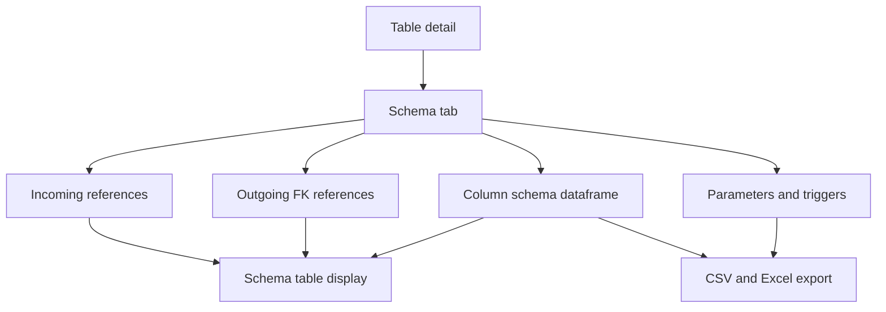
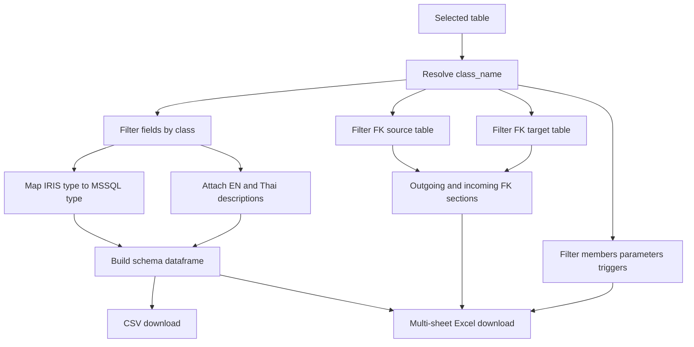
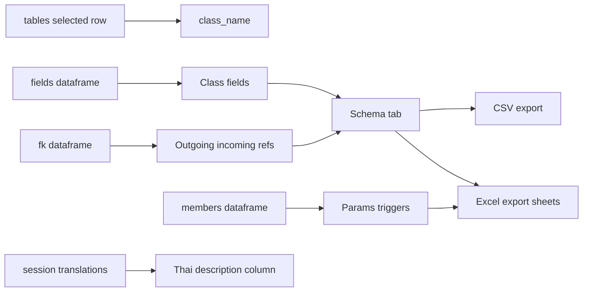

# Schema Export Stack

## Purpose

The Schema tab shows field-level schema for the selected table, including IRIS type, MSSQL type, English description, FK reference target, outgoing relationships, incoming references, parameters, and triggers. The same context feeds CSV and Excel downloads in the table detail header.

## Stack Diagrams

### High Level Stack Diagram



### Detail Level Stack Diagram



### Lineage / Data Flow Diagram




## High Level Stack

| Layer | Responsibility | Source |
|---|---|---|
| Header exports | Builds CSV and Excel bytes and exposes download buttons. | `app.py:2140-2157` |
| CSV helper | Creates UTF-8 CSV schema export for the selected table. | `app.py:461-485` |
| Excel helper | Creates multi-sheet Excel export for columns, outgoing FK, incoming refs, parameters, and triggers. | `app.py:488-548` |
| Schema tab | Renders column schema dataframe. | `app.py:2227-2246` |
| Relationship sections | Renders outgoing relationships and incoming references with row navigation. | `app.py:2248-2287` |
| Member sections | Renders parameters and triggers from class members. | `app.py:2289-2306` |

## High Level Flow

```text
Detail page builds selected-table context
  -> tbl_fields, resolved_fk, incoming, cls_members, fk_map, fk_pk_map
     app.py:2171-2188
  -> header download buttons call schema_to_csv/schema_to_excel
     app.py:2140-2157
  -> Schema tab renders columns and relationship sections
     app.py:2227-2306
  -> selecting outgoing/incoming relationship navigates to related table
     app.py:2266-2267, app.py:2286-2287
```

## Detail Level Stack

### 1. Export Helpers

| Detail | Source |
|---|---|
| `schema_to_csv()` is cached with `st.cache_data`. | `app.py:461-462` |
| CSV helper filters fields by class and sorts by `member_order`. | `app.py:464` |
| CSV helper filters resolved outgoing FK rows for the selected class. | `app.py:465-467` |
| CSV helper maps source field to target table for reference display. | `app.py:468-472` |
| CSV rows include table, field, IRIS type, MSSQL type, EN description, blank TH description, and reference target. | `app.py:473-485` |
| `schema_to_excel()` is cached and returns workbook bytes. | `app.py:488-493` |
| Excel helper builds selected fields, outgoing FK, incoming FK, and class member subsets. | `app.py:496-500` |
| Excel helper writes `Columns`, `Outgoing FK`, `Incoming Refs`, `Parameters`, and `Triggers` sheets when data exists. | `app.py:531-548` |

### 2. Header Download Buttons

| Detail | Source |
|---|---|
| CSV bytes are generated from `fields`, `fk`, selected table name, and class name. | `app.py:2140-2142` |
| CSV download uses filename `<table>_schema.csv` and MIME `text/csv`. | `app.py:2143-2149` |
| Excel bytes are generated from `fields`, `fk`, `members`, `tables`, selected table name, and class name. | `app.py:2150` |
| Excel download uses filename `<table>_schema.xlsx` and XLSX MIME type. | `app.py:2151-2157` |

### 3. Schema Tab Columns

| Detail | Source |
|---|---|
| Schema tab starts under `with tab_schema`. | `app.py:2227` |
| `Columns` subheader is rendered. | `app.py:2228` |
| Each field row reads SQL field name, IRIS type, EN description, FK target, and target PK. | `app.py:2229-2236` |
| Display rows include Field, IRIS Type, MSSQL Type, Description, and FK Reference. | `app.py:2237-2243` |
| Column rows are rendered with `st.dataframe`. | `app.py:2244` |
| Empty selected-table fields show `No columns found.` | `app.py:2245-2246` |

### 4. Relationships and Members

| Detail | Source |
|---|---|
| Outgoing relationships expander renders when `resolved_fk` is not empty. | `app.py:2248-2249` |
| Outgoing rows include field/member, evidence kind, target table, and target PK. | `app.py:2250-2260` |
| Selecting an outgoing row navigates to target table detail. | `app.py:2261-2267` |
| Incoming references expander renders when `incoming` is not empty. | `app.py:2269-2270` |
| Incoming rows map source class back to source SQL table and show via field and evidence kind. | `app.py:2271-2280` |
| Selecting an incoming row navigates to source table detail. | `app.py:2281-2287` |
| Parameters and triggers are split from `cls_members` by `member_kind`. | `app.py:2289-2290` |
| Parameters and triggers render in a shared expander when either exists. | `app.py:2291-2306` |

## Data Inputs

| Data | Required fields | Usage | Source |
|---|---|---|---|
| `fields` / `tbl_fields` | `class_name`, `sql_field_name`, `member_type`, `description`, `member_order` | Schema rows and CSV/Excel columns. | `app.py:464`, `app.py:496`, `app.py:2171-2172`, `app.py:2229-2244` |
| `fk` / `resolved_fk` | `source_class_name`, `source_sql_field_name`, `source_member_name`, `target_sql_table_name`, `target_pk_fields`, `evidence_source`, `resolve_status` | FK reference mapping and outgoing relationships. | `app.py:465-472`, `app.py:497`, `app.py:2173-2188`, `app.py:2248-2267` |
| `incoming` | `target_sql_table_name`, `source_class_name`, `source_sql_field_name`, `evidence_source`, `resolve_status` | Incoming reference table. | `app.py:498`, `app.py:2175`, `app.py:2269-2287` |
| `tables` | `class_name`, `sql_table_name` | Source class to table lookup for incoming references. | `app.py:527-529`, `app.py:2272-2274` |
| `members` / `cls_members` | `class_name`, `member_kind`, `member_name`, `member_type`, `member_decl`, `description` | Parameters and triggers. | `app.py:499`, `app.py:2176`, `app.py:2289-2306` |

## Ownership

| Area | Owner file | Source |
|---|---|---|
| Schema export helpers | `app.py` | `app.py:461-548` |
| Header download buttons | `app.py` | `app.py:2140-2157` |
| Schema tab UI and relationship navigation | `app.py` | `app.py:2227-2306` |
| MSSQL type mapping | `app.py` | `app.py:787-826` |

## Manual Verification

| Check | Steps | Expected result |
|---|---|---|
| Columns render | Open a table with fields and select Schema tab. | Field rows show IRIS type, MSSQL type, description, and FK references. |
| Empty schema guard | Open a table/class with no fields in a disposable dataset. | `No columns found.` appears. |
| Outgoing navigation | Select an outgoing relationship row. | Detail opens for target table. |
| Incoming navigation | Select an incoming reference row. | Detail opens for source table. |
| CSV download | Click CSV button in detail header. | CSV downloads with schema rows for selected table. |
| Excel download | Click Excel button in detail header. | XLSX downloads with expected sheets for available data. |

