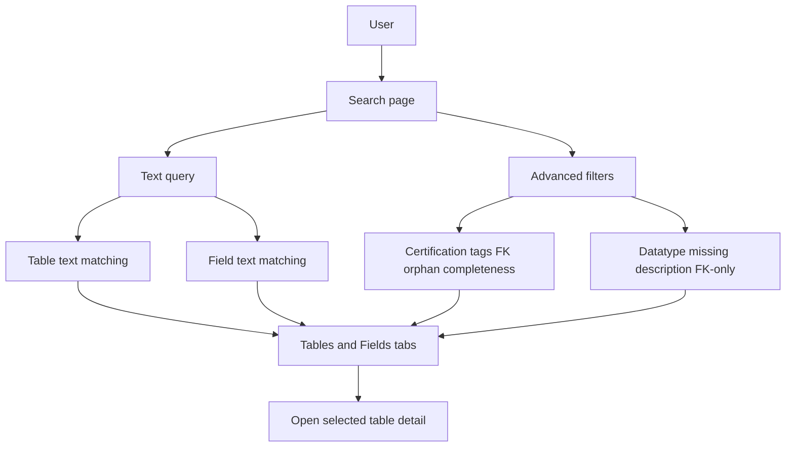
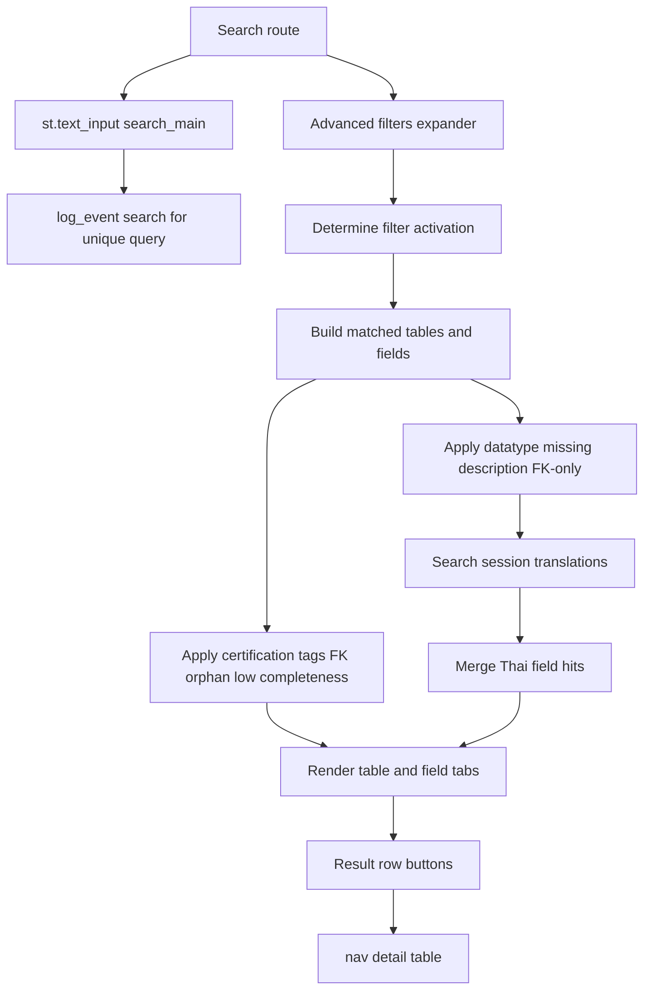
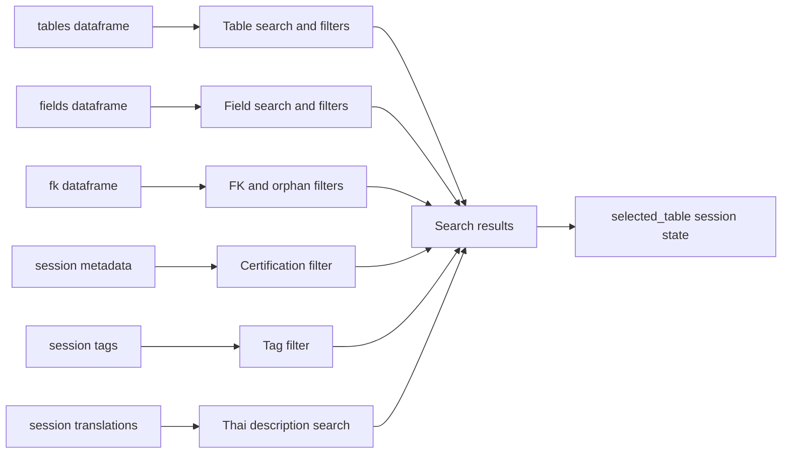

# Search Stack

## Purpose

Search lets users find dictionary content across tables, fields, IRIS types, English descriptions, and Thai descriptions. It also provides advanced filters for governance metadata, tags, FK presence, orphan tables, completeness, datatype, missing descriptions, and FK-only fields.

## Stack Diagrams

### High Level Stack Diagram



### Detail Level Stack Diagram



### Lineage / Data Flow Diagram




## High Level Stack

| Layer | Responsibility | Source |
|---|---|---|
| Page route | Renders Search when `st.session_state.page == "search"`. | `app.py:1686-1687` |
| Text input | Captures the main text query and logs unique search terms. | `app.py:1688-1696` |
| Advanced filters | Captures certification, tags, FK/orphan state, completeness, datatype, missing description, and FK-only filters. | `app.py:1698-1736` |
| Table search | Matches tables by SQL table name, class description, and module name. | `app.py:1741-1748` |
| Field search | Matches fields by field name, English description, and IRIS member type. | `app.py:1749-1757` |
| Filter logic | Applies table filters and field filters to the candidate dataframes. | `app.py:1759-1806` |
| Thai search | Searches session Thai translations and merges new hits into field results. | `app.py:1808-1829` |
| Results UI | Renders table/field result tabs and navigates selected rows to table detail. | `app.py:1831-1885` |

## High Level Flow

```text
User opens Search page
  -> app renders text input and advanced filters
     app.py:1686-1736
  -> query and filters create candidate table/field dataframes
     app.py:1738-1757
  -> table-level advanced filters reduce matched_tables
     app.py:1759-1787
  -> field-level advanced filters reduce matched_fields
     app.py:1788-1806
  -> Thai translation hits can add field rows
     app.py:1808-1829
  -> results appear in Tables and Fields tabs
     app.py:1831-1885
  -> selecting a row calls nav("detail", table=...)
     app.py:1857-1858, app.py:1882-1885
```

## Detail Level Stack

### 1. Entry Point

| Detail | Source |
|---|---|
| Sidebar exposes the Search page key. | `app.py:1590-1593` |
| Search page route begins with `elif st.session_state.page == "search"`. | `app.py:1686` |
| Page title is `Search`. | `app.py:1687` |
| Main text input uses key `search_main`. | `app.py:1688-1692` |
| Unique non-empty query terms are logged as `search` usage events. | `app.py:1694-1696` |

### 2. Advanced Filter Controls

| Control | Behavior | Source |
|---|---|---|
| Certification status | Multiselect from configured certification options except blank. | `app.py:1702-1705` |
| Tags | Multiselect from configured predefined tags. | `app.py:1706-1709` |
| Has FK relationships | Checkbox requiring a resolved FK relationship in either direction. | `app.py:1711`, `app.py:1774-1777` |
| No FK / orphan tables | Checkbox requiring no resolved FK relationships in either direction. | `app.py:1712`, `app.py:1779-1782` |
| Low EN description | Checkbox using completeness threshold from config. | `app.py:1713-1716`, `app.py:1784-1786` |
| Field datatype | Multiselect built from simplified IRIS member types. | `app.py:1718-1725`, `app.py:764-784` |
| Missing EN description | Checkbox limiting fields to blank or `nan` descriptions. | `app.py:1726-1729`, `app.py:1794-1797` |
| FK fields only | Checkbox limiting fields to resolved FK source fields. | `app.py:1730-1733`, `app.py:1799-1806` |
| Filter activation | Any selected advanced filter allows search without a text query. | `app.py:1735-1738` |

### 3. Text Matching Logic

| Detail | Source |
|---|---|
| Query is stripped and lowercased. | `app.py:1738-1739` |
| Table search checks `sql_table_name`, `class_description`, and `module_name`. | `app.py:1741-1747` |
| Field search checks `sql_field_name`, `description`, and `member_type`. | `app.py:1749-1754` |
| When no text query is present but filters are active, all tables and fields become candidates. | `app.py:1755-1757` |

### 4. Table Filter Logic

| Detail | Source |
|---|---|
| Certification filter uses `st.session_state.metadata[table]["certification"]`. | `app.py:1760-1765` |
| Tag filter requires every selected tag to exist in `st.session_state.tags[table]`. | `app.py:1767-1772` |
| Has-FK filter builds table set from resolved FK sources and targets. | `app.py:1774-1777` |
| No-FK filter excludes all tables with resolved FK sources or targets. | `app.py:1779-1782` |
| Low-completeness filter maps completeness by class name and applies `COMPLETENESS_LOW_THRESHOLD`. | `app.py:1784-1787`, `app.py:435-446` |

### 5. Field Filter Logic

| Detail | Source |
|---|---|
| Datatype filter maps `member_type` through `simplify_iris_type()`. | `app.py:1789-1792`, `app.py:764-784` |
| Missing-description filter checks stripped field description for blank or `nan`. | `app.py:1794-1797` |
| FK-only filter builds `(source_class_name, source_sql_field_name)` keys from resolved FK rows. | `app.py:1799-1806` |

### 6. Thai Translation Search

| Detail | Source |
|---|---|
| Class-to-table mapping is built from `tables`. | `app.py:1808-1809` |
| Thai search runs only for a text query. | `app.py:1810-1812` |
| Session translations are scanned by class and field. | `app.py:1813-1817` |
| Thai hits are merged with field metadata from `fields`. | `app.py:1818-1823` |
| Thai-only hits not already in field results are appended to `matched_fields`. | `app.py:1824-1829` |

### 7. Results and Navigation

| Detail | Source |
|---|---|
| Summary shows matched table and field counts. | `app.py:1831` |
| Results are split into Tables and Fields tabs. | `app.py:1833-1835` |
| Empty table result shows an info message. | `app.py:1837-1840` |
| Table display includes table, prefix, module, truncated description, certification, and owner. | `app.py:1841-1854` |
| Selecting a table row navigates to Detail for that table. | `app.py:1854-1858` |
| Empty field result shows an info message. | `app.py:1860-1862` |
| Field display maps class to table, adds Thai description, simplified datatype, truncated IRIS type, and English description. | `app.py:1864-1879` |
| Selecting a field row navigates to Detail for the field's table. | `app.py:1879-1885` |

## Data Inputs

| Data | Required fields | Usage | Source |
|---|---|---|---|
| `tables` | `sql_table_name`, `class_description`, `module_name`, `class_name`, `module_prefix` | Table search, class-to-table mapping, result display. | `app.py:1741-1748`, `app.py:1808-1809`, `app.py:1841-1847` |
| `fields` | `class_name`, `sql_field_name`, `description`, `member_type` | Field search, datatype filtering, Thai merge, result display. | `app.py:1749-1757`, `app.py:1789-1797`, `app.py:1820-1823`, `app.py:1864-1879` |
| `fk` | `resolve_status`, `source_sql_table_name`, `target_sql_table_name`, `source_class_name`, `source_sql_field_name` | Has-FK, orphan, and FK-only filters. | `app.py:1774-1782`, `app.py:1799-1806` |
| `st.session_state.metadata` | table certification and owner | Certification filter and table result context. | `app.py:1760-1765`, `app.py:1848-1853` |
| `st.session_state.tags` | table tag list | Tag filter. | `app.py:1767-1772` |
| `st.session_state.translations` | class/field Thai text | Thai text search and result column. | `app.py:1813-1829`, `app.py:1866-1871` |
| `COMPLETENESS` | class-to-percent mapping | Low-completeness filter. | `app.py:1784-1787`, `app.py:435-446` |

## Ownership

| Area | Owner file | Source |
|---|---|---|
| Search UI, filtering, result rendering, row navigation | `app.py` | `app.py:1686-1885` |
| Datatype simplification | `app.py` | `app.py:764-784` |
| Completeness calculation | `app.py` | `app.py:435-446` |
| Search usage logging persistence | `storage.py` | `storage.py:394-456` |

## Manual Verification

| Check | Steps | Expected result |
|---|---|---|
| Text table search | Open Search and search a known table/module word. | Tables tab shows matching tables and selecting a row opens Detail. |
| Text field search | Search a known field name or IRIS type. | Fields tab shows matching fields and selecting a row opens the owning table. |
| Advanced-only search | Leave query empty, select one advanced filter. | Results render using all data as candidates filtered by the selected condition. |
| Certification/tag filters | Select a certification or tag known to exist. | Table results include only matching metadata/tagged tables. |
| FK filters | Toggle Has FK and No FK separately. | Has FK shows tables with resolved relationships; No FK shows tables without resolved relationships. |
| Thai search | Search Thai text that exists in saved translations. | Matching Thai field appears in Fields tab with `TH Description`. |
| Search logging | Search a new query and inspect Usage Stats as admin. | Query appears in usage log/top searches when logging backend is available. |

