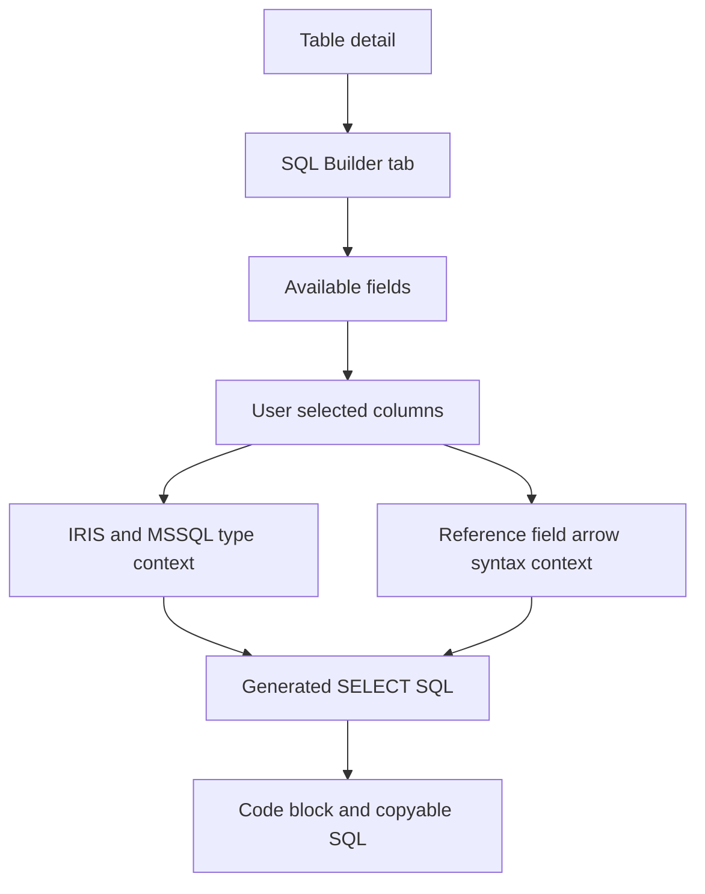
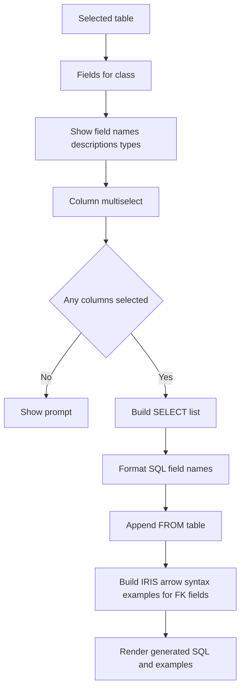
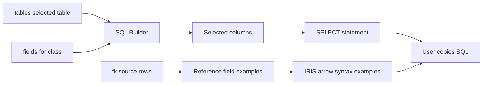

# SQL Builder Stack

## Purpose

The SQL Builder tab lets users select table fields and generate a basic `SELECT` statement. For reference fields, it also shows IRIS arrow-syntax examples and an ObjectScript access pattern for the selected class.

## Stack Diagrams

### High Level Stack Diagram



### Detail Level Stack Diagram



### Lineage / Data Flow Diagram




## High Level Stack

| Layer | Responsibility | Source |
|---|---|---|
| Tab entry | Renders under the SQL Builder tab. | `app.py:2310-2311` |
| Field selection | Offers all table fields in a multiselect and a Select all action. | `app.py:2313-2330` |
| SQL output | Builds a `SELECT` statement from chosen fields. | `app.py:2331-2334` |
| Arrow examples | Detects selected reference fields and `_DR` display fields, then renders IRIS `->` examples. | `app.py:2336-2370` |
| ObjectScript example | Shows object open/read pattern and equivalent SQL by ID. | `app.py:2372-2383` |

## High Level Flow

```text
User opens SQL Builder tab
  -> app lists selected table fields
     app.py:2313-2325
  -> user chooses fields or Select all
     app.py:2318-2330
  -> app builds SELECT statement
     app.py:2331-2334
  -> app finds reference fields in selected columns
     app.py:2336-2345
  -> app renders arrow syntax and ObjectScript examples
     app.py:2346-2383
```

## Detail Level Stack

### 1. Field Selection

| Detail | Source |
|---|---|
| SQL Builder tab starts under `with tab_sql`. | `app.py:2310` |
| Empty `tbl_fields` shows `No fields available.` | `app.py:2313-2314` |
| All selectable field names come from `tbl_fields["sql_field_name"]`. | `app.py:2316` |
| Multiselect defaults to all fields. | `app.py:2318-2325` |
| Select all button assigns all field names to `chosen`. | `app.py:2326-2330` |

### 2. SQL Generation

| Detail | Source |
|---|---|
| SQL is generated only when `chosen` has at least one field. | `app.py:2331` |
| Each selected field is rendered on its own indented line. | `app.py:2332` |
| Final statement uses `SELECT ... FROM <table>`. | `app.py:2333` |
| SQL output is displayed with `st.code(language="sql")`. | `app.py:2334` |

### 3. IRIS Arrow Syntax

| Detail | Source |
|---|---|
| Reference detection starts from chosen fields. | `app.py:2336-2339` |
| Direct FK fields are matched through `fk_map`. | `app.py:2340-2341` |
| `_DR` display fields are mapped back to base FK field when possible. | `app.py:2342-2345` |
| Arrow examples expander renders when reference fields are present. | `app.py:2346-2351` |
| Target table is resolved from `tables`, then target class fields are sampled from `fields`. | `app.py:2352-2360` |
| Generated examples use `arrow_field->target_field` syntax. | `app.py:2361-2370` |

### 4. ObjectScript Pattern

| Detail | Source |
|---|---|
| ObjectScript example is shown in an expander after SQL generation. | `app.py:2372-2373` |
| Class name is cleaned by removing `.cls`. | `app.py:2374` |
| Example opens object by ID, reads a property, and shows SQL equivalent with `%ID = :id`. | `app.py:2375-2383` |

## Data Inputs

| Data | Required fields | Usage | Source |
|---|---|---|---|
| `tbl_fields` | `sql_field_name` | Field options and selected SQL columns. | `app.py:2171-2172`, `app.py:2313-2334` |
| `fk_map` | source field to target table | Reference field detection. | `app.py:2178-2182`, `app.py:2336-2345` |
| `tables` | `sql_table_name`, `class_name` | Target class lookup for arrow examples. | `app.py:2352-2356` |
| `fields` | `class_name`, `sql_field_name` | Target fields sampled for arrow examples. | `app.py:2357-2360` |
| `class_name`, `tbl_name` | selected class/table | ObjectScript and SQL snippets. | `app.py:1978-1979`, `app.py:2374-2383` |

## Ownership

| Area | Owner file | Source |
|---|---|---|
| SQL Builder UI and generated snippets | `app.py` | `app.py:2310-2383` |
| FK map setup | `app.py` | `app.py:2178-2182` |

## Manual Verification

| Check | Steps | Expected result |
|---|---|---|
| Generate all-fields SQL | Open SQL Builder for a table with fields. | SQL contains all fields and selected table name. |
| Select subset | Remove some fields from multiselect. | SQL updates to selected fields only. |
| Select all | Click Select all after removing fields. | All fields are included again. |
| Arrow examples | Include a field that has FK mapping. | Arrow syntax expander appears with target field examples. |
| ObjectScript | Generate any SQL. | ObjectScript access pattern expander appears with selected class/table context. |

