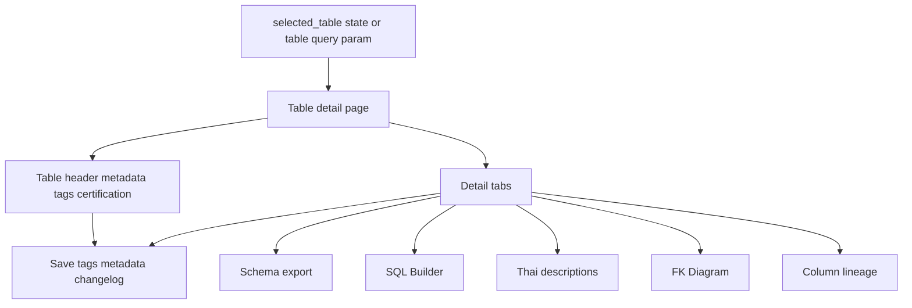
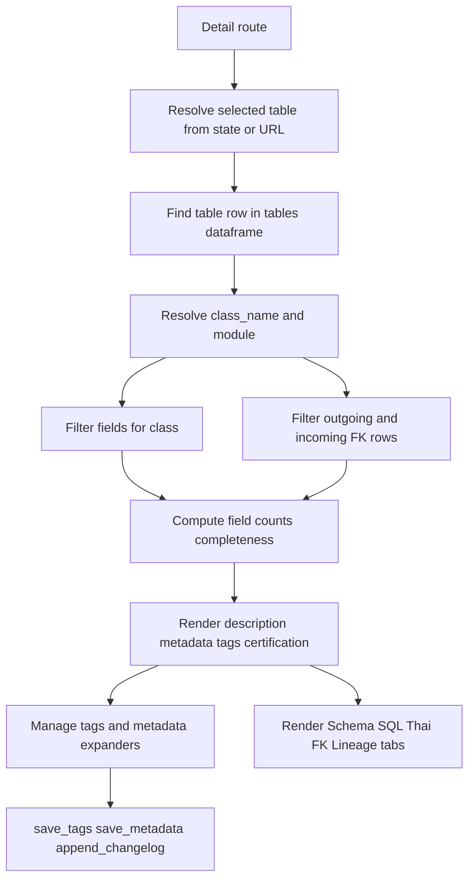
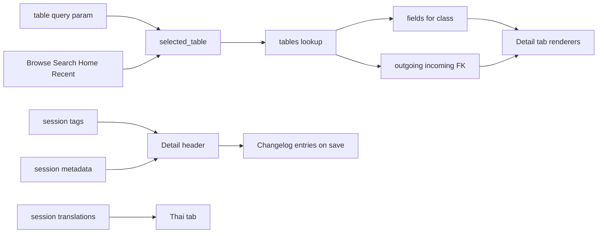

# Table Detail Stack

## Purpose

Table Detail is the central per-table workspace. It shows table identity, module/tag/certification badges, governance metadata, schema export shortcuts, class metadata, precomputed FK context, and five feature tabs: Schema, SQL Builder, Thai Descriptions, FK Diagram, and Lineage.

This document is the overview. Detailed tab-specific behavior belongs in `SCHEMA_EXPORT_STACK.md`, `SQL_BUILDER_STACK.md`, `THAI_DESCRIPTIONS_STACK.md`, `GOVERNANCE_METADATA_STACK.md`, `FK_DIAGRAM_STACK.md`, and `COLUMN_LINEAGE_STACK.md`.

## Stack Diagrams

### High Level Stack Diagram



### Detail Level Stack Diagram



### Lineage / Data Flow Diagram




## High Level Stack

| Layer | Responsibility | Source |
|---|---|---|
| Entry state | Detail renders when `page == "detail"` and `selected_table` is set. | `app.py:1971-1977` |
| Table lookup | Finds the selected table row and class name from `tables`. | `app.py:1972-1979` |
| Header identity | Renders table name, module badges, tags, certification, owner/steward/contact/frequency/refresh metadata, and share hint. | `app.py:1983-2025` |
| Tag management | Adds/removes predefined or custom tags, persists tags, and writes changelog entries. | `app.py:2027-2079` |
| Metadata management | Edits owner, steward, contact, certification, update frequency, and last refresh; persists metadata and writes changelog entries. | `app.py:2081-2135` |
| Header actions | Shows completeness metric and CSV/Excel schema downloads. | `app.py:2137-2157` |
| Class context | Shows class description, class name, storage strategy, and database value. | `app.py:2159-2169` |
| Precomputed context | Builds table fields, outgoing FK, resolved FK, incoming FK, class members, FK maps, and PK maps for tabs. | `app.py:2171-2188` |
| Detail tabs | Creates Schema, SQL Builder, Thai Descriptions, FK Diagram, and Lineage tabs. | `app.py:2190-2194` |
| Tab persistence | Stores selected tab index in browser `localStorage` and restores after reruns. | `app.py:2196-2223` |

## High Level Flow

```text
User selects a table from Browse/Search/Home/deep link
  -> selected_table is set in session state
     app.py:1517-1527, app.py:1559-1569, app.py:1857-1858, app.py:1965-1968
  -> detail route validates the table
     app.py:1971-1977
  -> header renders identity, badges, governance, and export buttons
     app.py:1983-2157
  -> table/class/FK/member context is precomputed
     app.py:2159-2188
  -> five tabs are created and current tab is restored
     app.py:2190-2223
  -> selected tab renders feature-specific content
     app.py:2227-2878
```

## Detail Level Stack

### 1. Entry Point and Selected Table

| Detail | Source |
|---|---|
| Browse and Detail share the same route block. | `app.py:1889` |
| Detail renders only when `st.session_state.page == "detail"` and `st.session_state.selected_table` is truthy. | `app.py:1971` |
| Selected table name is copied into `tbl_name`. | `app.py:1972` |
| Table row lookup filters `tables["sql_table_name"] == tbl_name`. | `app.py:1973` |
| Missing table shows an error and skips detail content. | `app.py:1975-1977` |
| Existing table row provides `tbl_row` and `class_name`. | `app.py:1978-1979` |

### 2. Header Identity

| Detail | Source |
|---|---|
| Header is laid out in three columns. | `app.py:1983-1984` |
| Main title uses selected SQL table name. | `app.py:1985-1986` |
| Module prefix and module name badges are rendered from `tbl_row`. | `app.py:1987-1991` |
| Table tags are read from `st.session_state.tags` and rendered as badges. | `app.py:1992-1997` |
| Certification is read from `st.session_state.metadata` and rendered as a colored badge. | `app.py:1998-2003` |
| Owner, steward, contact, update frequency, and last refresh are rendered when present. | `app.py:2005-2023` |
| Share hint shows `?table=<table_name>`. | `app.py:2025` |

### 3. Governance Editors

| Detail | Source |
|---|---|
| Manage Tags expander starts inside the header column. | `app.py:2027-2028` |
| Predefined tag selectbox excludes tags already assigned to the table. | `app.py:2029-2036` |
| Predefined tag add updates session tags, saves tags, appends changelog, and reruns. | `app.py:2037-2045` |
| Custom tag input is limited by `MAX_CUSTOM_TAG_CHARS`. | `app.py:2046-2054` |
| Custom tag is normalized by stripping, lowercasing, and replacing spaces with hyphens. | `app.py:2055-2066` |
| Current tags can be removed one at a time; removal saves tags and appends changelog. | `app.py:2067-2079` |
| Manage Metadata expander loads current metadata from session state. | `app.py:2081-2084` |
| Metadata form captures owner, steward, contact, certification, update frequency, and last refresh. | `app.py:2085-2118` |
| Save Metadata removes empty values, persists metadata, appends changelog, shows success, and reruns. | `app.py:2119-2135` |

### 4. Header Metrics and Export

| Detail | Source |
|---|---|
| English description completeness metric comes from `COMPLETENESS[class_name]`. | `app.py:2137-2139` |
| CSV export bytes come from `schema_to_csv(fields, fk, tbl_name, class_name)`. | `app.py:2140-2149` |
| Excel export bytes come from `schema_to_excel(fields, fk, members, tables, tbl_name, class_name)`. | `app.py:2150-2157` |
| Table class description is rendered as an info block when present. | `app.py:2159-2160` |
| Class declaration row shows class name, storage strategy, and database value. | `app.py:2162-2169` |
| Storage strategy is extracted from class declaration by `extract_storage()`. | `app.py:454-456`, `app.py:2162-2166` |

### 5. Precomputed Detail Context

| Detail | Source |
|---|---|
| `tbl_fields` contains fields for the selected class sorted by `member_order`. | `app.py:2171-2172` |
| `tbl_fk_src` contains all FK rows whose source class is the selected class. | `app.py:2173` |
| `resolved_fk` filters selected-class outgoing FK rows to `resolve_status == "resolved"`. | `app.py:2174` |
| `incoming` contains resolved FK rows whose target SQL table is the selected table. | `app.py:2175` |
| `cls_members` contains class members for parameters, triggers, and other member context. | `app.py:2176` |
| `fk_map` maps source SQL field to target SQL table. | `app.py:2178-2182` |
| `fk_pk_map` maps source SQL field to target PK fields. | `app.py:2183-2188` |

### 6. Tabs and Tab State

| Tab | Responsibility | Source |
|---|---|---|
| Schema | Columns, FK references, outgoing relationships, incoming references, parameters, triggers. | `app.py:2227-2306` |
| SQL Builder | Field selection and generated SQL/ObjectScript examples. | `app.py:2310-2386` |
| Thai Descriptions | Translation progress and editable Thai field descriptions. | `app.py:2387-2439` |
| FK Diagram | Per-table ER/FK diagram with Mermaid/Cytoscape renderers and filters. | `app.py:2441-2794` |
| Lineage | Column-level upstream and downstream FK paths for the selected table. | `app.py:2795-2878` |
| Tab persistence | Browser JS stores/restores selected tab index by table-specific key. | `app.py:2196-2223` |

## Data Inputs

| Data | Required fields | Usage | Source |
|---|---|---|---|
| `tables` | `sql_table_name`, `class_name`, `module_prefix`, `module_name`, `class_description` | Selected table lookup, badges, class context, incoming source resolution. | `app.py:1972-1979`, `app.py:1987-1991`, `app.py:2159-2169`, `app.py:2272-2274` |
| `fields` | `class_name`, `sql_field_name`, `member_type`, `description`, `member_order` | Detail field list, schema export, tabs. | `app.py:2171-2172`, `app.py:2142-2150` |
| `fk` | `source_class_name`, `source_sql_field_name`, `target_sql_table_name`, `target_pk_fields`, `resolve_status` | Outgoing/incoming relationship context and FK maps. | `app.py:2173-2188` |
| `classes` | `class_name`, `class_decl`, `db` | Class detail row and storage strategy extraction. | `app.py:2162-2169` |
| `members` | `class_name`, `member_kind`, `member_name`, `member_type`, `member_decl`, `description` | Parameters, triggers, and Excel export context. | `app.py:2176`, `app.py:2289-2306` |
| `st.session_state.tags` | table tag list | Header badges and tag editor. | `app.py:1992-1997`, `app.py:2027-2079` |
| `st.session_state.metadata` | owner, steward, contact, certification, update frequency, last refresh | Header governance display and metadata editor. | `app.py:1998-2023`, `app.py:2081-2135` |
| `COMPLETENESS` | class-to-percent mapping | Header completeness metric. | `app.py:2137-2139` |

## Ownership

| Area | Owner file | Source |
|---|---|---|
| Table detail route, header, context build, tab setup | `app.py` | `app.py:1971-2223` |
| Tag and metadata persistence | `storage.py` | `storage.py:173-308` |
| Changelog persistence for governance edits | `storage.py` | `storage.py:313-383` |
| Schema export helpers used by header downloads | `app.py` | `app.py:459-548`, `app.py:2142-2157` |
| Feature-specific tab implementations | `app.py` | `app.py:2227-2878` |

## Manual Verification

| Check | Steps | Expected result |
|---|---|---|
| Detail opens from Browse | Select a table row on Browse. | Detail route opens for selected table. |
| Missing table guard | Set a non-existent `selected_table` in a disposable debug session. | Detail area shows table-not-found error and does not crash. |
| Header identity | Open a table with module metadata, tags, and certification. | Header shows table name, module badges, tag badges, and certification badge. |
| Governance metadata display | Add owner/steward/contact/frequency/refresh metadata, save, and reopen table. | Metadata row persists and appears below badges. |
| Exports | Click CSV and Excel download buttons. | Files download with selected table schema content. |
| Class context | Open a table with class metadata. | Class name, storage strategy, and DB value render below description. |
| Tabs | Click each of the five tabs. | Each tab renders its feature area without losing selected table. |
| Tab persistence | Select a non-first tab, trigger a rerun via save or navigation back to same table. | Browser restores the last selected tab for that table. |

