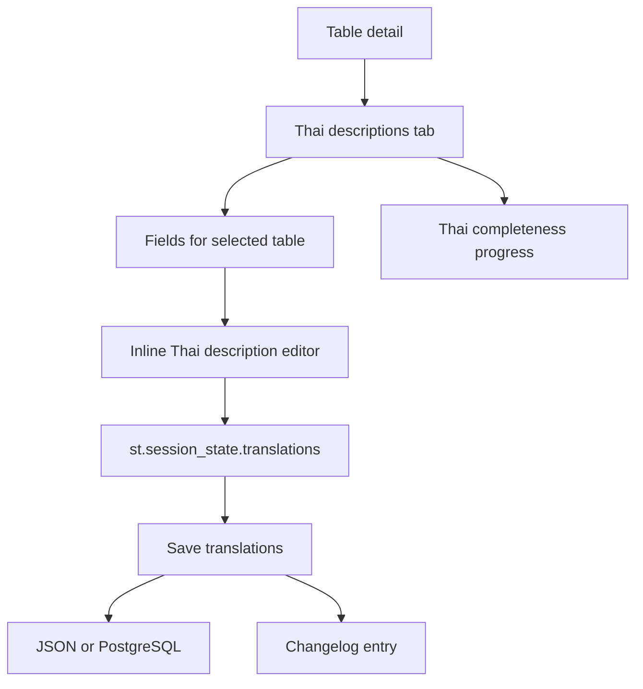
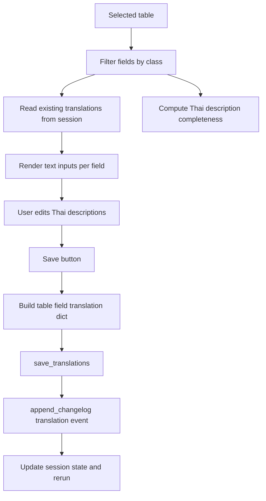
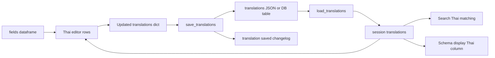

# Thai Descriptions Stack

## Purpose

The Thai Descriptions tab lets users maintain Thai field descriptions for the selected table. It shows completion progress, provides an editable grid, saves non-empty translations through the storage layer, and records changes in the changelog.

## Stack Diagrams

### High Level Stack Diagram



### Detail Level Stack Diagram



### Lineage / Data Flow Diagram




## High Level Stack

| Layer | Responsibility | Source |
|---|---|---|
| Session data | Uses `st.session_state.translations` loaded at startup. | `app.py:1499-1501`, `app.py:2387-2389` |
| Progress | Counts filled Thai descriptions against selected table fields. | `app.py:2391-2397` |
| Editor | Renders field/English description read-only columns and editable Thai description column. | `app.py:2399-2421` |
| Save action | Saves non-empty Thai descriptions, updates session state, appends changelog, and reruns. | `app.py:2423-2437` |
| Storage | Persists to JSON file or PostgreSQL depending on backend. | `storage.py:111-168` |

## High Level Flow

```text
User opens Thai Descriptions tab
  -> app loads translations for selected class
     app.py:2387-2389
  -> app displays filled/total progress
     app.py:2391-2397
  -> user edits TH Description cells
     app.py:2402-2421
  -> Save Thai descriptions builds non-empty translation map
     app.py:2423-2428
  -> storage persists data and changelog records action
     app.py:2429-2437 -> storage.py:111-168
```

## Detail Level Stack

### 1. Startup and Tab Entry

| Detail | Source |
|---|---|
| Translations are loaded into session state if absent. | `app.py:1499-1501` |
| Thai tab starts under `with tab_translate`. | `app.py:2387` |
| Tab reads the full translations dict and selected class translations. | `app.py:2388-2389` |

### 2. Progress Calculation

| Detail | Source |
|---|---|
| Filled count checks selected-table fields that have non-blank Thai translation text. | `app.py:2391` |
| Total count is length of `tbl_fields`. | `app.py:2392` |
| Progress text and progress bar are rendered. | `app.py:2393-2397` |

### 3. Data Editor

| Detail | Source |
|---|---|
| Empty selected-table fields show `No fields available.` | `app.py:2399-2400` |
| Editable dataframe starts with selected table field name and English description. | `app.py:2401-2403` |
| Thai description column is mapped from saved table translations. | `app.py:2404-2406` |
| `Field` and `EN Description` columns are disabled/read-only. | `app.py:2408-2414` |
| `TH Description` column is editable. | `app.py:2413-2415` |
| Editor uses fixed rows and table-specific key. | `app.py:2417-2421` |

### 4. Save Behavior

| Detail | Source |
|---|---|
| Save button is labeled `Save Thai descriptions`. | `app.py:2423` |
| New translation map keeps only rows with non-blank Thai text. | `app.py:2424-2428` |
| Selected class translations are replaced with the new map. | `app.py:2429` |
| `save_translations()` persists the full translations dict. | `app.py:2430` |
| Session translations are refreshed from the updated dict. | `app.py:2431` |
| Changelog action `translation_saved` records table and saved count. | `app.py:2432-2435` |
| Success message is shown and app reruns. | `app.py:2436-2437` |

### 5. Storage Detail

| Detail | Source |
|---|---|
| Public `load_translations()` switches between PostgreSQL and JSON file backend. | `storage.py:111-114` |
| Public `save_translations()` switches between PostgreSQL and JSON file backend. | `storage.py:117-121` |
| PostgreSQL load returns nested `{class_name: {field_name: thai_text}}`. | `storage.py:124-136` |
| PostgreSQL save replaces entries for updated class names and inserts non-empty rows. | `storage.py:139-168` |
| File backend reads/writes configured JSON path. | `storage.py:461-477` |

## Data Inputs

| Data | Required fields | Usage | Source |
|---|---|---|---|
| `tbl_fields` | `sql_field_name`, `description` | Editor rows and progress denominator. | `app.py:2171-2172`, `app.py:2391-2421` |
| `class_name` | selected class | Translation namespace. | `app.py:1978-1979`, `app.py:2388-2429` |
| `st.session_state.translations` | `{class: {field: thai_text}}` | Existing values and save target. | `app.py:1499-1501`, `app.py:2388-2431` |
| `tbl_name` | selected SQL table | Changelog and UI keys. | `app.py:1972`, `app.py:2419`, `app.py:2432-2436` |

## Ownership

| Area | Owner file | Source |
|---|---|---|
| Thai editor UI and save orchestration | `app.py` | `app.py:2387-2437` |
| Translation persistence | `storage.py` | `storage.py:111-168`, `storage.py:461-477` |
| Changelog persistence | `storage.py` | `storage.py:313-383` |

## Manual Verification

| Check | Steps | Expected result |
|---|---|---|
| Progress display | Open Thai tab for a table. | Filled/total count and progress bar render. |
| Edit and save | Add Thai text to one or more fields and save. | Success message appears and values persist after rerun. |
| Blank removal | Clear a Thai description and save. | Blank entry is omitted from stored translations. |
| Changelog | Save translations, then open Changelog as admin. | `translation_saved` entry appears with saved count. |
| Search integration | Search saved Thai text on Search page. | Field appears in Search Fields tab with TH Description. |

