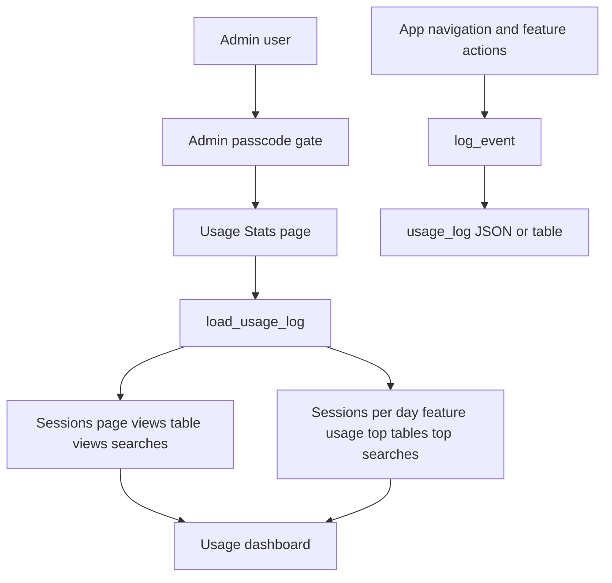
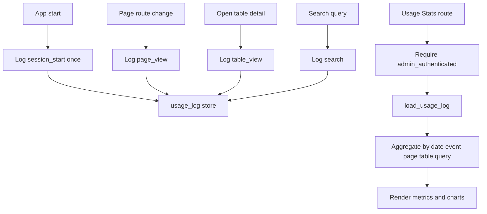
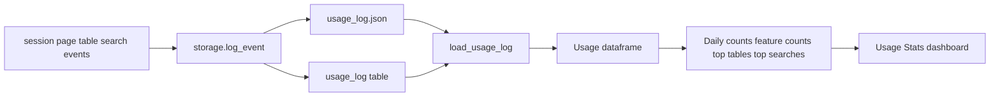

# Usage Stats Stack

## Purpose

Usage Stats is an admin-only observability page for app usage events. It summarizes sessions, page views, table views, and searches, then visualizes sessions/day, feature usage, top tables, top searches, and recent activity.

## Stack Diagrams

### High Level Stack Diagram



### Detail Level Stack Diagram



### Lineage / Data Flow Diagram




## High Level Stack

| Layer | Responsibility | Source |
|---|---|---|
| Event producers | App shell logs session start, page views, table views, and search events. | `app.py:1508-1511`, `app.py:1572-1582`, `app.py:1694-1696` |
| Storage | `load_usage_log()` and `log_event()` use file or PostgreSQL backend. | `storage.py:388-456` |
| Admin gate | Usage page requires admin authentication. | `app.py:3446-3449` |
| Data prep | Converts usage log to dataframe, parses timestamp/date, and splits by event type. | `app.py:3454-3467` |
| Dashboard | Renders metrics, charts, top lists, and recent activity table. | `app.py:3468-3588` |

## High Level Flow

```text
Users interact with app
  -> session/page/table/search events are logged
     app.py:1508-1511, app.py:1572-1582, app.py:1694-1696
Admin opens Usage Stats
  -> admin gate checks authentication
     app.py:3446-3449
  -> load_usage_log() returns event list
     app.py:3454 -> storage.py:388-456
  -> page renders metrics and charts
     app.py:3468-3588
```

## Detail Level Stack

### 1. Event Producers

| Detail | Source |
|---|---|
| `session_start` logs once per browser session. | `app.py:1508-1511` |
| `page_view` logs when current page changes. | `app.py:1572-1576` |
| `table_view` logs when selected detail table changes. | `app.py:1578-1582` |
| `search` logs a unique query when the Search input changes. | `app.py:1694-1696` |

### 2. Storage

| Detail | Source |
|---|---|
| `load_usage_log()` switches by backend. | `storage.py:388-391` |
| `log_event()` switches by backend. | `storage.py:394-398` |
| PostgreSQL load reads latest rows up to `MAX_USAGE_LOG_ENTRIES`. | `storage.py:401-420` |
| PostgreSQL logging inserts JSONB details and prunes old rows. | `storage.py:423-443` |
| File logging appends to JSON and keeps latest `MAX_USAGE_LOG_ENTRIES`. | `storage.py:446-456` |

### 3. Admin Gate and Data Prep

| Detail | Source |
|---|---|
| Usage route starts when `page == "usage"`. | `app.py:3446` |
| Unauthenticated users see `render_admin_gate("usage stats")` and rendering stops. | `app.py:3447-3449` |
| Page loads raw usage log from storage. | `app.py:3454` |
| Empty log shows info message. | `app.py:3456-3457` |
| Non-empty log becomes dataframe with parsed timestamp and date columns. | `app.py:3459-3462` |
| Event subsets are sessions, page views, table views, and searches. | `app.py:3463-3467` |

### 4. Dashboard Widgets

| Detail | Source |
|---|---|
| Summary metrics show counts for sessions, page views, table views, and searches. | `app.py:3468-3473` |
| Sessions per Day chart groups sessions by date and shows last 30 days. | `app.py:3477-3501` |
| Feature Usage pie chart groups page views by `details.page`. | `app.py:3503-3525` |
| Top Tables Viewed chart groups table views by `details.table`. | `app.py:3529-3553` |
| Top Searches chart groups search events by `details.query`. | `app.py:3555-3577` |
| Recent Activity table shows latest 50 events with flattened details. | `app.py:3579-3588` |

## Data Inputs

| Data | Required fields | Usage | Source |
|---|---|---|---|
| Usage log rows | `timestamp`, `event`, `details` | Dashboard metrics/charts/recent table. | `storage.py:388-456`, `app.py:3454-3588` |
| Session state | `admin_authenticated` | Admin gate. | `app.py:3446-3449` |
| Event details | `page`, `table`, `query` keys | Feature usage, top tables, top searches. | `app.py:1576`, `app.py:1582`, `app.py:1696`, `app.py:3507-3563` |

## Ownership

| Area | Owner file | Source |
|---|---|---|
| Usage event production and dashboard UI | `app.py` | `app.py:1508-1511`, `app.py:1572-1582`, `app.py:1694-1696`, `app.py:3446-3588` |
| Usage persistence | `storage.py` | `storage.py:388-456` |
| Usage retention limit | `config.py`, `config.toml` | `config.py:76-77`, `config.toml:29-31` |

## Manual Verification

| Check | Steps | Expected result |
|---|---|---|
| Admin gate | Open Usage Stats without admin mode. | Passcode gate blocks dashboard. |
| Event capture | Navigate pages, open a table, run a search. | Corresponding usage events are logged. |
| Metrics | Open Usage Stats after activity. | Session/page/table/search metrics are nonzero. |
| Charts | Inspect all four chart panels. | Charts render when corresponding event type exists; info messages appear otherwise. |
| Recent activity | Scroll Recent Activity table. | Latest events show timestamp, event, and flattened details. |

